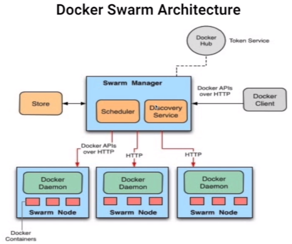
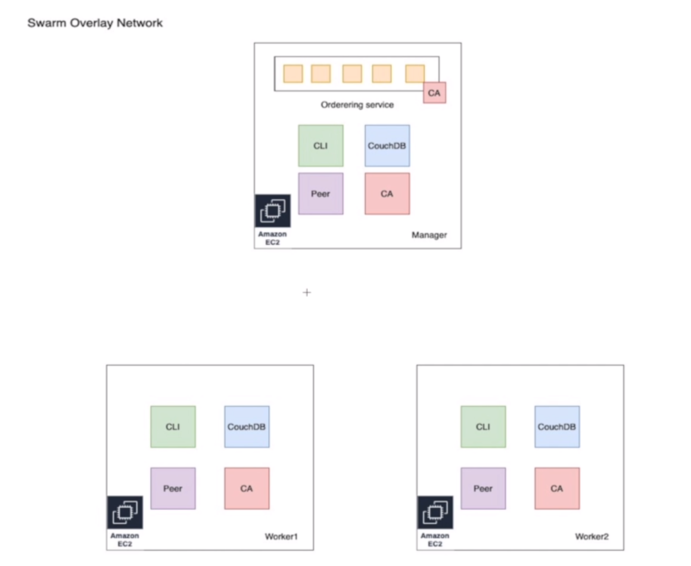

# Learn to Deploy Hyperledger Fabric v2.2 on Multihost

## Section 0 - About this course

> `https://www.udemy.com/course/learn-to-deploy-hyperledger-fabric-v22-on-multihost`

Deploy Hyperledger Fabric on Multi-VM, Multi-Org

In this course, you are going to learn how you can set up Hyperledger Fabric Network on multiple hosts on multiple clouds. We are going to use the following configuration for deploying fabric applications.

- 3 Virtual Machine (any cloud of your choice.
- 3 Orgs - 3 Peer Orgs(1 peer each) and 1 Orderer Orgs( 5 Ordering Nodes).
- 3 Certificates Authority for each org. (For certificate creation).

NodeJS API Server for Chaincode invocation.

## Section 1 - Introduction

Resources:

- [Fabric Samples](https://github.com/hyperledger/fabric-samples)
- [Docker Swarm Documentation](https://docs.docker.com/engine/swarm/)

## Section 2 - Introduction to Docker Swarm



- Step 1 - Create VM's and starting Docker Swarm

```s
# Install Vagrant
# Verify installation
vagrant version

# Create machines
vagrant up

# Connect to each machine on different terms
vagrant ssh manager
vagrant ssh worker1
vagrant ssh worker2

# On manager
sudo docker swarm init --advertise-addr 192.168.100.40
# On workers
sudo docker swarm join --token <TOKEN> 192.168.100.40:2377

# On manager
sudo docker node ls
```

- Step 2 - Creating services in Swarm

```s
# On manager as a SUDO
docker service create --replicas 3 -p 80:80 --name web nginx
docker node ls
docker service ls
docker service ps web
# Get from search "deploy portainer in docker"
curl -L https://downloads.portainer.io/portainer-agent-stack.yml -o portainer-agent-stack.yml
docker stack deploy -c portainer-agent-stack.yml portainer

docker service ls
watch -n 1 docker service ls

# Try on browser http://192.168.100.40:9000
```

- Step 3 - Scalling services up and down

```s
# On manager as a SUDO
docker service ls
docker service ps web
docker ps
docker service scale web=4
docker service ls
docker service ps web
docker ps

# On workers
sudo docker ps

# On manager as a SUDO
docker service scale web=2
docker service ps web
docker ps

# On workers
sudo docker ps
```

- Step 4 - Features/Helpful Tips

FAQs & Helpful Tips:

- A swarm is a group of machines that are running Docker and joined into a cluster
- A cluster is managed by a swarm manager The machines in a swarm can be physical or virtual.
- After joining a swarm, they are referred to as nodes Swarm managers are the only machines in a swarm that can execute your commands, or authorize other machines to join the swarm as workers
- Workers are just there to provide capacity and do not have the authority to tell any other machine what it can and cannot do you can have a node join as a worker or as a manager.
- At any point in time, there is only one LEADER and the other manager nodes will be as a backup in case the current LEADER opts out

Recursos para esta aula

- [Deploy to Swarm](https://docs.docker.com/get-started/swarm-deploy/)

## Section 3 - Setting up our cloud environment



Similar envirionment from Docker Swarm chapter

## Section 4 - Fabric Certificate Authority

```s
# Creating 'test' network
docker network create --driver=overlay --attachable test
docker network ls

# Labels on nodes
docker node ls
docker node update --label-add name=manager <manager node id>
docker node update --label-add name=worker1 <worker1 node id>
docker node update --label-add name=worker2 <worker2 node id>

docker node inspect <manager node id> | less # Attention on Labels definition
docker node inspect <worker1 node id> | less
docker node inspect <worker2 node id> | less

# Deploy CA Docker Compose on manager node
cd /home/ubuntu/hlf-docker-swarm/test-network
docker stack deploy -c docker/docker-compose-ca.yaml hlf

# Inspect Docker containers on all nodes
watch -n 1 docker container ps

# On manager node
cd /home/ubuntu/hlf-docker-swarm/test-network
source ./organizations/fabric-ca/registerEnroll.sh 
createOrg1
createOrderer

# On worker1 node
cd /home/ubuntu/hlf-docker-swarm/test-network
source ./organizations/fabric-ca/registerEnroll.sh 
createOrg2

# On worker2 node
cd /home/ubuntu/hlf-docker-swarm/test-network
source ./organizations/fabric-ca/registerEnroll.sh 
createOrg3

# Copy certificates from/to nodes
#
# To Manager, 
#   we need to copy from organizations/peerOrganizations/org{2/3}.example.com from Workers
# To Workers,
#   we need to copy from organizations/ordererOrganizations/* from Manager
```

## Section 5 - Channel artifacts

```s
# Genesis block creation
#
# On manager node
cd /home/ubuntu/hlf-docker-swarm/test-network
./scripts/createGenesis.sh

# Main channel creation
#
# On manager node
./scripts/createChannelTx.sh

# Copy anchor peers to other nodes
#
# From manager on ./test-network/channel-artifacts/* 
# To   workers on ./test-network/channel-artifacts/* 
```

## Section 6 - Starting peers and ordering services

```s
# Starting:
#   - Ordering services
#   - Peers
#   - CouchDB's
#
# On manager node
cd /home/ubuntu/hlf-docker-swarm/test-network
docker stack deploy -c docker/docker-compose-test-net.yaml -c docker/docker-compose-couch.yaml hlf

# On all nodes to see containers starting
watch -n 1 docker container ps
```

## Section 7 - Channel operations

```s
# Channel creation
# 
# On manager node
cd /home/ubuntu/hlf-docker-swarm/test-network
docker stack deploy -c docker/docker-compose-cli.yaml hlf

# On all nodes
watch -n 1 docker container ps

# On manager node
docker exec -it hlf_cliOrg1...... bash

# On container `hlf_cliOrg1......`
ls -la
ls -la channel-artifacts/
ls -la organizations/
ls -la scripts/
export CHANNEL_NAME=mychannel
echo $CHANNEL_NAME
./scripts/create_app_channel.sh
# Inside `test-network/channel-artifacts` of manager it'll have `mychannel.block`

# Joining channel `mychannel`
#
# Copy `mychannel.block` from manger to workers

# On container `hlf_cliOrg1......`
ls -la channel-artifacts/
peer channel list
peer channel join -b ./channel-artifacts/mychannel.block 
peer channel list

# On worker1 node
docker exec -it hlf_cliOrg2...... bash

# On container `hlf_cliOrg2......`
ls -la channel-artifacts/
peer channel list
peer channel join -b ./channel-artifacts/mychannel.block 
peer channel list

# On worker2 node
docker exec -it hlf_cliOrg3...... bash

# On container `hlf_cliOrg3......`
ls -la channel-artifacts/
peer channel list
peer channel join -b ./channel-artifacts/mychannel.block 
peer channel list

# Update anchor peers
#
# On container `hlf_cliOrg1......`
./scripts/updateAnchorPeer.sh mychannel Org1MSP

# On container `hlf_cliOrg2......`
./scripts/updateAnchorPeer.sh mychannel Org2MSP

# On container `hlf_cliOrg3......`
./scripts/updateAnchorPeer.sh mychannel Org3MSP
```

## Section 8 - Chaincode installation and approval

```s
# Chaincode packing and installation
# 
# On container `hlf_cliOrg1......`
export CC_NAME=basic
echo $CC_PATH
echo $CC_NAME
./scripts/package_cc.sh 

# From manager copy `hlf-docker-swarm/chaincode/basic.tar.gz` 
# To workers on same path

# On container `hlf_cliOrg1......`
./scripts/install_cc.sh

# On container `hlf_cliOrg2......`
export CC_NAME=basic
./scripts/install_cc.sh

# On container `hlf_cliOrg3......`
export CC_NAME=basic
./scripts/install_cc.sh

# Appove chaincode definition
#
# On container `hlf_cliOrg1......`
export CHANNEL_NAME=mychannel
export CC_NAME=basic
./scripts/approve_cc.sh
./scripts/check_commit.sh

# On container `hlf_cliOrg2......`
export CHANNEL_NAME=mychannel
export CC_NAME=basic
./scripts/approve_cc.sh

# On container `hlf_cliOrg1......`
./scripts/check_commit.sh

# On container `hlf_cliOrg3......`
export CHANNEL_NAME=mychannel
export CC_NAME=basic
./scripts/approve_cc.sh
./scripts/check_commit.sh

# Commiting chaincode
#
# On container `hlf_cliOrg1......`
./scripts/commit_cc.sh

# On container `hlf_cliOrg2......`
peer lifecycle chaincode querycommitted --channelID mychannel --name basic

# On container `hlf_cliOrg3......`
peer lifecycle chaincode querycommitted --channelID mychannel --name basic

# Transaction invocation
#

# On browser access CouchDB on this url `192.168.100.40:5984/_utils`

# Adjusts on `envVar.sh`
# line 9: source ./scripts/scriptUtils.sh

# Adjusts on `invoke_cc.sh`
# Uncomment first pair of commands (line 3 and 4)
# Comment second pair of commands (line 7 and 8)

# On container `hlf_cliOrg1......`
source ./scripts/envVar.sh 
parsePeerConnectionParameters 1 2 3
echo $PEER
echo $PEER_CONN_PARMS
export CHANNEL_NAME=mychannel
export CC_NAME=basic
./scripts/invoke_cc.sh 

# Look at the CouchDB on `mychannel_basic` table for asset "1" inserted

# Adjusts on `invoke_cc.sh`
# Comment first pair of commands (line 3 and 4)
# Uncomment second pair of commands (line 7 and 8)

# On container `hlf_cliOrg2......`
# Adjusts on `envVar.sh`
# line 9: source ./scripts/scriptUtils.sh
source ./scripts/envVar.sh 
ll organizations/peerOrganizations/
parsePeerConnectionParameters 2
echo $PEER_CONN_PARMS
fcn_call='{"function":"CreateAsset","Args":["100","RED","10","SAM","3000"]}'
peer chaincode invoke -o orderer.example.com:7050 --tls --cafile $ORDERER_CA -C mychannel -n ${CC_NAME} $PEER_CONN_PARMS -c ${fcn_call}

# Look at the CouchDB on `mychannel_basic` table for asset "100" inserted

# On container `hlf_cliOrg3......`
# Adjusts on `envVar.sh`
# line 9: source ./scripts/scriptUtils.sh
source ./scripts/envVar.sh 
ll organizations/peerOrganizations/
parsePeerConnectionParameters 2
echo $PEER_CONN_PARMS
fcn_call='{"function":"CreateAsset","Args":["200","BLUE","20","RON","4000"]}'
peer chaincode invoke -o orderer.example.com:7050 --tls --cafile $ORDERER_CA -C mychannel -n ${CC_NAME} $PEER_CONN_PARMS -c ${fcn_call}

# Look at the CouchDB on `mychannel_basic` table for asset "200" inserted

# On container `hlf_cliOrg2......`
# Retreive all info on DLT
peer chaincode query -C mychannel -n basic -c '{"function":"GetAllAssets","Args":[]}'
```

## Section 9 - API Server

```s
# Creating ExpressJS Server (Part1)
# Creating ExpressJS Server (Part2)
# Creating connection profiles
# 
# On container `hlf_cliOrg1......`

# Generating configuration files for 3 orgs (`connection-org{1|2|3}.json`)
source ./organizations/ccp-generate.sh 
Org1CCP 
Org2CCP 
Org3CCP 
# Copy file (.json) to `/api-server`

# Containerizing API Server
#
# On manager node go to `hlf-docker-swarm/api-server`
# comment `docker service ...` on `build.sh`
cd /home/ubuntu/hlf-docker-swarm/api-server/
chmod +x ./build.sh
./build.sh
docker image ls
docker stack deploy -c stack.yaml hlf
docker container ps
docker container logs -f hlf_nodeapp.1.....

# Invoking transaction

# Registering a user

URL:    http://192.168.100.40:4000/register
Method: POST
Body:   Raw
Type:   JSON
Data:   
{
    "userId":"sam",
    "orgMSP":"Org2MSP"
}

Result: 200 OK
Response:
{
    "wallet": {
        "providerRegistry": {
            "providers": {}
        },
        "store": {
            "storePath": "/usr/src/app/wallet"
        }
    }
}

# Create asset

URL:    http://192.168.100.40:4000/tx
Method: POST
Body:   Raw
Type:   JSON
Data:   
{
    "orgMSP":"Org2MSP",
    "userId":"sam",
    "channelName":"mychannel",
    "chaincodeName":"basic",
    "data":{
        "function":"CreateAsset",
        "id":"1000",
        "color":"pink",
        "size":20,
        "owser":"sam",
        "appraisalValue":"4500"
    }
}

Result: 200 OK

# Read all assets

URL:    http://192.168.100.40:4000/query
Method: POST
Body:   Raw
Type:   JSON
Data:   
{
    "orgMSP":"Org2MSP",
    "userId":"sam",
    "channelName":"mychannel",
    "chaincodeName":"basic",
    "data":{
        "function":"GetAllAssets"
    }
}

Result: 200 OK

# Read asset 

URL:    http://192.168.100.40:4000/query
Method: POST
Body:   Raw
Type:   JSON
Data:   
{
    "orgMSP":"Org2MSP",
    "userId":"sam",
    "channelName":"mychannel",
    "chaincodeName":"basic",
    "data":{
        "function":"ReadAsset",
        "id":"100"
    }
}

Result: 200 OK
```


## Section 10 - Hyperledger Explorer integration

```s
# Understanding the Hyperledger Explorer
#
Official documentation: https://blockchain-explorer.readthedocs.io/

# On node manager
# Go hlf-docker-swarm/explorer
./setup.sh

# Starting Hyperledger Explorer Service

docker stack deploy -c docker-compose.yaml hlf
docker service ls

```