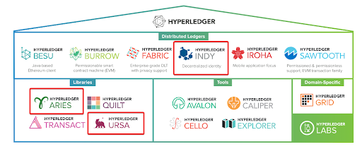
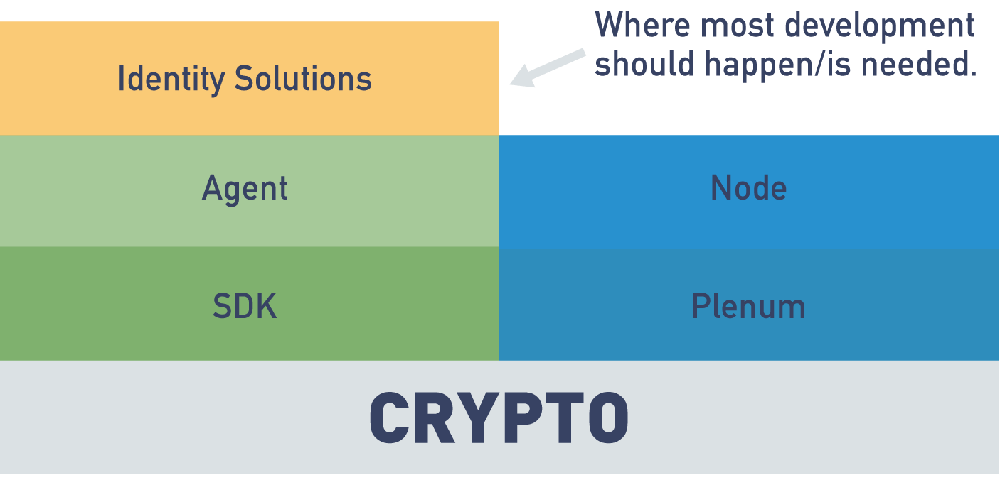
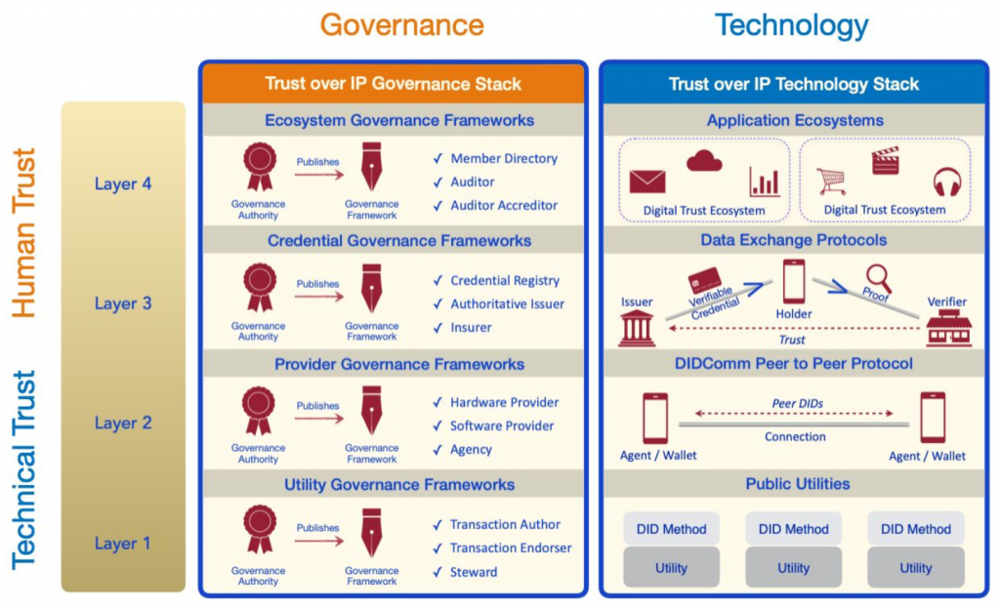
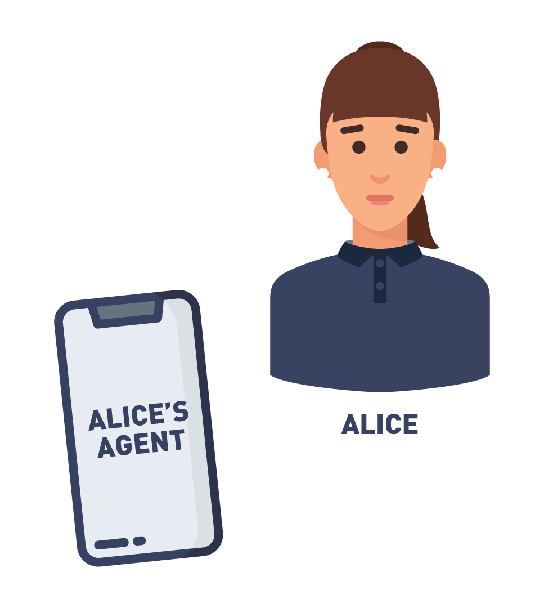
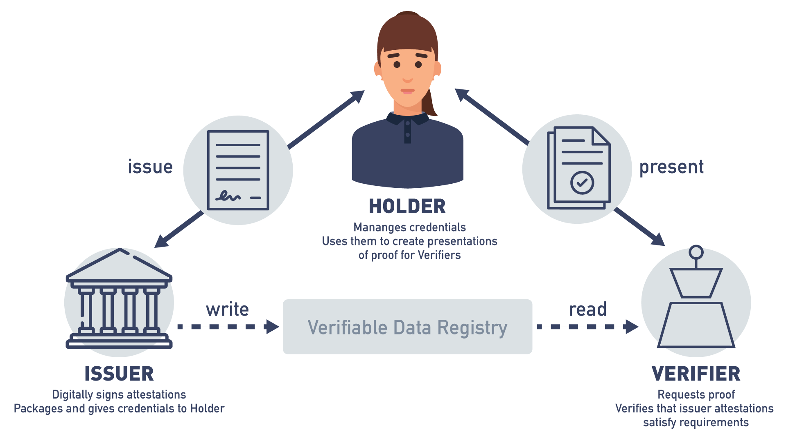
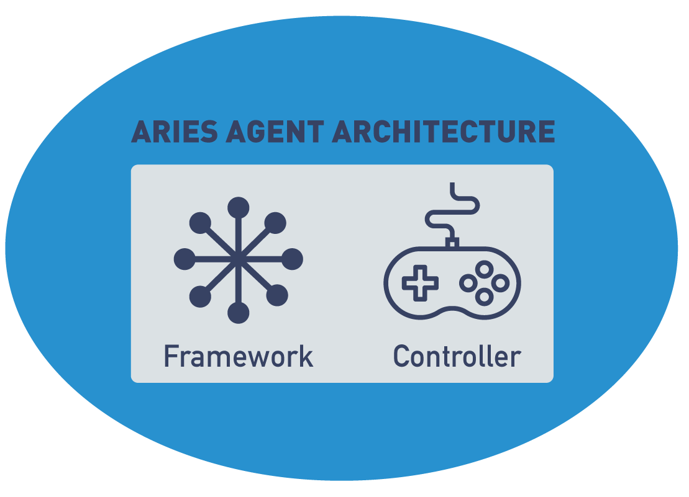
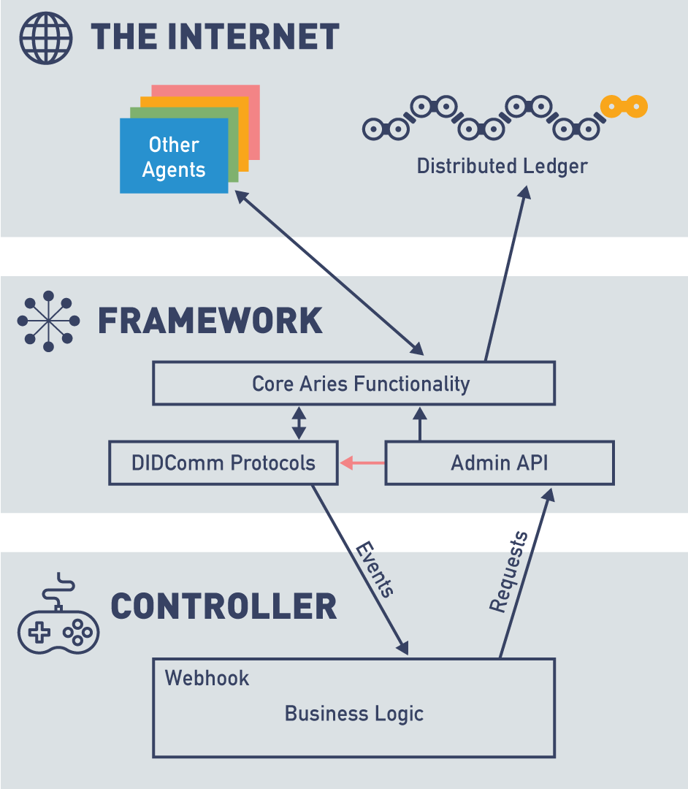
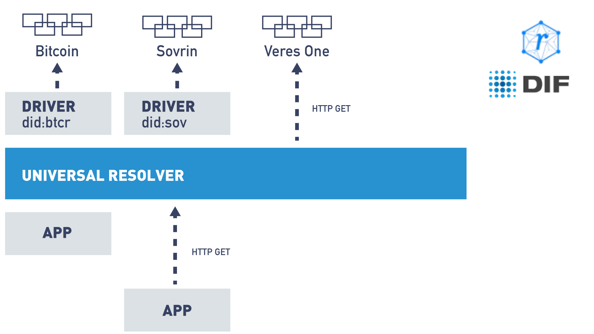
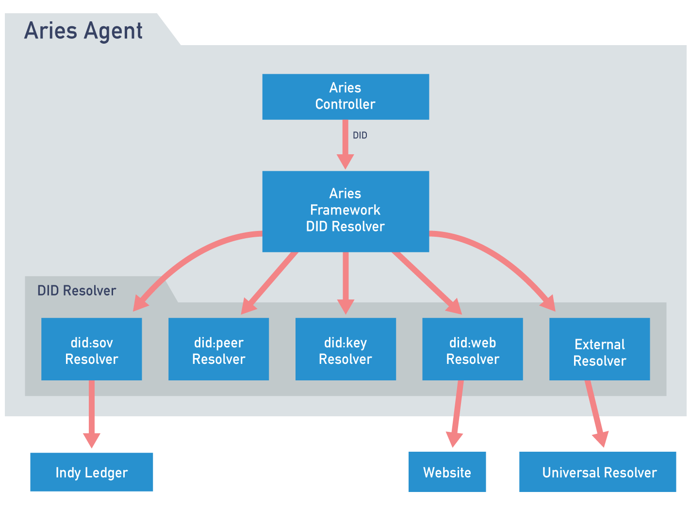

# The Linux Foundation - FS173x - Becoming a Hyperledger Aries Developer

> `https://learning.edx.org/course/course-v1:LinuxFoundationX+LFS173x+3T2021/home`

## Welcome!

### Introduction and Learning Objectives

**Welcome to Becoming a Hyperledger Aries Developer (LFS173x)!**

*Learn how to develop blockchain-based, production-ready, decentralized identity applications using verifiable credentials with Hyperledger Aries in this free course.*

Data is driving our world today. However, we hear about data breaches and identity thefts all the time. Trust on the Internet is broken, and it needs to be fixed. As such, it is imperative that we adopt a new approach to identity management, and ensure data security and user privacy through tamper-proof transactions and infrastructures.

Blockchain-based decentralized identity management is revolutionizing this space. The three Hyperledger open source projects, Aries, Indy and Ursa, provide the foundation for distributed applications built on authentic data, applications that implement the concept of ***Trust over IP***. Together, the three projects provide tools, libraries, and reusable components for creating and using independent digital identities rooted on blockchains or other distributed ledgers that are interoperable across jurisdictions, applications and other data silos. While this course will cover what you need to know about Indy and Ursa, the main focus is Aries and how you can use it to quickly build your own applications on a solid digital foundation of trust. This focus will be explained further in the course but for now, rest assured: if you want to start developing decentralized identity applications rooted on the blockchain, Aries is where you need to be.

This course will get you from (pretty much) zero to developing code for issuing, holding and verifying credentials with your own production-ready Aries agents. On the way, you'll look at how Aries agents use Hyperledger Indy ledgers (you’ll even run your own ledger instances), dig into the architecture and components of an Aries agent, and learn about its underlying messaging protocols. Most importantly, you’ll get started building applications that address your Trust over IP use cases, whether they involve COVID-19 proof-of-vaccination credentials, digital driver's licenses, proof of employment, climate change, or anything else. The possibilities are endless!

### What You Will Learn

This course is designed to get students from the basics of Trust over IP (ToIP) and self-sovereign identity (SSI)—what you learned about in the last course (["Introduction to Hyperledger Sovereign Identity Blockchain Solutions: Indy, Aries & Ursa" (LFS172x)](https://www.edx.org/course/identity-in-hyperledger-aries-indy-and-ursa))—to developing code for issuing (and verifying) credentials with your own Aries agent.

### Before You Begin

We strongly recommend that you review the course syllabus before jumping into the content. It provides the most important information related to the course, including:

- Course overview
- Instructors biographies and targeted audience
- Course prerequisites and length
- Course learning objectives and the outline
- edX platform guidelines
- Discussion forums, course timing, and learning aids
- Grading, progress, and course completion
- Professional Certificate Program audit and verified tracks
- The Linux Foundation's history, events, training, and certifications.

### Getting Help

For any **technical issues** with the edX platform (including login problems and issues with the Verified Certificate), please use the Help icon located on the upper right side of your screen.

One great way to interact with peers taking this course and resolving any **content-related issues** is via the Discussion Forums. These forums can be used in the following ways:

- To introduce yourselves to your peer learners.
- To discuss concepts, tools, and technologies presented in this course, or related to the topics discussed in the course material.
- To ask questions about course content.
- To share resources and ideas related to Hyperledger Aries.

We strongly encourage you not only to ask questions, but to share with your peers opinions about the course content, as well as valuable related resources. The Discussion Forums will be reviewed periodically by the Linux Foundation staff, but it is primarily a community resource, not an 'ask the instructor' service.

> **NOTE:** *Before starting a thread about your issue, we strongly encourage you to do a quick search to see if your question has already been addressed. It’s often the case that there will be one or two threads asking the same question that has been answered.*

To learn more tips on how to use them, read the following article: "[Getting the Most Out of the edX Discussion Forums](https://blog.edx.org/getting-most-out-edx-discussion-forums)".

### Terminology

We use the terms blockchain, ledger, decentralized ledger technology (DLT) and decentralized ledger (DL) interchangeably in this course. While there are precise meanings of those terms in other contexts, in the context of the material covered in this course the differences are not meaningful.

For more definitions, take a look at our course [Glossary](https://courses.edx.org/courses/course-v1:LinuxFoundationX+LFS173x+1T2020/65cfba99617340f39051f7c6f839bf85/) section.

### Labs and Demos

Throughout this course there will be labs and demos that are a key part of the content and that you are strongly advised to complete. The labs and demos are hosted on GitHub so that we can maintain them easily as the underlying technology evolves. Many will be short interactions between agents. In all cases, you will have access to the underlying code to dig into, run and alter.

For some labs, you won’t need anything on your laptop except your browser (and perhaps your mobile phone). For others, you have the option of running the labs in your browser or locally on your own system. For the "in browser" option, we use a service called "Play with Docker" that allows you to access a terminal command line environment in your browser so you don’t have to install everything locally. The downside of using Play with Docker is that you don’t have all the code locally to review and update in your local code editor. If you want that, stick with running the labs locally.

When you run the labs locally, you need the following prerequisites installed on your system:

- A terminal command line interface running bash shell.
  - This is built-in for Mac and Linux, and on Windows, the **git-bash** shell comes with git (see installation instructions below).
- Docker, including Docker Compose (Community Edition is fine).
  - If you do not already have Docker installed, open [Docker Documentation](https://docs.docker.com/get-docker/) and then click the link for the installation instructions for your platform.
  - Instructions for installing docker-compose for a variety of platforms can be found [here](https://docs.docker.com/compose/install/).
- Git
  - This [link](https://www.linode.com/docs/guides/how-to-install-git-on-linux-mac-and-windows/) provides installation instructions for Mac, Linux (including if you are running Linux using VirtualBox) and native Windows (without VirtualBox).

All of the labs that you can run locally use Docker. You can run the labs directly on your own system without Docker, but we don’t provide instructions for doing that, and we highly recommend you not try that until you have run through them with Docker. Because of the differences across systems, it’s difficult to provide universal instructions; we’ve seen many developers spend too much time trying to get everything installed and working right.

> **NOTE:** *The teams we work with only use Docker/containers for development and production deployment. In other cases, developers unfamiliar with (or not interested in) Docker set up their own native development environment. However, doing so is outside the scope of the labs in this course.*

### Meet Your Instructors

**Stephen Curran** of Cloud Compass Computing, Inc. is a Software Development and DevOps veteran who dove full on into the identity on blockchain world in 2017. Working with the British Columbia Government, Stephen has helped define, build and launch the Verifiable Organizations Network (VON)—a production instance of the Linux Foundation's Hyperledger Indy, Aries and Ursa projects that makes public information about organizations (incorporations/legal entities) in BC available in the form of verifiable credentials. Stephen is a regular contributor in the Hyperledger Indy and Aries community, facilitating discussions and driving interoperability. Stephen has presented on Blockchain and the Hyperledger Indy and Aries projects many times and is a member of the Sovrin Foundation's Board of Trustees and Technical Governance Board.

**Carol Howard** of Cloud Compass Computing, Inc. is a technical writer with more than 14 years experience, working for both hardware and software companies writing user guides, technical references, help text, and so on. She has been helping document the BC Government initiatives (VON, Greenlight, OrgBook BC and IIWBook) and became hooked on self-sovereign identity at IIW28.

### Acknowledgements

We have many, many people to thank for this course. The first and foremost is the Linux Foundation for allowing us to share what we know about this evolving and exciting technology. In particular, thank you Flavia and Magda for your guidance and expertise in getting this course online.

We would also like to thank the developers, visionaries and change-seekers in the Hyperledger Indy, Aries and Ursa world—the people we talk to on the weekly calls and daily chats, the people we meet at conferences, and the people who are driving this technology on a daily basis to make the Internet a better place. We would especially like to thank all Hyperledger Aries, Indy and Ursa contributors, and in particular, the BC Government Digital Trust Services (DTS) team for their contributions to this ecosystem.

While we have tried to be as accurate and timely as possible, these tools and libraries are changing rapidly. There are no doubt mistakes and we own them. Keeping this in mind, we have created a [change log on GitHub](https://github.com/cloudcompass/ToIPLabs/blob/main/docs/LFS173x/ChangeLog.md) to track course updates that are needed when mistakes are found in the content and when a major change or shift occurs within the Hyperledger Indy, Aries and Ursa space. If you find an error, a need for a content update, or something in one of the demos doesn’t work, please let us know via the GitHub repo.

Thank you for taking this course!

## Chapter 1: Overview

### Overview

*Data breaches. Identity theft. Companies exploiting our personal information.* We read about these Internet issues all the time. Simply put, trust on the Internet is broken and it needs to be fixed.

*No Shortage of Headlines About Internet Issues*

This is where the Hyperledger Indy, Aries and Ursa projects come in and, we assume, the main reason you are taking this course. The Indy, Aries and Ursa tools, libraries and reusable components provide a foundation for distributed applications built on authentic data using a distributed ledger, purpose-built for decentralized trust.

*The Hyperledger Frameworks and Tools*

> **NOTE:** *This course is called "Becoming a Hyperledger Aries Developer" because it focuses on building applications on top of Hyperledger Aries components—the area where you, a (soon to be!) verifiable credentials application developer, can have the most impact. Aries builds on Indy and Ursa. While you need to have a good understanding of Indy (and other ledger/verifiable credential technologies) and a basic idea of what Ursa (the underlying cryptography) is and does, Aries is where you need to dig in.*

### Learning Objectives

By the end of this chapter you should:

- Understand why this course focuses on Aries (and not Indy or Ursa).
- Understand the issues that Aries is trying to address.
- Know the core concepts behind self-sovereign identity.

### Why Focus on Aries Development?

Hyperledger Indy, Aries and Ursa make it possible to:

- Establish a secure, private channel with another person, organization, or IoT thing—like authentication plus a virtual private network—but with no central server and no login.
- Send and receive arbitrary messages with high security and privacy.
- Prove things about yourself; receive and validate proofs about other parties.
- Create an agent that proxies/represents you in the cloud or on edge devices.
- Manage your own identity:
  - Authorize or revoke devices.
  - Create, update and revoke keys.

However, you will have relatively little interaction with Indy—and almost none with Ursa—as the vast majority of those working with the Hyperledger identity solutions will build on top of Aries; only those contributing code directly into Indy, Aries and Ursa (e.g., fixing a flaw in a crypto algorithm implementation), will have significant interaction with Indy and Ursa. And here’s another big takeaway: while all three projects are focused on decentralized identity, Indy is a specific blockchain, whereas Aries is blockchain-agnostic. With Aries, you don’t have to be limited to Indy.

*Where Most Development Happens*

### Why We Need Identity Solutions

In today's world, we are issued **credentials** as paper documents (for example, our driver's license). When we need to prove things from those paper documents, such as who we are, we hand over (or present) the document. The **verifier** looks at the document and attempts to ascertain whether it is valid and whether it satisfies the purpose for which it was requested. The **holder** of the document cannot choose to only hand over a certain piece of the document but must hand over the entire thing.

A typical paper credential, such as a driver’s license, is issued by a government authority (an **issuer**) after you prove to them who you are (usually in person using your passport and/or birth certificate) and that you are qualified to drive. You then hold this credential (usually in your wallet) and can use it elsewhere whenever you want—for example, when renting a car, in a bank to open up an account or in a bar to prove that you are old enough to drink. When you do that you've **proven** (or **presented**) the credential. That’s the **paper credential model**.

*Examples of Paper Credentials*

The paper credential model (ideally) **proves**:

- Who issued the credential.
- Who holds the credential.
- The claims have not been altered.

The caveat "ideally" is included because of the possibility of forgery in the use of paper credentials. As many university students know, it’s pretty easy to get a fake driver’s license that can be used when needed to "prove" those same things.

### The Verifiable Credential (VC) Model

Enter the VC model, the bread and butter behind authentic data and decentralized identity. The VC model brings about the possibility of building applications with a solid digital foundation of trust.

The verifiable credentials model is the digital version of the paper credentials model. That is:

- An authority decides you are eligible to receive a credential and issues you one.
- You hold your credential in your (digital) wallet.
- At some point, you are asked to prove the claims from the credential.
- You provide a verifiable presentation to the verifier, proving the same things as with a paper credential.

Plus,

- In some cases, you can prove one more thing—that the issued credential has not been revoked.

As we’ll see, verifiable credentials and presentations are not simple documents that anyone can create and use. They are cryptographically constructed so that a presentation proves the four key attributes of all credentials:

1. Who issued the credential.
1. The credential was issued to the entity presenting it.
1. The claims were not tampered with.
1. The credential has not been revoked.

Unlike a paper credential, those four attributes are evaluated not based on the judgment and expertise of the person looking at the credential, but rather online using cryptographic algorithms that are extremely difficult to forge. When a verifier receives a presentation from a holder, they use information from a decentralized source, often a distributed ledger (shown as the **verifiable data registry** in the image below) to perform the cryptographic calculations necessary to prove the four attributes. Forgeries become much (MUCH!) harder with verifiable credentials!

*The W3C Verifiable Credentials Model*

The prerequisite course, "[Introduction to Hyperledger Sovereign Identity Blockchain Solutions: Indy, Aries and Ursa" (LFS172x)](https://www.edx.org/course/identity-in-hyperledger-aries-indy-and-ursa), more than covers the reasons why we need a better identity model on the Internet so we won’t go into it too much here. Suffice to say, the availability of distributed ledgers (such as those based on Hyperledger Indy) has enabled a better way to build solutions using authentic data, and in doing so, enables the creation of a more trusted Internet.

### Key Concepts

Let’s review other key concepts that you’ll need for this course, such as:

- self-sovereign identity
- trust over IP
- decentralized identifiers
- zero-knowledge proofs
- selective disclosure
- revocation
- verifiable credential formats
- secure storage
- agent

If you are not familiar or comfortable with these concepts and terminology from the following short summaries, we suggest you review them in greater depth in this course: ["Introduction to Hyperledger Sovereign Identity Blockchain Solutions: Indy, Aries and Ursa" (LFS172x)](https://www.edx.org/course/identity-in-hyperledger-aries-indy-and-ursa).

### Self-Sovereign Identity (SSI)

**Self-sovereign identity** is one of the most important concepts discussed in the prerequisite course and it is what you should keep in mind at all times as you dig into the Aries world of development. SSI is the idea that you control your own data and you control when and how it is provided to others; when it is shared, it is done so in a trusted way. With SSI, there is no central authority holding your data that passes it on to others upon request. You hold your own data. And because of the underlying cryptography and distributed ledger technology, SSI means that you can present claims about your identity and others can verify it with cryptographic certainty.

### Trust Over IP (ToIP)

Along with SSI, another term we use in this course is **Trust over IP (ToIP)**. ToIP is a Linux Foundation organization that (per the [ToIP website](https://trustoverip.org/)) is defining a complete architecture for Internet-scale digital trust that combines both cryptographic trust at the machine layer and human trust at the business, legal and social layers. The technical capabilities embodied in Indy, Aries and Ursa enable the "trust at the machine layer." ToIP includes self-sovereign identity in that it covers identity, but also goes beyond identity (attributes about you) to cover any type of authentic data. Authentic data, in this context, is a set of claims (assertions) stated by the issuer to the holder (in the form of a verifiable credential), that the holder can later prove were said by the issuer to the holder, were not tampered with and have not been revoked. ToIP’s dual focus on both the technical and governance aspects of authentic data is encapsulated in the "Trust over IP Stacks," as represented in this image from the [Trust over IP Foundation](https://trustoverip.org/):

*Trust over IP (ToIP) Technology Stack*

As shown, there are two stacks in ToIP: a governance stack and a technology stack. The technology stack is a typical layered stack, driven by technical components at each level. In parallel, the governance stack defines the information to govern each layer of the stack. For example, at Layer 3, where verifiable credentials are exchanged, governance defines how a verifier might come to trust the issuer of a credential—not the cryptography (that can be verified using technology), but what the information in the credential means. That is, under whose authority and using what processes did the issuer come to issue the credential being proven?

### Trust Over IP (ToIP): Aries in the ToIP Stack

The core of Aries implements Layer Two (peer-to-peer protocol) of the ToIP stack, enabling both Layer One (DIDs) and Layer Three (Data Exchange, including verifiable credentials) capabilities. Aries implements DIDComm, a secure, transport-agnostic mechanism for sending messages based on DIDs (decentralized identifiers). Hyperledger Indy provides both a Layer 1 DID utility mechanism and Layer 3 verifiable credential format called **AnonCreds** (aka, Anonymous Credentials). Although Aries works really well with Indy, it can also be used with other Layer One implementations, as well as other verifiable credential formats, including W3C Standard Verifiable Credentials.

### Decentralized Identifiers (DIDs)

A **decentralized identifier** is like a universally unique identifier (uuid), but with some added power—it is backed by a cryptographic key owned by the controller of the key. When needed, an Aries agent generates DIDs to either publish on a distributed ledger (such as an instance of Indy) or for exclusive use by another agent (a "peer DID"). A DID looks like this:

**`did:sov:AKRMugEbG3ez24K2xnqqrm`**

An Indy DID is created by generating an Ed25519 cryptographic public/private key pair. We’re assuming in this course that you know about key pairs and elliptical curve cryptography, but if you need a quick refresher, here is the [Wikipedia definition](https://en.wikipedia.org/wiki/Elliptic-curve_cryptography). The identifier for the DID (such as above) is derived from the first instance of the public verification key (the verkey). An Aries agent will publish an issuer’s public DID on a ledger, including the DID, the verkey and a physical endpoint (such as a URL) to which messages can be sent to the agent. Aries holder/provers and verifiers generally do not publish a DID on a ledger because they don’t need to play those roles. On most public Indy ledgers, such as Sovrin, a DID for a person may **not** be published, blocked by GDPR-related legal agreements that a ledger writer must accept before using the ledger. Such agreements prevent a person from issuing verifiable credentials rooted in a public Indy network.

> **NOTE:** *While early (2020) Aries agents could only read and write published DIDs on an Indy ledger, newer implementations can use other ledgers.*

Peer DIDs are created and exchanged peer-to-peer between pairs of messaging agents. Such DIDs are shared directly with the paired agent and so do not need to be published on a distributed ledger. Such DIDs are used only for messaging; they are not used in the signing and issuing of verifiable credentials or in presenting proofs of claims from verifiable credentials.

The DID specification can be found in the W3C document titled ["Decentralized Identifiers (DIDs) v1.0."](https://w3c.github.io/did-core/)

### Zero-Knowledge Proof (ZKP)

A **zero-knowledge proof** ([ZKP](https://en.wikipedia.org/wiki/Zero-knowledge_proof)) is a cryptographic method of proving to someone that you know the value of an attribute without exposing the value of the attribute itself. In verifiable presentations, a ZKP is used to prove that the verifiable credentials were issued to the holder without exposing a unique, correlable identifier for the holder to the verifier. A presentation using a ZKP still exposes the claims asked for by the verifier (which may uniquely identify the prover), but a unique identifier for the holder is **not** automatically provided as part of the process of presenting a proof.

A second (super cool) use of a ZKP in verifiable presentations is a "predicate ZKP." A predicate ZKP is a true/false expression proven (with cryptography) to a verifier based on a claim from an issued credential without exposing the underlying claim—for example, proving based on a "date of birth" claim that a person is older than a given age (e.g., older than 18) without providing the date of birth itself. The cryptography is pretty neat, although left up to you to dig into. In this course, we’ll just cover enough to show how it is used.

> **NOTE:** *Although powerful and certainly privacy preserving, the application of predicates in Indy AnonCreds is limited to situations where the underlying data is a number. As such, to prove "an older than" predicate, the "date of birth" in the credential MUST be a number (such as the integer 20210413 for April 13, 2021), not a string (such as “2021-04-13”), and the expression from the verifier must also use a date represented in the same way.*

### Selective Disclosure

A key capability of some verifiable credential formats is support for **selective disclosure**, meaning it is possible to prove a subset of the claims issued in a verifiable credential. With selective disclosure support, an issuer can put all of the claims that might be needed for a range of use cases, and the holder/prover and the verifier can limit the information shared for a specific presentation. In the example pictured below, a holder with a “driver’s license” type verifiable credential can share just their picture and that they are old enough to drink (using a ZKP predicate) to a bartender at a pub. The rest (name, address, driver’s license number, etc.) can be held back—it’s not needed by the pub. Selective disclosure is an important privacy capability with verifiable credentials!

*An Example of Selective Disclosure: Person is verified as "old enough" to enter the bar but no other data is revealed*

### Revocation

Verifiable credential **revocation** is the capability for an issuer to publish that an issued verifiable credential is no longer active. This action is done unilaterally by the issuer, although they might inform the holder that the credential is revoked. While many think that revocation is the result of something "bad" done by the holder (e.g., the "revoking a driver’s license" scenario), there are many other business reasons for revoking a credential, the most common being that information in the credential is changed (e.g., change of address), and a new verifiable credential is available with updated information. Once revoked, the verifiable presentation process should make it easy for a verifier to know if a prover uses a credential that has been revoked, and hence (in most use cases), should not be accepted.

For verifiable credential formats that support ZKP capabilities, revocation is a bit more complex than one might assume. In a simple revocation approach, the issuer might include a unique ID for the credential, and to revoke it, add the ID to a published list of revoked credential IDs. The holder/prover and verifier can use the credential ID to check the registry and see if the credential has been revoked. The problem with that approach for a ZKP-enabled verifiable credential is that the credential ID is given to the verifier—a unique, correlatable identifier. That’s exactly what we want to avoid by using a ZKP verifiable credential! ZKP revocation generally uses a credential ID that is shared by the issuer to the holder, and a published revocation registry. However, the prover does not give the credential ID to the verifier. Instead, the prover generates a ZKP "proof of non-revocation" that the verifier can check using the data in the published revocation registry.

### Verifiable Credential Formats

Aries agents support one or more of a limited set of **verifiable credential formats**. At the time this course is being updated (mid-2021), verifiable credential formats are an active area of focus in the Aries community.

Any Aries agent that is built on Hyperledger Indy supports the Indy AnonCreds format. AnonCreds includes a number of verifiable credential capabilities that are outlined in this section, including support for ZKPs, ZKP predicates, selective disclosure and ZKP revocation based on CL Signature cryptography. While simple to use in Aries and functionally complete, the Indy AnonCreds data format predates the publishing of the W3C Verifiable Credential Standard, and as such, does not meet that standard.

To align with other verifiable credential communities that don’t use Indy AnonCreds, some Aries projects have implemented support for the W3C Standard Verifiable Credentials data format, which is commonly based on JSON-LD. Those implementations use a couple of types of cryptographic signatures:

- LD Signatures (JSON-LD signed with an Ed25519 key), or
- BBS+ Signatures.

With LD Signatures, a verifiable presentation includes the entire verifiable credential, lacking selective disclosure and any form of ZKP. Using BBS+ Signatures, a verifiable presentation supports selective disclosure. BBS+ Signatures can be implemented to support basic ZKPs—e.g., not exposing a unique identifier for a prover as part of a verifiable presentation. However, the BBS+ ZKP capability is not part of the mid-2021 Aries implementations (although it’s being worked on). Further, there is not yet a ZKP revocation capability for BBS+ SIgnatures, and ZKP predicates, while theoretically possible with BBS+ Signatures, are unlikely to be supported.

When looking at different Aries agents, verifiable credential format support is a differentiating factor. Want all the privacy-preserving features available today? Indy AnonCreds is the way to go. Want W3C Standard Verifiable Credentials? JSON-LD credentials and signatures are your best bet, ideally using BBS+ so you get selective disclosure. It’s an either/or right now (mid-2021), but we expect it will become less of an issue over time, as support for one, the other or both become the norm across all Aries agents.

### Secure Storage

Every Aries agent includes some kind of **secure storage** to hold its secrets. Most important of those secrets are the private keys that the agent creates and uses to sign data and decrypt messages from other agents. The creation and use of private keys is generally handled within a **key management service (KMS)** that is within or associated with the agent’s secure storage. The KMS makes sure that the keys are used appropriately, and are not ever available to the Aries application code. Ideally, the KMS is a hardware component or a software secure enclave. For an Aries developer (like you!) that is good news as it means that you don’t have to write any software that accesses those important secrets.

Along with the Aries agent created keys, the secure storage holds other data that you don’t want others to access but need as an operational agent, such as connections with other agents (peer DIDs and connection metadata), verifiable credentials issued to you, cached ledger objects, and the state of protocols that are currently "in flight" (e.g., while you are being issued a credential). All of the data in Aries secure storage is encrypted, with the decryption keys carefully managed. While this is absolutely necessary for the security of Aries, at some point when you are debugging your Aries application, you will likely become annoyed that all secure storage is encrypted, inaccessible even in a developer sandbox.

Most Aries implementations provide a way for "other data" to be stored in the Aries agent secure storage, but we usually discourage such use of Aries’ persistence. Our recommendation is that any business data not needed for the operation of the agent itself be stored in a separate "business" database. We’ll talk more about this when we talk about Aries controllers, starting in Chapter 4.

### Agent

Hyperledger Aries uses the term **agent** to mean the software that interacts with other entities (via DIDs and more). For example, a person might have a mobile agent wallet application on their smart device, while an organization might have an enterprise agent running on a server, perhaps in the cloud. All agents (with rare exceptions) have secure storage for securing identity-related data including DIDs, keys and verifiable credentials. As well, all agents are controlled to some degree by their owner, sometimes with direct control (and comparable high trust) and sometimes with minimal control, and far less trust. We’re going to be talking a lot about agents in this course. As an Aries developer, you’ll spend most of your time building agents for specific use cases.

### Summary

This chapter has largely been a review of the concepts introduced in the previous course. Its purpose is to provide context for why you want to become an Aries developer and recaps some of the terminology and concepts behind decentralized identity solutions that were discussed in the prerequisite course: ["Introduction to Hyperledger Sovereign Identity Blockchain Solutions: Indy, Aries and Ursa" (LFS172x)](https://www.edx.org/course/identity-in-hyperledger-aries-indy-and-ursa).

## Chapter 2: Exploring Aries and Aries Agents, Incomplete section

### Introduction

As you learned in the prerequisite course (["Introduction to Hyperledger Sovereign Identity Blockchain Solutions: Indy, Aries and Ursa" (LFS172x)](https://www.edx.org/course/identity-in-hyperledger-aries-indy-and-ursa))—which you took, right?—Hyperledger Aries provides a shared, reusable, interoperable tool kit designed for initiatives and solutions focused on creating, transmitting and storing verifiable digital credentials. It provides the infrastructure for distributed ledger-rooted, peer-to-peer interactions as the basis for applications using verifiable credentials. Aries agents are software components that act on behalf of entities—people, organizations and things. Aries agents enable decentralized, self-sovereign identity based on a secure, peer-to-peer communications channel.

*Hyperledger Aries logo*

In this chapter, we’ll try to convert all the buzzwords in the previous paragraph into practical knowledge about Aries that you can use to develop your own applications. We’ll look at the architecture of an Aries agent through some hands-on labs. Specifically, we look at what parts of an agent come from Aries, and what parts you, an Aries developer-to-be, are going to have to build. We will also look at the interfaces that exist to allow Aries agents to talk to one another and to distributed ledgers such as instances of Hyperledger Indy.

### Learning Objectives

By the end of this chapter you should:

- Be familiar with the Aries ecosystem consisting of wallet agents for people and organizations, server-based agents for enterprises and agents for IoT devices.
- Know the concepts behind issuing, holding/proving and verifying agents.
- Understand the internal components of an Aries agent.
- Know what Aries interoperability means and how it is achieved.

### Examples of Aries Agents

Let’s first look at a couple of examples to remind us what Aries agents can do. We’ll also use this as a chance to introduce some characters that the Aries community has adopted for many Aries proof-of-concept implementations. You first met these characters in the LFS172x course.

*Alice's Agent*

Alice is a person who has a mobile wallet that uses Aries protocols running on her smartphone. She uses it to receive credentials from various entities, and uses those credentials to prove things about herself online.
Alice’s smartphone wallet application connects with a specialized Aries agent that does nothing except routes messages to her. It too is Alice’s agent (called a **mediator agent**, as we’ll see), but it’s one that is (most likely) run by a vendor. We’ll learn more about these cloud services when we get to the Aries mobile agents chapter.
Alice is a graduate of Faber College (of Animal House fame), where the school slogan is "Knowledge is Good." (We think the slogan should really be "Zero Knowledge is Good.") Faber College has an Aries agent that issues verifiable credentials to the college’s students. It issues student ID cards as verifiable credentials to students, and digital diplomas to graduates.
 

*Faber College*

- Faber has agents that verify presentations of claims from students when their student ID is needed around campus—joining classes, writing exams, getting food at campus eateries and so on.
- Businesses in and around Faber College have agents that verify presentations of claims from students and staff at the college to allow them to easily offer discounts to students. For example, Alice proves the claims from her "Faber College Student ID" credential to get a discount every Tuesday night when she goes to (and wins) Trivia Night at a nearby pub.
- Faber also has an Aries agent that receives, holds and proves claims from credentials about the college itself. For example, Faber’s agent might hold a credential that it is authorized to grant degrees to its graduates from the jurisdiction (perhaps the US state) in which it is registered.
- ACME is a company for whom Alice wants to work. As part of their application process, ACME’s Aries agent requests proof of Alice’s educational qualifications. Alice’s Aries agent can provide proof using the credential issued by Faber to Alice.
- Since Alice is the first Faber College student to ever apply to ACME, ACME doesn’t know if they can trust Faber. An ACME agent might connect to Faber’s agent (using the DID in the verifiable credential that Alice presented) to get a proof from Faber that it is a credentialed academic institution.

### Lab: Issuing, Holding, Proving and Verifying

In this first lab, we’ll walk through the interactions of three Aries agents:

- A mobile agent to hold a credential and prove claims from that credential.
- An issuing agent.
- A verifying agent.

The instructions for running the lab can be found on [GitHub](https://github.com/cloudcompass/ToIPLabs/blob/master/docs/LFS173xV2/IssuingHoldingProving.md).

### An Aries Ecosystem

All of the examples of Aries agents in the previous section can be built and operated independently by different organizations because of the common protocols upon which Aries agents communicate, as pictured below.

- Some of the Aries agents are run by large enterprises (such as Faber College) that have a publicly accessible endpoint to which other agents can initiate connections.
- Other agents are owned by small businesses (such as the pub where Alice goes for Trivia Night) that might not be sufficiently IT-savvy to run their own agents. They might use an Agency-as-a-Service offered by a vendor that allows them to easily configure their agent to, for example, verify certain types of credentials.
- Mobile wallet applications, such as the one you used in the first lab, run on smartphones.
- Since mobile applications cannot have their own physical endpoint, it is not possible for an enterprise agent (such as Faber’s agent) to send a message directly to a mobile wallet. Rather, each mobile wallet must have routing agents that give other agents a physical endpoint to which they can send messages destined for the wallet. We’ll cover this in detail in the course chapter on mobile wallets and routing.

An Aries ecosystem consists of both the Aries agents that message one another to exchange verifiable credentials and an understanding of the verifiable credential types that are being issued, held, proven and verified. The off-campus store that is providing discounts to students because they have a student ID verifiable credential must know that Faber College is issuing the credential and the meaning of the various data elements ("claims") in the credential. To put that into Trust over IP (ToIP) terms, all the participants have to know both the technical and governance elements of the ecosystem—the ToIP Dual Stack.

The agents in an Aries ecosystem share many attributes:

- They all have secure storage for keys.
- They all have some secure storage for other data related to their role as an agent.
- Each interacts with other agents using secure, peer-to-peer messaging protocols.
- Most connect with ledger(s) to write (issuers) and read (holders, provers and verifiers) decentralized identifiers (DIDs) and verifiable credential metadata.
- Most process (issue, hold, prove and verify) verifiable credentials (although routing agents may not).
- They all have an associated mechanism to provide "business rules" to control the behavior of the agent:
  - Often a person (via a user interface) for phone, tablet, laptop, etc.-based wallet agents.
  - Often a backend enterprise system for enterprise agents. The backend system may have request handling workflows that include people.
  - For routing agents the "rules" are usually limited to the forwarding of messages to other agents. Such routing agents are usually fully automated.

While there can be many agent variations, the most common ones are:

Agents for people.
Agents for organizations.
Agents for routing messages to and from agents for people and organizations.
 

*Phone, car, cloud, screen, home*

A significant emerging use case that we’ve not covered in this section are agents embedded within or associated with IoT devices. In the common IoT case, IoT device agents are just variants of other agents, connected to the rest of the ecosystem through a server-based agent. All the same principles apply. For example, IoT devices might include a sensor to measure something (such as greenhouse gas emissions at a factory) and emitting the data by issuing verifiable credentials, ensuring that the data cannot be tampered with after generation. This provides a foundation of trust about the captured data—if the device itself can be trusted. Such trust might be accomplished by third-party auditors or government regulators certifying the operation of the device, and hence the validity of the issued verifiable credentials.

### Ledgers and Verifiable Credential Formats in an Aries Ecosystem

The vast majority of Aries agents connect with a distributed ledger (and sometimes several) to read and write the data necessary to share verifiable credentials and presentations. In the diagram below, the issuer, holder and verifier use the **verifiable data registry** (as defined in the W3C Verifiable Credential standard), which is often implemented as a distributed ledger as the basis for issuing and presenting verifiable data. Early Aries agents used both Hyperledger Indy ledgers (such as the Sovrin MainNet) and the Indy verifiable credential format, called Anonymous Credentials (AnonCreds). As of the updating of this course (mid 2021), a significant shift has begun to building Aries agents that can use other types of verifiable credentials, specifically those based on the W3C Verifiable Credential standard, as well as use data from other ledgers. Interestingly, the architecture and operation of an Aries agent is the same regardless of the verifiable credential format or the ledger used. As such, in this course, we will mostly use the more mature Aries+Indy combination in the labs as we establish the foundational concepts. However, we’ll also highlight the differences in using other verifiable credential formats and point out where other ledgers can be used. There is also a lab or two where you can get hands-on with some non-Indy-based use cases.

*The Verifiable Credential Trust Triangle*

### Aries Agent Architecture: The Logical Components of an Aries Agent

All Aries agent deployments have two logical components: a framework and a controller.

*The Logical Components of an Aries Agent*

The framework contains the standard capabilities that enable an Aries agent to interact with its surroundings—ledgers, storage, verifiable credentials, presentations and other agents. As an Aries application developer, a framework is an artifact of Aries that you don’t have to create or maintain, you just embed it in your solution. An Aries framework knows how to initiate connections, respond to requests, send messages, manage secure storage and more. However, a framework needs to be told when to initiate a connection or to send a request. It doesn’t know what response should be sent to a given request. A deployed framework just sits there until it’s told what to do.

The controller is the component that, well, controls the behaviour of an instance of an Aries framework—the business rules for that particular agent instance. The controller is the part of a deployment that you, an Aries developer, build to create an Aries agent that handles your use case. For example:

- In a mobile application, the controller is the user interface and how the person interacts with the user interface. As events come in, the user interface shows the person their options, and after input from the user, tells the framework how to respond to the event.
- An issuer, such as Faber College’s agent, has a controller that integrates agent capabilities (requesting proofs, verifying them, issuing credentials and so on) with enterprise systems, such as a "Student Information System" that tracks students and their grades. When Faber’s agent is interacting with Alice’s, and Alice’s requests an "I am a Faber Graduate" credential, it’s the controller that figures out if Alice has earned such a credential, and if so, what claims should be put into the credential. The controller also directs the agent to issue the credential.

### Aries Agent Architecture (ACA-Py)

The diagram below is an example of an Aries agent architecture, as exemplified by Aries Cloud Agent-Python (ACA-Py):

*Aries Agent Architecture (ACA-Py)*

The framework provides all of the core Aries functionality such as interacting with other agents and the ledger, managing secure storage, sending event notifications to, and receiving instructions from the controller. The controller executes the business logic that defines how that particular agent instance behaves—how it responds to the events it receives, and when to initiate events. The controller might be a web or native user interface for a person or it might be coded business rules driven by an enterprise system.

Between the two is a pair of interfaces:

- When the framework receives a message (an event) from the outside world, it sends a webhook (a notification) about the event to the controller so the controller can decide what to do.
- In turn, the controller sends a request to the framework to tell the framework how to respond to the event.
  - The same controller-to-framework request interface is used when the controller wants the framework to initiate an action, such as sending a message to another agent.

What that means for an Aries developer is that the framework you use is a complete dependency that you include in your application. You don’t have to build it yourself. It is the controller that gives your agent its unique personality. Thus, the vast majority of Aries developers focus only on building controllers, while paying little attention to the internals of the Aries framework they are using.

Further easing the learning curve for controller development is that its event driven processing is almost identical to web development. The controller sits waiting for an event. When received, the event type is determined, it is dispatched for processing, and back into the event loop we go.

Of course, since Aries frameworks are both evolving and open source, if your agent needs a feature that is not in the framework you are using, you are welcome to do some Aries framework development and contribute the feature to Hyperledger. We’d really like it if you did!

### Agent Terminology Confusion

In many places in the Aries community, the "agent framework" term we are using here is shortened to "agent." That creates some confusion as you can say "an Aries agent consists of an agent and a controller." Ugh… Throughout the course we have tried to make it clear when we are talking about the whole agent versus just the framework. Often we will use the name of a specific framework (e.g., Aries Cloud Agent Python or ACA-Py) to make it clear the context of the term. However, as a developer, you should be aware that in the community, the term "agent" is sometimes used just for the agent framework component and sometimes for the combined framework+controller. Naming is hard...

### Aries Agent Internals and Protocols

In this section, we’ll cover, at a high level, the internals of Aries agents and how Aries agent messaging protocols are handled.

The most basic function of an Aries agent is to enable (on behalf of its controlling entity) secure, encrypted messaging with other agents. Here’s an overview of how that happens:

- Faber and Alice have running agents.
- Somehow (we’ll get to that) Faber’s agent discovers Alice’s agent and sends it an invitation (yes, we’ll get to that too!) to connect.
  - The invitation is in plaintext (often presented as a QR code) and includes information on how a message can be encrypted and securely sent by Alice’s agent to Faber’s.
- Alice’s agent (after conferring with Alice—"Do you want to do this?") creates a private DID for the relationship and embeds it in a "request to connect" message it sends to Faber’s agent.
  - This message is not plaintext. It uses information from the invitation to securely send the encrypted message back to Faber’s agent.
- Faber’s agent associates the message from Alice’s agent with the invitation that was sent to Alice and confers with Faber’s backend system about what to do with the request.
- Assuming Faber agrees, its agent stores Alice’s connection information, creates a private DID for the relationship, and sends an encrypted response message to Alice’s agent.
  - Whoohoo! The agents are connected.
- Using its agent, Faber can now send a message to Alice (via their agents, of course) and vice versa. The messages use the newly established encrypted communication channel and so are both private and secure.

### Lab: Agents Connecting

Let’s run through a live code example of two Aries agents using a protocol to connect and send messages to one another.

Follow this [link](https://github.com/cloudcompass/ToIPLabs/blob/master/docs/LFS173xV2/agentsConnecting.md) to try it yourself and explore the code in the example.

### Aries RFCs, Interoperability and Aries Interop Profiles

While we’ll be digging into Aries protocols a lot more in this course (especially in Chapters 4 and 5), we want to cover something right up front that is crucial in any software component built to run protocols: interoperability. A core part of Aries are the protocols that have been defined to exchange messages between agents to accomplish shared goals, such as issuing a verifiable credential and presenting a proof. Inherent in the use of protocols is that they evolve over time as implementations are completed ("wait, we missed this piece of data!"), as new use cases come up ("if we add this to the protocol, we can do these other use cases"), and as the need for new protocols are discovered. In Aries, the ["Aries RFCs"](https://github.com/hyperledger/aries-rfcs) GitHub repository contains the full set of community-created protocols that enable software components to be Aries agents, and PRs are constantly being submitted, reviewed and merged (or rejected). Aries protocols are ever changing. How can a developer build something that is interoperable with things being built by others in the face of all this change?

The challenge of independently building components based on shared, changing protocols is enabling interoperability. How can we get all of the teams of developers using a common set of protocols? What version of the protocols should they be using? Are all the teams interpreting the protocols in the same way? This is a common problem in many technical communities building products based on protocols—Wi-Fi makers, Bluetooth, OAuth and more have all faced this challenge.

The Hyperledger Aries project encountered this challenge after the first few Aries agents were successfully demonstrated at a hackathon in Provo, Utah in early 2020. Leading up to, and at the hackathon, the teams building Aries implementations regularly tested with one another and things worked pretty well—the hackathon was a success! However, once the hackathon ended, the teams went back to focusing on their own use cases, their own deployments, and cross implementation testing and communication fell away. New teams joined the community and built their own implementations without the benefit of the hackathon interop focus. And with a lack of focus on interoperability came frustration… one could never be certain that the agents that worked together yesterday would still be working together tomorrow.

The solution for the Aries community was the definition of Aries Interop Profiles (AIPs). The concept of Aries Interop Profiles is formally defined in [Aries RFC 302](https://github.com/hyperledger/aries-rfcs/tree/main/concepts/0302-aries-interop-profile). Here is a quick summary of the key points:

- Each AIP has a version number, starting with 1.0.
  - AIP versions are much like the various published Wi-Fi standards (e.g., 802.11a, 802.11b/g/n and 802.11ac and so on).
- Each AIP has a mission, goals that Aries implementations will be able to accomplish if they are compliant with the AIP version.
- Each AIP defines a set of Aries RFCs that all compliant implementations will support.
- For each included RFC, a link in the AIP goes to a specific version (a literal GitHub commit) of the RFC.
- An RFC-driven suite of tests enables demonstrating interoperability across Aries implementations.

The Aries community defined AIP 1.0 in February 2020, selecting 19 RFCs, and (per the AIP process) selecting a specific version of each of those RFCs. The AIP 1.0 mission was based on the de facto standard Aries agents of the time, particularly as it related to the use of establishing connections and the use of Indy AnonCreds verifiable credentials. One thing that AIP 1.0 did not include at the time it was created was an effective test suite for demonstrating either compliance or interoperability. As we’ll see in Chapter 6, such a test capability came later.

AIP 1.0 has proven to be quite successful in enabling (pretty) reliable interoperability across many Aries implementations. It has been demonstrated repeatedly that it is relatively easy to build interoperable Aries agents from scratch or based on existing frameworks.

In early 2021, an effort was begun to define AIP 2.0, with final approval occurring on May 26, 2021. AIP 2.0’s mission is much the same as AIP 1.0, but extended to add support for both ledgers and verifiable credential formats other than those in Hyperledger Indy. Throughout the course, we’ll highlight places where the differences between AIP 1.0 and 2.0 are most relevant. As we’ve mentioned before, the core concepts of Aries remain the same across implementations, and that’s also true with AIP 1.0 and 2.0.

### Lab: Agents Connecting, AIP 2.0-Style

Let’s do the "agents connecting" lab from earlier, but this time using AIP 2.0 protocols. Not surprisingly, you won’t find much of a difference in the user experience.

Follow this [link](https://github.com/cloudcompass/ToIPLabs/blob/master/docs/LFS173xV2/agentsConnectingAIP2.md) to try it yourself and explore the code in the example.

### Current Agent Frameworks

There are currently (mid-2021) five major Aries general purpose open source agent frameworks that are (more or less) ready to go out-of-the-box. The following provides a brief summary of the frameworks, including key features and links to their associated repos:

- [aries-cloudagent-python](https://github.com/hyperledger/aries-cloudagent-python) (ACA-Py) is suitable for all non-mobile agent applications and has production deployments. As noted in the previous section, ACA-Py and a controller run together, communicating across an HTTP interface. Your controller can be written in any language that can send and receive HTTP requests, which is pretty much any language. While initially built on top of the indy-sdk for use with Indy ledgers and verifiable credentials, in early 2021, ACA-Py maintainers added support for JSON-LD format verifiable credentials and added a multi-ledger resolver to support other ledgers. As well, in mid-2021, support was added for an Aries-based secure storage module (called [aries-askar](https://github.com/hyperledger/aries-askar)), eliminating the dependency on the "indy-wallet" part of the indy-sdk. We’ll spend a fair amount of time in this course running labs based on ACA-Py.
- [aries-framework-dotnet](https://github.com/hyperledger/aries-framework-dotnet) (AF-.NET) can be used for building mobile (via [Xamarin](https://dotnet.microsoft.com/apps/xamarin)) and server-side agents and has production deployments. Many of the current (mid-2021) Aries agents in the Google and Apple app stores are built on AF-.NET. The controller for an aries-framework-dotnet app can be written in any language that supports embedding the framework as a .NET library in the controller. The framework embeds the indy-sdk. The [Trinsic Studio](https://trinsic.id/trinsic-studio/) from [Trinsic](https://trinsic.id/) is a powerful verifiable credentials "as-a-service" platform built on AF-.NET.
- [aries-framework-go](https://github.com/hyperledger/aries-framework-go) (AF-Go) is a pure Golang Aries framework that implements a similar architecture to that of ACA-Py, exposing an HTTP interface for its companion controller. Since it is a pure Golang implementation, it does not embed or use the indy-sdk at all, and has read-only support for Indy ledgers. AF-Go supports W3C Standard Verifiable Credentials, including JSON-LD credentials, and its primary maintainers (SecureKey) have defined their own W3C standard DID method for publishing DIDs called [did:orb](https://github.com/trustbloc/orb). AF-Go uses a pluggable remote secure storage mechanism that provides various options for deploying storage for Aries agents.
- [aries-framework-javascript](https://github.com/hyperledger/aries-framework-javascript) (AFJ) is a fairly new framework currently being developed primarily to support the creation of mobile applications based on a JavaScript mobile framework such as React Native. That said, AFJ is also being built to run server-side with Node-JS. The initial version of AFJ is being built to work with Hyperledger Indy ledgers and verifiable credentials, with an aggressive roadmap to add support for other ledgers and verifiable credential formats.
- [aries-vcx](https://github.com/hyperledger/aries-vcx) (AVCX) is an evolution of the VCX (Verifiable Credential eXchange) component written in Rust that was added to the indy-sdk just before the Aries project started. Since it makes more sense for a verifiable credential exchange component to be at the Aries level, VCX was extracted from Indy in early 2021 and a full Aries framework built around it. AVCX is deployed as a library with a C callable interface, meaning that it can be wrapped in and used by a wide variety of programming languages. Like AF-.NET, as of mid-2021, AVCX is focused on use cases involving Indy ledgers and AnonCreds verifiable credentials, although that is likely to change over time.

Of the five frameworks, all except AF-Go support AIP 1.0, and as of mid-2021, only ACA-Py and AF-Go support (much of) AIP 2.0. As you look into the question of what open source Aries framework you will use in your application, check on the current status and roadmap for supporting AIP 2.0.

In addition to the open source Aries frameworks, there are a number of other ways to take advantage of Aries capabilities:

- As of mid-2021, there are two significant Hyperledger Aries mobile wallet applications that we’ll talk about later in the course (wait for it!).
- In addition to the sub-projects within Aries, there are also a number of private companies that have built their own Aries components. For example, the company that started working on the software that became Hyperledger Indy, [Evernym](https://www.evernym.com/), has its own closed source Aries Verity server platform and Connect.Me mobile application SDK.
- A number of companies, such as [Trinsic](https://trinsic.id/), [esatus](https://esatus.com/?lang=en) and [idRamp](https://idramp.com/), have built platforms on top of Aries that in turn allow organizations to deploy verifiable credential-based solutions with minimal internal effort.
- Open source applications built on Aries are starting to appear. The Aries "Business Partner Agent" (BPA) Hyperledger Labs project, started by Bosch, is a great example. BPA is an Aries agent that holds, issues and verifies organizational credentials, allowing businesses to share verifiable data amongst partner organizations, such as in a supply chain.
- As well, there are countless applications that have been deployed on top of the Hyperledger Aries open source platforms.

There’s a lot going on in Aries!

### So Many Choices...

With all that is going on in and around Hyperledger Aries, how do you decide what to use for your project? Well, you are certainly in the right place to figure that out! In this course, we’re covering the core concepts of Aries, things that are consistent across all the frameworks. With that knowledge, combined with your ideas about what you are trying to achieve for your use case, you’ll be ready to decide what is the best platform to build upon. You might decide to go with a commercial approach that does a lot of the heavy lifting for you, leaving you with (mostly) configuration work to support the issuing, holding/proving and/or verifications that your app needs to do. Alternatively, you might deploy your own solution, built on top of the Aries open source framework that fits your organization and the ecosystem in which you want to participate.

Whatever your use case, you’ll have the knowledge you need at the end of this course to make the right call.

### Summary

This chapter focused on the Aries ecosystem (the way Aries is used in the real world), the Aries agent architecture (the components that make up an Aries agent), and how an Aries agent functions. We looked at examples of Aries agents, namely Alice and Faber College, and you stepped through a demo to verify, hold and issue verifiable credentials. We mentioned, but didn’t spend a lot of time on routing agents (mediators and relays). We’ll cover them in more detail later in the course. Next, we described the Aries agent architecture, discussing an agent framework, its controller and how the two work together.

We next looked at the core of Aries, the protocols, and how Aries Interop Profiles are used to provide certainty for developers looking to build Aries agents that will interoperate with Aries agents built by others. We surveyed the current landscape of Aries frameworks (open and closed source), showing the range of approaches that are available to Aries developers. There are lots of options!

The main takeaway from this chapter is that as a developer, you will most likely be building your own controller, which will give your agent the business rules it needs to follow depending on your agent implementation. This is true regardless of the Aries framework upon which you plan to build your controller.

You might have noticed in the *Agents Connecting* lab, there was no mention of a distributed ledger. That’s right, Aries agents can provide messaging capabilities without any ledger at all! Of course, since the main reason for using an Aries agent is to exchange verifiable credentials, and verifiable credential exchange requires a ledger, we’ll look at ledgers in the next section.

## Chapter 3: Running a Network for Aries Development, Incomplete section

### Introduction: Chapter Overview

n the last chapter, we learned all about the Aries agent architecture and the key components of an agent: the controller and framework. We also discussed common setups of agents and some basics about messaging protocols used for peer-to-peer communication. The labs in Chapter 2 demonstrated connecting two agents that didn’t use a ledger. Now that you’re getting comfortable with what an agent does and how it does it—and have seen agents at work off-ledger—let’s set the groundwork for using a distributed ledger for your development needs. We’ll even look at some alternatives to using a ledger.

### Learning Objectives

In this chapter, we will describe:

- What you need to know and not know about ledgers in order to build an SSI application.
- How to get a local Indy network up and running, plus other options for getting started.
- The ledger’s genesis file—the file that contains the information necessary for an agent to connect to a specific ledger.

### Ledgers: What You Don’t Need To Know

Many people come to the Indy and Aries communities thinking that because the projects are "based on blockchain," that the most important thing to learn first is about the underlying blockchain. Even though their goal is to build an application for their use case, they dive into Indy, finding the guide on starting an Indy network and off they go—bumping their heads a few times on the way. Later, when they discover Aries and what they really need to do (build a controller, which is really, just an app with APIs), they discover they’ve wasted a lot of time.

Don’t get us wrong. The ledger is important, and the attributes (robustness, decentralized control, transaction speed) are all key factors in making sure that the ledger your application will use is sufficient. It’s just that as an Aries agent application developer, the details of the ledger are *someone else’s problem*. There are three situations in which an organization producing self-sovereign identity solutions will need to know about ledgers:

- If your organization is going to operate a ledger node (for example, a steward on the Sovrin network), the operations team needs to know how to install and maintain that node. There is no development involved in that work, just the operation of a software artifact.
- If you are a developer who is going to contribute code to a ledger project (such as Indy) or contribute an interface to a ledger not yet supported by Aries, you need to know about the development details of that ledger.
- If you are building a product for a specific use case, the business team must select a ledger that is capable of supporting that use case. Although there is some technical knowledge required for that, there is little developer knowledge needed—it’s more of a business question.

So, assuming you are here because you are building an application, the less time you spend on ledgers, the sooner you can get to work on developing that application. For now, skip diving into Indy and use the tools and techniques outlined here. We’ll also cover some additional details about integrating with ledgers in *Chapter 8: Planning for Production, later in this course*.

With that, we’ll get on with the minimum you have to know about ledgers to get started with Aries development. In the following, we assume you are building an application for running based on a Hyperledger Indy ledger.

### Why Use a Distributed Ledger with Aries?

Before we go further in this chapter, let’s go back to the basics and cover the purpose of a distributed ledger when using Aries. For Aries agents that comply with Aries Interop Profile (AIP) 1.0 and AIP 2.0, the primary purpose of the ledger is to be a place for a verifiable credential issuer to publish cryptographic keys and credential metadata so that a prover can produce a presentation that a verifier can cryptographically verify. In theory, such information could be digitally published in other ways, but the attributes of a ledger are ideal for this purpose:

- Data written to a distributed ledger (such as Indy) is immutable—it can’t ever be changed.
- Ledger data can’t be removed, so, for example, the issuer cannot remove the data (public keys and credential metadata) and "break" (make unverifiable) the credentials issued to holders.
- Multiple parties (that is, validators or miners) reach consensus on what is to be written to a ledger, preventing the data from being maliciously altered before writing.
- The data is replicated across a set of independent parties and as such is highly available.

> **NOTE:** *Always remember that with verifiable credentials in general, and specifically with Aries, no private data goes on the ledger, and the data written to the ledger is extremely limited to the verifiable credential use case.* ***Credentials are NEVER written to the ledger.***

That discussion covers why distributed ledgers are commonly used for verifiable credential implementations such as Aries. However, publishing DIDs need not always be to a distributed ledger. There are DID methods that enable publishing DIDs that can be used with Aries agents if you are using other than the Indy AnonCreds verifiable credential format. The limitation about requiring an Indy ledger for Indy AnonCreds is because of the additional ledger objects (e.g., schema, credential definitions, etc.) involved that require the use of an Indy ledger.

The following are some DID methods that you might run into when doing Aries development:

- The ["did:web" DID method](https://w3c-ccg.github.io/did-method-web/) is a non-ledger alternative for an organization to publish DIDs using their domain name’s DNS record—the same place where they publish, for example, the location of their email and web server. It’s easy to update a DNS record, and we trust the DNS record for that data, why not for the organization’s DID?
  - The problem with this approach is that it is easy for the organization to remove the data at any time, breaking the "immutability" goal for verifiable credentials.
  - On the other hand, (almost) every organization has a domain name and DNS record, so it’s public and really easy to publish DIDs, so it might be a good stopgap measure.
- A developer might use the ["did:github" DID method](https://github.com/decentralized-identity/github-did/blob/master/docs/did-method-spec/index.md) as a quick’n’dirty way to publish a DID for development purposes.
  - Like "did:web," the DID is not immutable and implies even less trust than "did:web," but for development purposes it might be useful.
- A new DID method being developed by SecureKey, the maintainers of Aries Framework Go, is the ["did:orb" DID method](https://trustbloc.github.io/did-method-orb/) which uses a protocol called ActivityPub (and other technologies) to enable an entity to publish their DIDs in a trusted way without requiring a distributed ledger.

There are a lot of other DID methods defined in the W3C DID Standard registry. In theory, for non-Indy verifiable credential purposes, any of them could be used. If you plan to use other than Indy, we recommend you do some research on the DID methods to gain confidence that they will still be around in a few years. Some of the more interesting DID methods are ones that are rooted in the major permissionless blockchains such as Bitcoin and Ethereum, as well as ones built on private blockchains such as Hyperledger Fabric.

While the published DIDs and other objects on a ledger are mostly used for the processing of verifiable credentials and verifiable presentations, the public DIDs can also be used for connecting and messaging with an organizational Aries agent. Some organizations use a public DID as the basis for all their connections with other agents, instead of using peer DIDs for that purpose.

We’ll touch on the use of other DID methods later in this chapter. For now though, we’ll focus on running (or not) an Indy network that we’ll use for labs in the later chapters.

### Running a Local Indy Network

The easiest way to get a local Indy network running is to use [von-network](https://github.com/bcgov/von-network), a pre-packaged Indy network built by the Government of British Columbia’s (BC) [VON Team](https://vonx.io/). In addition to providing a way to run a minimal four-node Indy network using docker containers with just two commands, von-network includes:

- A well maintained set of versioned Indy container images.
- A web interface allowing you to browse the transactions on the ledger.
- An API for accessing the network’s genesis file (see below).
- A web form for registering DIDs on the network.
- Guidance for running a network in a cloud service such as Amazon Web Service or Digital Ocean.

The [VON container images](https://hub.docker.com/r/bcgovimages/von-image/) maintained by the BC Gov team are updated with each release of Indy, saving others the trouble of having to do that packaging themselves. A lab focused on running a von-network instance will be provided at the end of this chapter.

### Or, Don’t Run a Network for Aries Development

What is easier than running a local network with von-network? How about not running a local network at all!

Another way to do development with Indy is to use a public Indy network sandbox. With a sandbox network, each developer doesn’t run their own local network, they access one that is running remotely. With this approach, you can run your own, or even easier, use the BC Government’s BCovrin (pronounced "Be Sovereign") networks (dev and test). As of writing this course, the networks are open to anyone to use and are pretty reliable (although no guarantees!). They are rarely reset, so even long lasting tests can use a BCovrin network.

An important thing that a developer needs to know about using a public sandbox network is to make sure you create unique credential definitions on every run by making sure issuer DIDs are different on every run. To get into the weeds a little:

- Indy DIDs are created from a seed, an arbitrary 32-character string. A given seed passed to Indy for creating a DID will always return the same DID, public key and private key.
- Historically, Indy/Aries developers have configured their apps to use the same seeds in development so that the resulting DIDs are the same every time. This works if you restart (delete and start fresh) the ledger and your agent storage on every run, but causes problems when using a long lasting ledger.
  - Specifically, a duplicate credential definition (same DID, name and version) to one already on a ledger will fail to be written to the ledger.
- The best solution is to configure your application so a randomly generated seed is used in development such that the issuer’s DID is unique on every run so that the credential definition name and version can remain the same on every run.

> **NOTE:** *This is important for development. We’ll talk about some issues related to going to production in Chapter 8: Planning for Production, where the problem is reversed—we MUST use the same DID and credential definition every time we start an issuer agent.*

In the labs in this course, you will see examples of development agents running against both local and remote sandbox Indy networks.

### Proof of Concept Networks

When you get to the point of releasing a proof of concept (PoC) application "into the wild" for multiple users to try, you will want to use an Indy network that all of your PoC participants can access, especially if the PoC includes a third party mobile wallet application. As well, you will want that environment to be stable such that it is always available when it’s needed. We all know about how mean the demo gods can be!

Some of the factors related to production applications (covered in *Chapter 8: Planning for Production*) will be important for a PoC. For such a test, a locally running network is not viable and you must run a publicly accessible network. For that, you have three choices:

1. The BCovrin sandbox test network is available for long term testing and is supported by many of the better known mobile wallet applications.
1. The Sovrin Foundation, operates two non-production networks:
  - Builder Net: For active development of your solution.
  - Staging Net: For proofs of concept, demos, and other non-production but stable use cases.
> **NOTE:** *Non-production Sovrin networks are permissioned, which means that you have to do a bit more to use those—get a special "Endorser" DID that allows writing to the ledger and agreeing to a "Transaction Author Agreement" as you write to the ledger. We’ll cover these issues a bit in the next section of this chapter and in Chapter 8: Planning for Production.*
3. You may choose to run your own network on something like Amazon Web Service or Azure. Basically, you would be running your own version of "BCovrin."

Running your own network gives you the most control (and is pretty easy if you use [von-network](https://github.com/bcgov/von-network)), so that might seem at first glance to be the preferred option. However, that means extra work for you running the network, and if you need to interoperate with agents from other vendors (such as mobile wallet apps), the distributed ledger you choose must be one that is supported by all agents. That often makes either or both of the BCovrin and Sovrin Foundation networks as the best/only options.

### The Indy Genesis File

In working with an Indy network, the ledger’s **genesis file** contains the information necessary for an agent to connect to that ledger. Developers new to Indy, particularly those who try to run their own network, often have trouble with the genesis file, so we’ll cover it here.

The genesis file contains information about the physical endpoints (IP addresses and ports) for some or all of the nodes in the ledger pool, as well as the cryptographic material necessary to securely communicate with those nodes. Each genesis file is unique to its associated ledger and must be available to an agent that wants to connect to the ledger. It is called the genesis file because it has information about the genesis (first) transactions on the ledger. Recall that a core concept of blockchain is that the blocks of the chain are cryptographically tied to all the blocks that came before it, right back to the first (genesis) block on the chain.

The genesis file for Indy **sandbox** ledgers is (usually) identical, with the exception of the endpoints for the ledger—the endpoints must match where the nodes of the ledger are physically running. The cryptographic material is the same for sandbox ledgers because the genesis transactions are all the same, generated from the same seeds. Those transactions:

- Create a trustee **endorser** DID on the ledger that has full write permission on the ledger.
- Permission the nodes of the ledger to process transactions.

Thus, if you get the genesis file for a ledger and you know the "magic" seed for the DID of the [trustee](https://docs.google.com/document/d/1gfIz5TT0cNp2kxGMLFXr19x1uoZsruUe_0glHst2fZ8/edit#heading=h.xs7z6weav1fw) (the identity owner entrusted with specific identity control responsibilities by another identity owner or with specific governance responsibilities by a governance framework), you can access and write to that ledger. That’s great for development and it makes deploying proof of concepts easy. Configurations such as von-network take advantage of that consistency, using the "magic" seed to bootstrap the agent. For agents that need to write to the network (at least credential issuers, and possibly others), there is usually an agent provisioning step where the endorser DID is used to write a DID for the issuer that has sufficient write capabilities to do whatever else it needs to do. This is possible because the seed used to create the endorser DID is well known. In case you are wondering, the magic seed is:

- `000000000000000000000000Trustee1`

> **NOTE:** *For information about this, see this [great answer](https://stackoverflow.com/questions/59089178/hypelerdger-indy-node-seed-value) on Stack Overflow about where it comes from.*

As we’ll see in *Chapter 8: Preparing for Production*, the steps are conceptually the same when you go to production—you use a transaction endorser that has network write permissions to create your DID. However, you’ll need to take additional steps when using a permissioned test or production ledger (such as the Sovrin Foundation’s StagingNet or MainNet) because you won’t know the seed of any endorsers on the network. Connecting to and reading from a production ledger is just as easy as a sandbox ledger—you get the network’s genesis file and pass that to your agent. However, being able to write to the network is more complicated because you don’t know the "magic DID" that enables full write access.

By the way, the typical problems that developers have with genesis files is either they try to run an agent without a genesis file, or they use a default genesis file that has not had the endpoints updated to match the location of the nodes in their network. It’s part of why using von-network is so helpful; it takes care of those details for you, dynamically making the genesis file available to you based on how the network was started.

### Genesis File Handling in Aries Frameworks

Most Aries frameworks make it easy to pass to the agent the genesis file for the network to which it will connect. For example, we’ll see from the labs in the next chapter that to connect an instance of an ACA-Py agent to a ledger you use command line parameters to specify either a file name for a local copy of the genesis file, or a URL that is resolved to fetch the genesis file. The latter is often used by developers that use the von-network because each von-network instance has a web server deployed with the network and provides the URL for the network’s genesis file. The file is always generated after deployment, so the endpoints in the file are always accurate for that network.

### Lab: Running a von-network Instance

Please follow this [link](https://github.com/cloudcompass/ToIPLabs/blob/master/docs/LFS173xV2/vonNetwork.md) to run a lab in which you will start a von-network, browse the ledger, look at the genesis file and create a DID.

> [General Instructions for Running Labs](https://github.com/cloudcompass/ToIPLabs/blob/main/docs/LFS173xV2/RunningLabs.md)
>
> [Tutorial: Using VON Network](https://github.com/bcgov/von-network/blob/master/docs/UsingVONNetwork.md)

### Accessing Multiple Indy Networks

In the "genesis file" discussions before the lab we talked about loading the genesis file for an Aries agent deployment, allowing the agent to connect with, read and possibly write to a single Indy ledger instance. And, until recently, that has been sufficient. With small use cases each with relatively few participants, one network was (sort of) enough (if we ignore developers that were using development, test and production ledgers…). However, as more production networks become available, and Aries agents (especially Aries mobile wallet apps) are used in different use cases, it has become obvious that Aries agents need to access more than one ledger at a time. A person might be issued verifiable credentials from a university using the Indicio MainNet, and a government using the Sovrin MainNet and it all has to work smoothly.

Early Aries wallets allowed the user to manually switch ledgers in the settings, but that’s a pretty bad user experience, especially if they have to keep switching back and forth. Worse, there is no way to construct a presentation that uses the two credentials at the same time.

There is a "fix" for this issue in some Aries implementations, with more on the way as this course is updated (mid 2021). Aries agents can be configured to load genesis files for, and connect to, all needed Indy networks. While an issuer agent will likely only write to one of the loaded networks, when resolving a given Indy identifier (a DID or ledger object ID), the agent will check for the object on each of the connected networks. The process has proven to work pretty well, with the caveat that the resolver might find the same object on multiple networks and so need some form of collision handling if the object is on more than one ledger. A future evolution will embed in all Indy identifiers a reference to the ledger on which the object resides, eliminating the possibility of a collision.

The good news for you, the Aries developer, is that for the most part, the complexity of connecting to and resolving objects on multiple Indy ledgers will be handled by the Aries framework you are using.

### Resolving DIDs

As discussed earlier in this chapter, Indy is not the only ledger around and Indy DIDs are not the only DIDs used in Aries. In this section we’ll cover how Aries handles other ledgers and DID methods.

As you (should) know by now, DIDs are resolved in a similar fashion to web URLs, returning a DID document (DIDDoc) instead of a web page. Rather than a single DNS-based process for finding the resource associated with a URL, DID identifiers embed a reference to a **DID method** in each DID. In turn, each DID method has an associated specification that is implemented in software to resolve the DID and find the associated DIDDoc. This picture below shows the DID resolution process.

An application (such as an Aries agent) needs to resolve a DID. They call a resolver ("Universal Resolver" in the picture below), which figures out what DID method is being used. Remember that the DID method is part of the DID, right after "did:". From that the resolver decides on the driver to use—there’s usually a driver per DID method, and the DID method knows how to interact with the distributed ledger (or other storage location) to get and return the DIDDoc associated with the DID.

*The DID Resolution Process*

This all sounds good, until you realize that the current (June 2021) [W3C DID Registry](https://w3c.github.io/did-spec-registries/#did-methods) contains 104 DID methods and the list is still growing. With each having their own DID method specification, that means a **universal DID resolver** that can resolve every DID method must support 104 drivers. This is exactly what the open source **DIF universal resolver** does (more or less). Each organization that adds a DID method to W3C DID Method Registry also implements a driver for their DID method and adds it to the DIF universal resolver. An instance of the universal resolver is deployed by DIF as a central web service with APIs that can be used for resolving (in theory, at least) any DID that has been published. And anyone else can deploy their own version of a universal resolver.

That paragraph leads us to a couple of editorial comments:

- First, not all 104 (and counting!) DID methods will last. The general expectation of the community is that a handful of DID methods will survive and the rest will quietly fade away.
- Second, while an interesting and useful tool for developers, a centralized web service such as the DIF universal resolver is not a particularly strong foundation on which to build a scalable, production layer of trust for the Internet. There’s a safer way.

Let’s look at how DID resolution is handled in Aries.

### Aries DID Resolvers

In early AIP 1.0 Aries implementations, only a couple of DID methods were supported (specifically Indy and peer DIDs) and they were used only in a few specific scenarios. As a result, DID resolution was handled wherever needed via direct calls to each method. It was workable for the use cases we had, but was not really meeting the goal of Aries being "ledger agnostic."

The "new" approach to Aries DID resolution is a generic "resolveDID" call in each Aries deployment that takes DIDs of any method and returns (if available) a DIDDoc for the DID via a set of resolver plugins. The call determines the DID’s method and checks if there is a resolver plugin available for that DID method. If so, the resolver plugin is called and the result returned; if not, the resolution fails. The term "plugin" is used loosely here; plugins might be either added at compile time or loaded at runtime depending on the framework. Either way, a generic interface to the resolver is used. Each supported DID method is handled in one of two ways:

- The resolver may be a local plugin run within the Aries deployment.
- The resolver might be part of an external "universal resolver."

*Aries Agent DID Resolution: Local and External*

The idea (shown in the diagram above) is that an Aries implementation will use faster, local instances for commonly used DIDs (in this case, "did:sov", "did:peer", "did:key" and "did:web") and fallback to a universal resolver for "obscure" DIDs that it might need to support. The external "universal resolver" could be the public DIF universal resolver (although that’s not recommended for production), or more likely, a local deployment of the DIF universal resolver, including only the DID methods of interest.

Using such an approach, an Aries deployment can have an easily configured policy on what DIDs to resolve (or not) and how—via a built-in plugin or external resolver.

The built in DID resolvers in Aries are likely "did:peer," "did:key" and the ledger that the Aries deployment writes to, such as an Indy ledger. Aries implementations that don’t support Indy, such as those based on Aries Framework Go, will likely have favored DID methods and use an external DID resolver for Indy DIDs.

### The did:key DID Method

A special DID method that we haven’t talked about yet but that deserves mention is "did:key." did:key is similar to did:peer in that it is not a DID that is published on a ledger. Rather, it is a way to represent a single, public key as a DID. It’s not as capable as a did:peer (for example, a did:key cannot have an endpoint, and its key cannot be rotated), but it is useful in a number of Aries RFCs.

The details of using the did:key method are provided in the [did:key specification](https://w3c-ccg.github.io/did-method-key/), but the quick version is as follow:

- Create a key pair of a known key type (e.g., Ed25519).
- Encode (using standards "multibase" and "multicodec" per the did:key specification) the public key and its type, and then prefix the result with "did:key:" to create a DID that looks like this: **`did:key:z6MkpTHR8VNsBxYAAWHut2Geadd9jSwuBV8xRoAnwWsdvktH`**
- To "resolve" the DID, reverse the encoding (e.g., remove the "did:key:" prefix and decode the multibase/multicodec string) to get back the public key and its type.
- Generate a DIDDoc by merging the three data values (the DID, public key and signature type) into a fixed template.
  - Where possible, such as with an Ed25519 verification key, generate a key agreement key (for encryption) from the verification key and include in the DIDDoc a key agreement block.
  - Here’s a link to a [sample did:key DIDDoc](https://w3c-ccg.github.io/did-method-key/#example-2-a-did-document-derived-from-a-did-key).
Although the did:key template process is based on some pretty simple text processing, the representation is powerful, allowing an otherwise plain old public key string to be handled in the same way as any other DID.

### Lab: Aries and Universal DID Resolvers

Enough on DID resolution, let's try some hands-on resolving.

Please follow this [link](https://github.com/cloudcompass/ToIPLabs/blob/master/docs/LFS173xV2/didResolvers.md) to run a lab in which you try out a couple of DID resolvers, including one built into an instance of ACA-Py.

> [Lab: Resolving DIDs Universally](https://github.com/cloudcompass/ToIPLabs/blob/main/docs/LFS173xV2/didResolvers.md)
>
> [Universal Resolver](https://github.com/decentralized-identity/universal-resolver/)

### Summary

The main point of this chapter is to get you started in the right spot: you don’t need to dig deep into distributed ledger technology in order to develop SSI applications. By now, you should be aware of the options running an Indy network and know the importance of the genesis file for your particular network. We also covered some of the new options for publishing DIDs to other than a Hyperledger Indy network when not using Indy AnonCreds verifiable credentials. If you are using AnonCreds, you will want to stick to using an Indy network. Finally, we went over a powerful DID method that doesn’t use a ledger at all and makes plain public keys way more useful, the "did:key" DID method.

In the last chapter, we covered the architecture of an agent and demonstrated connecting two agents that didn’t use a ledger. In this chapter, we covered running a ledger. So, in the next chapter, let’s combine the two and look at running agents that connect to a ledger.

## Chapter 4: Developing Aries Controllers, Incomplete section

### Introduction

### Aside: The Term "Wallet"

### Agent Start Up

### How Aries Protocols Impact Controllers

### Building Your Own Controller

### Controllers for Other Frameworks

### Summary, Incomplete1 min1 minute

## Chapter 5. Digging Deeper—The Aries Protocols, Incomplete section

Introduction, Incomplete2 min2 minutes
The All-Important aries-rfcs Repository, Incomplete2 min2 minutes
Basic Concepts of DIDComm Messaging, Incomplete3 min3 minutes
The Format of Aries Protocol Messages, Incomplete6 min6 minutes
Framework Message Processing, Incomplete5 min5 minutes
Aries Interop Profile (AIP) Versions, Incomplete3 min3 minutes
Knowledge Check, Incomplete5 activities
Knowledge Check due 13 de mar. de 2022 05:09 BRT
Summary, Incomplete2 min2 minutes

## Chapter 6. Aries Interoperability, Incomplete section

Introduction, Incomplete1 min1 minute
Interoperability Testing, Incomplete8 min8 minutes
The Aries Toolbox, Incomplete3 min3 minutes
Knowledge Check, Incomplete4 activities
Knowledge Check due 19 de mar. de 2022 13:52 BRT
Summary, Incomplete1 min1 minute

## Chapter 7: Mobile Wallets and Message Routing, Incomplete section

Introduction, Incomplete1 min1 minute
Agent Message Routing, Incomplete8 min8 minutes
Mobile Agents and Mobile Agent Mediators, Incomplete5 min5 minutes
Establishing a Connection with Routing, Incomplete10 min10 minutes
Open Source Mobile Wallets, Incomplete6 min6 minutes
Knowledge Check, Incomplete4 activities
Knowledge Check due 25 de mar. de 2022 22:36 BRT
Summary, Incomplete1 min1 minute

## Chapter 8: Planning for Production, Incomplete section

Introduction, Incomplete1 min1 minute
Production Challenges—Mobile Wallet Apps, Incomplete5 min5 minutes
Working with Production Indy Ledgers, Incomplete13 min13 minutes
Horizontally Scaling Enterprise Aries Agents, Incomplete5 min5 minutes
Multi-Tenant Aries Agency, Incomplete3 min3 minutes
Advanced Capabilities, Incomplete3 min3 minutes
Knowledge Check, Incomplete4 activities
Knowledge Check due 1 de abr. de 2022 07:19 BRT
Summary, Incomplete1 min1 minute

## Chapter 9: What to Do Next, Incomplete section

Introduction, Incomplete1 min1 minute
Where to Go From Here, Incomplete1 min1 minute
Building Decentralized Identity/Trust over IP Applications, Incomplete4 min4 minutes
Contributing to Aries Projects, Incomplete6 min6 minutes
How to Get Involved, Incomplete1 min1 minute
Knowledge Check, Incomplete4 activities
Knowledge Check due 7 de abr. de 2022 16:03 BRT
Summary, Incomplete1 min1 minute

Course Feedback, Incomplete1 min1 minute

## Final Exam

### Before You Begin Your Final Exam

Congratulations! You have completed this course. You can now click on the I'm ready, bring on the Final Exam button below to start the final exam. 

***To pass, you must score a final grade of 70% or above on this course. Your final grade is a combination of the knowledge check questions (20%) at the end of each chapter, and the final exam (80%).***

You will have a maximum of 2 attempts to answer each question on the exam (other than true/false answers, in which case, you have only 1 attempt). It is an open book exam (meaning that you are free to reference your notes, screens from the course, etc.), and there is no time limit on how long you can spend on a question. You can always skip a question and come back to it later. 

### Congratulations!

You have completed your course. Share your success on social media or email.

## That's all folks!!!
___
