# The Linux Foundation - LFS172x - Introduction to Hyperledger Sovereign Identity Blockchain Solutions: Indy, Aries & Ursa

> `https://learning.edx.org/course/course-v1:LinuxFoundationX+LFS172x+2T2021/home`

## Welcome!

### Introduction and Learning Objectives

Welcome to LFS172x - Introduction to Hyperledger Sovereign Identity Blockchain Solutions: Indy, Aries and Ursa!

To the surprise of absolutely no one, trust is broken on the Internet. Wherever you go online, the advice is the same—be wary. Will the link give you a virus? Can you trust that the website is legit? Is the information you’re reading really true? The fact is, when it comes to the Internet, there is a huge lack of trust! And that’s why you’re here, to learn how privacy, security and control of our own data, can be brought to the Internet through the use of the Hyperledger open source projects, Indy, Aries and Ursa.

In this course, we’ll dive into these three identity-based projects, looking at the tools, libraries and reusable components they provide for creating and using independent digital identities rooted on blockchains or other distributed ledgers. We will explore the possibilities they offer for building applications on a solid digital foundation of trust and examine how these technologies can make the Internet safe. It’s quite a challenge!

### What You Will Learn

Hyperledger Indy, Aries and Ursa are blockchain-based frameworks that enable an important missing layer of the Internet—the trust layer. While still rooted in blockchain technology, the use of blockchain in these projects is quite different from the other Hyperledger projects, such as Fabric or Sawtooth. Where the other projects are general purpose blockchain systems (they can be used in many situations), Indy, Aries and Ursa are used for a specific purpose—and it’s big! They are about identity on the Internet and being able to trust the data passed to you. They are about being able to prove to others who you are and you being certain who they are.

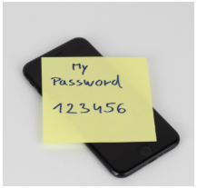

*Phone with a sticky note*

What’s the big deal about identity? Well, when the Internet was first created, all of the computers that were connecting to one another were "trusted". The number of systems was small and the people running those systems knew each other so they didn’t need mechanisms to know who was sending what data between the systems. As the number of systems on the Internet grew (and grew and grew…), that trust quickly diminished and the first of many mechanisms was added to systems to try to identify who was contacting whom. Unfortunately, the problem has never really been solved. The most common (and universally hated) system, that of user IDs and passwords, is fraught with problems. The resulting lack of certainty of who is on the other keyboard has led to the loss of billions from hacks, data breaches, identity theft, scams and more. Further, that same lack of certainty has made many types of business transactions on the Internet impossible—the risk of being fooled is just too high.

Indy, Aries and Ursa have been created to add a trust layer to the Internet using mechanisms that are easy to use, enable online trust and enhance privacy. It’s a big goal that is of vital importance to everyone on the Internet. And, it’s a goal that has recently become realizable with the advent of blockchain.

### Before You Begin

We strongly recommend that you review the course syllabus before jumping into the content. It provides the most important information related to the course, including:

  - Course overview
  - Instructors biographies and targeted audience
  - Course prerequisites and length
  - Course learning objectives and the outline
  - edX platform guidelines
  - Discussion forums, course timing, and learning aids
  - Grading, progress, and course completion
  - Professional Certificate Program Audit and verified tracks
  - The Linux Foundation's history, events, training, and certifications.

### Getting Help

For any **technical issues** with the edX platform (including login problems and issues with the Verified Certificate), please use the Help icon located on the upper right side of your screen.

One great way to interact with peers taking this course and resolving any **content-related issues** is via the Discussion Forums. These forums can be used in the following ways:

  - To introduce yourselves to your peer learners.
  - To discuss concepts, tools, and technologies presented in this course, or related to the topics discussed in the course material.
  - To ask questions about course content.
  - To share resources and ideas related to Hyperledger Indy, Aries and Ursa.

We strongly encourage you not only to ask questions, but to share with your peers opinions about the course content, as well as valuable related resources. The Discussion Forums will be reviewed periodically by the Linux Foundation staff, but it is primarily a community resource, not an 'ask the instructor' service.

> **NOTE:** Before starting a thread about your issue, we strongly encourage you to do a quick search to see if your question has already been addressed. It’s often the case that there will be one or two threads asking the same question that has been answered.

To learn more tips on how to use them, read the following article: "[Getting the Most Out of the edX Discussion Forums.](https://blog.edx.org/getting-most-out-edx-discussion-forums"

### Terminology

We use the terms blockchain, ledger, decentralized ledger technology (DLT) and decentralized ledger (DL) interchangeably in this course. While there are precise meanings of these terms in other contexts, in the context of the material covered in this course the differences are not meaningful.

For more definitions, take a look at our Glossary on The Sovrin Foundation. Special thanks to The Sovrin Foundation for the majority of these glossary definitions. The full 248 term (at last count) Sovrin Glossary can be found [here](https://sovrin.org/library/glossary/).

### Meet Your Instructors

**Stephen Curran** of Cloud Compass Computing, Inc. is a Software Development and DevOps veteran who dove full on into the identity on blockchain world in 2017. Working with the British Columbia Government, Stephen has helped define, build and launch the Verifiable Organizations Network (VON)—a production instance of the Linux Foundation's Hyperledger Indy, Aries and Ursa projects that makes public information about organizations (incorporations/legal entities) in BC available in the form of verifiable credentials. Stephen is a regular contributor in the Hyperledger Indy and Aries community, facilitating discussions and driving interoperability. Stephen has presented on Blockchain and the Hyperledger Indy and Aries projects many times and is a member of the Sovrin Foundation's Board of Trustees and Technical Governance Board.

**Carol Howard** of Cloud Compass Computing, Inc. is a technical writer with more than 14 years experience, working for both hardware and software companies writing user guides, technical references, help text, and so on. She has been helping document the BC Government initiatives (VON, Greenlight, OrgBook BC and IIWBook) and became hooked on self-sovereign identity at IIW28.

### Acknowledgements

We have many, many people to thank for this course. The first and foremost is the Linux Foundation for allowing us to share what we know about this evolving and exciting technology. In particular, thank you Flavia and Magda for your guidance and expertise in getting this course online.

We would also like to thank the developers, visionaries and change-seekers in the Hyperledger Indy, Aries and Ursa world—the people we talk to on the weekly calls and daily rocketchats, the people we meet at conferences, and the people who are driving this technology on a daily basis to make the Internet a better place. We would especially like to thank Hyperledger contributors, the Sovrin Foundation, the BC Government VON team and Evernym for their contributions to this ecosystem. A number of the images in the content are the wonderful work of Peter Stokyo.

While we have tried to be as accurate and timely as possible, these tools and libraries are changing rapidly. There are no doubt mistakes and we own them. Keeping this in mind, we have created a [change log on GitHub](https://github.com/cloudcompass/ToIPLabs/blob/master/docs/LFS172x/ChangeLog.md) to track course updates that are needed when mistakes are found in the content and when a major change or shift occurs within the Hyperledger Indy, Aries and Ursa space. If you find an error, a need for a content update, or something in one of the demos doesn’t work, please let us know via the GitHub repo.

Thank you for taking this course!

## Chapter 1: Something Is Missing

### Chapter Overview: Trust is broken on the Internet

That statement is intended to be controversial and surprising. But it’s not. Everyone knows that trust is not a part of using the Internet. We are trained to not believe what is said on the Internet, to not click links that we are unsure of, and if we want to do something really important, well, we just don’t use the Internet for that.

As the famous 1993 New Yorker cartoon goes—"[No one knows you are a dog on the Internet.](https://en.wikipedia.org/wiki/On_the_Internet,_nobody_knows_you%27re_a_dog)" It was true then, and sadly, it’s still true today. We need to fix that.

*Laptop and dog*

To ensure that the person you're talking to online is who they say they are, that what they are saying is true, and whether or not you want to trust them for some business transaction, you really have to do a thorough background investigation. Today,

  - Would you buy a house based solely on the electronic data sent to you by the seller?
  - Would a university admit a student based solely on the grades and background delivered electronically directly from the student?
  - Would you help a Nigerian prince transfer 30M$ for 30% commission based solely on unsolicited online messages?

The answer is "no way!!," right?

In this chapter, we will explore the reasons why it’s difficult to establish trust about the identity of an online contact and what they say. It doesn’t take long to gather evidence that forged documents are wreaking havoc online and off—from a man forging a police memo to get out of jail for murder in Baltimore, to a man forging ownership documents to evade taxes in British Columbia, to people forging their eligibility documents to get a COVID-19 vaccine in California—forged documents are difficult to detect and stop. Digital platforms and electronic communications, with their lack of built-in authentication, heighten the potential for misuse. We’ll look at how trust was established in the past—and why that approach no longer works. In future chapters, we’ll look at how the Hyperledger Indy, Aries and Ursa projects can change that situation by adding the missing trust layer to the Internet.

### Learning Objectives

By the end of this chapter you should:

  - Understand the basic mechanism (user ID and password) for proving your identity on the Internet and the problems it creates.
  - Understand how other attributes about you (e.g., your name, driver’s license number, address, etc.) are collected both on- and off-line and the problems these methods create.
  - Understand how Identity Providers (IdPs) can learn more about us than we want them to.
  - Be familiar with other Internet identity challenges such as unwanted correlation, data breaches and central authority issues.
  - Understand the paper credential model that we have used for thousands of years.

### Today’s Internet Identity Challenges: Interaction Creates Identifiers

When we interact in the real world, we often need to "prove" who we are. To do that, we present some evidence we have about ourselves. What we present varies based on the context of the relationship. When we meet someone socially, we introduce ourselves. When we want to open a bank account, we show documents (attributes) issued by others (driver's license, utility bill, government ID, etc.) to prove things about ourselves, such as our name, address and government ID number (e.g. SIN in Canada, SSN in the USA).

In turn, those with whom we interact create an identifier for us and check that identifier when we connect again. A person remembers our name and face, and "verifies" them on subsequent meetings ("Hi Stephen! Good to see you again!"). Our bank creates a card with an ID on it for us to use each time we go to a bank branch.

*Interaction Creates Identifiers*

The same pattern is used online, but there are a variety of problems that occur, some obvious, some a little more subtle. Let's go through them.

### Identifiers: User IDs and Passwords

The basic mechanism for knowing who you are on the Internet is the user ID and password combination. You register at a site, make a user ID and set a secret password that only you know (right?), and each time you return you use them to access your account. We all know the problems with user IDs and passwords—we deal with them every day:

  - We have too many to track.
  - Because we have so many, we often use "easy to remember" passwords that are also easy for others to guess.
  - Password recovery mechanisms (question/responses, support desks) provide avenues of attack by hackers. For example, if they know our ID and our recovery answers, they can reset our password to something only they know. This [video from CNN](https://www.cnn.com/2019/10/18/tech/reporter-hack/index.html) shows an example of collecting data about a person and then using it against them. It’s amazing—in a really bad way.
  - Data breaches occur that result in our IDs and passwords being exposed and used—either by hackers or anyone that buys them.
  - We often use the same password on many sites, and if that password gets exposed on one site, our accounts on others sites are also exposed.
 

*Today’s User ID and Password Model Has Problems!*

A common approach to solving the "too many passwords" problem is the use of Identity Providers (IdPs) such as Facebook and Google. Smaller sites use an IdP for authentication (user ID and password verification) and to get basic identity attributes such as name and email address. A problem with that approach is that each time an IdP is used, the IdP learns things about us—our habits, our interests, what sites we use and so on. Our privacy is lost.

We also need to note that while users of websites have IDs for the site, the reverse is not the case—we are not provided an ID and password for the site that we can verify each time we connect. This has enabled "phishing" techniques to become common in recent years, where users are tricked to click a link that takes them to a website that appears to be real, has a similar name, but is actually fake (for example, goog1e.com). This fools us into revealing our user ID and password and sometimes even into revealing our two-factor authentication code for the real site.

### Identity Attributes

On almost every site, we also share other identifiers to use a service—our email and name at minimum, and depending on the nature of the service, additional information (address, credit card info, etc.). With that, we can do the only common business transaction on the Internet—buy things. Buying things has a low enough risk because sellers can easily trace to whom the purchased item is delivered, which deters widespread abuse.

Conducting higher trust online transactions—such as opening a bank account—is much more difficult. We have to provide the same information about ourselves as we would in person. In theory, we should be able to just type those attributes in since they are private and (in theory) only we know them. However, much of that type of information is relatively widely known, either because it is routinely published (e.g. name and address), or because of the many data breaches that have occurred (e.g. government ID number). Even non-identifiers that are used for verification, so-called "shared secrets" such as the value of "Line 150 from your 2020 Tax Return," can be fraudulently acquired and used for targeting specific individuals.

An alternative is to do an online version of the in-person verification—scan and send the source documents. However, scans are easy to forge and as such are not trusted. We should also add that paper documents used in person are increasingly easy to forge as well. That issue is actually putting at risk the "real world" identity-proofing that we mentioned earlier. Verifiers, such as bank employees and lawyers, have to become experts at detecting the authenticity of documents used for identity proofing.

### Additional Problems

We've talked about a few problems with the current Internet identity approaches already—user IDs and passwords are hackable, and supposedly private information is too well-known to be trusted. Let’s discuss a few more problems with the current approaches.

### Additional Problems: Unwanted Correlation

The use of common identifiers on so many different sites creates what is known as a correlation problem. Correlation in this context means associating without consent information about a single identity across multiple systems. The proliferation of this kind of correlation on the Internet, driven primarily by advertising, has resulted in a massive loss of privacy for Internet users (basically, everyone). An excellent/horrible example of this was exposed by a data breach at the relatively unknown Florida company, [Exactis](https://www.marketwatch.com/story/a-new-data-breach-may-have-exposed-personal-information-of-almost-every-american-adult-2018-06-27). The breach was massive, covering almost every American and American company (340M records total). However, the content was equally shocking: more than 400 data elements per record collected from a number of sites correlating details about each person—their name, age, race, religion, size of family, etc. You can be sure that no one ever agreed to allow Exactis to collect that information. They correlated the data across many "partner" sites to collect a picture of each person that they in turn sold to anyone willing to pay.

*Common Identifiers Across Multiple Sites Causes Correlation*

Correlation is made possible because of the common identifiers we use online daily. Our email address is the single largest factor since we share it on almost every site, but there are others. Each time we use the same account name on a different site we create the possibility of correlation. When we give other identifiers about ourselves (e.g. phone number, address, government IDs, etc.), firms can correlate that data across sites. Tracking cookies placed by websites and ads enable the linking of IDs across websites. Some of the new General Data Protection Regulations (GDPR) in Europe are designed to prevent these practices for companies that do business in Europe, but not so in other places. Even then, it is a legal, not technical solution, and so remains susceptible to bad actors. In fact, even with GDPR in place, the data collection continues, as this article from the Linux Journal shows in quite shocking detail, "[If Your Privacy Is in the Hands of Others Alone, You Don’t Have Any.](https://www.linuxjournal.com/content/if-your-privacy-hands-others-alone-you-dont-have-any)"

In an attempt at preserving privacy—and because cookies are a pain—Internet browsers such as Apple Safari and Firefox block third-party cookies (those created by domains other than the one the user is visiting, and used for tracking and online-advertising purposes). However, [Google is taking a phased approach](https://blog.google/products/ads-commerce/a-more-privacy-first-web/) to third-party cookies, replacing them over time with tracking in Google Chrome that goes across the Internet, but shares back to sites only the information collected while on that site (first party data). It’s still a business model based on selling things to us, but it’s a little more transparent than 3rd party cookies!

The Identity Providers (IdPs) model is also a correlation point—although in this case, one given with consent. The IdP approach trades convenience (fewer user IDs and passwords) for correlation. Since the IdP is used for each login, the IdP can track your use of other sites and thus correlate your online activities, increasing their knowledge of you.

### Additional Problems: Data Breaches

Identity-related data is currently of particularly high value and so large data repositories of identity data are favourite targets for hackers. This includes not only user ID and password data to enable unauthorized access to accounts, but also all of the other information we use to "prove" our identity online such as name, email address, government ID and so on. As noted, the availability of this supposedly private data makes the online use of such data impossible for high-value interactions because of the risk that the person typing the data is not its owner.

### Additional Problems: Centralized Identifiers

The vast majority of identifiers we use today are centralized—the identifiers are provided to us and maintained by a centralized entity. That might be the government in the case of our tax ID and driver's license, or a company for an ID we use to log into a website. A major problem with this approach is that the central authority can choose to take away that identifier at any time. This is of particular concern for those in a minority situation—a critic of a central entity, be it a government suppressing its people, or a private company.

A second concern with central authorities controlling identifiers is that if they are compromised in some way, those identifiers can be used in malicious ways. For example, a [hack of a Dutch Certificate Authority](https://en.wikipedia.org/wiki/DigiNotar) (manager of Secure Socket Layer Encryption Certificates) allowed supposedly secure encrypted data going across the Internet to be intercepted and accessed by hackers. Further, since the identifiers are held in a central place, if that repository is compromised, it impacts many people.

### The Paper Credential Model (450BC-1970AD)

Let’s talk about what have we done in the real world for identity. As far back as 450BC, we have used paper credentials to enable trusted identity. Legend has it that King Artixerxes of the Persian Empire signed and gave Nehemiah a paper "safe transit" authorization to travel across Persia. People have been using such documents ever since. However, starting around 1970, with the widespread use of corporate/personal printers and copiers, forging these paper documents became easy. And trying to use paper credentials on the Internet is even worse because they are even easier to forge—all you need is Photoshop—you don’t even need a printer. So while paper credentials may not help us in the digital age, let’s look at the attributes of paper credentials and what made them useful for so many years.

A **credential** is an attestation of qualification, competence, or authority issued to an entity (e.g., an individual or organization) by a third party with a relevant or de facto authority or assumed competence to do so. Examples of credentials issued to people include a driver’s license, a passport, an academic degree, and so on. Credentials are also issued to companies, such as business registrations, building permits, and even health inspection certifications.

A typical paper credential, say a driver’s license, is issued by a government authority (an **issuer**) after you prove to them who you are (usually in person using your passport or birth certificate) and that you are qualified to drive. You then hold this credential (usually in your wallet) and can use it elsewhere whenever you want—for example, to rent a car, to open a bank account or in a bar to show that you are old enough to drink. When you do that, you're **proving** (or **presenting**) the credential to the verifier. The verifier inspects the physical document to decide if it is valid for the business purpose at hand. Note that in verifying the paper credential, the verifier does not call the issuer of the document. The transaction is only between the holder and the verifier. Further, it is the holder’s choice whether they want to share the piece of paper. If they want, they can keep it to themselves. That’s the **paper credential model**.

*The Paper Credential Model*

The paper credential model (ideally) **proves**:

  - Who issued the credential.
  - Who holds the credential.
  - The claims have not been altered.

The caveat "ideally" is included because of the possibility of forgery in the use of paper credentials. As many university students know, it’s pretty easy to get a fake driver’s license that can be used when needed to "prove" those same things.

At the time this course is being updated (April 2021) vaccines for COVID-19 are rolling out around the globe, and calls for a trusted “proof of vaccination” document are gaining momentum. The decades old World Health Organization Yellow Card/Carte Jaune is the current standard, but it is insufficient for a 21st century pandemic. While a COVID-19 vaccine certificate could enable travel and the ability to get back to a more “normal” life, relying on a handwritten, paper document is insufficient to provide the necessary trust. They are just too easy to forge, as we have seen from the many stories in the press about scammers selling and people buying fake COVID-19 test results and proof of vaccination certificates.

*Easily Forged Proof of Vaccination Record*

Further, the motivation to forge the documents is higher than situations we have seen in the past. For example, combine a desire/need to travel with the need for unavailable proof of vaccinations (or proof of a recent negative test) and a new, basic and high volume, paper-based verification process, and you have a situation ripe for fraud. And, the ramification of fraud in this case is significant. Worst case is you have people travelling that shouldn’t be, increasing instances of COVID-19 and extending the pandemic. Further, a lack of trust in the safety of travel will prevent many from doing so, suppressing the economic recovery of the travel industry as we come out of the pandemic.

### Risk Mitigation

In the paper credential model we’ve just discussed, we’ve talked about trust a lot (15 times so far!). In fact, with paper (and especially on the Internet), there really is not a lot of trust. Rather, those receiving data (verifiers in our model) are forced to take actions to mitigate their risk because of that lack of trust, actions to reduce the likelihood that the documents being collected are forged or that the information provided is false. In this section, we’ll talk about how that risk has been mitigated in the paper world. In later chapters of the course, we’ll talk about new ways to mitigate these risks automatically—making sharing information on the Internet a lot easier for everyone! Well—easier for everyone that’s not trying to scam others!

### Trusting the Holder/Prover

When the verifier receives information in the form of paper documents, scanned images or data typed into a web form, the verifier has several ways to mitigate their risk:

  - The easiest scenario for the verifier is that the holder of the data is motivated to only present valid information because they are likely to be caught if they don’t. Buying insurance based on false information such that the insurance is invalid when needed is a pretty strong motivation to provide accurate information.
  - Some verifiers mitigate the risk by building the cost of receiving false data into the cost of doing business, increasing their prices to cover their losses.
  - Where paper credentials are involved, the verifier can inspect the documents to see if they look forged. That is reasonably effective for money, passports and drivers licenses, where special technologies are used, but much less so with most other documents.
  - Another tactic that verifiers commonly use is to over-collect data—collect more data than is actually needed to make it harder to “forge it all.” For example, requiring multiple pieces of identification for a person.

Each of these techniques come at a cost for both the holder and the verifier. For the holder it takes longer to complete the transaction, often requiring an in-person visit, and they must turn over more information than should be required. For the verifiers, the cost of completing a transaction goes up (especially if an in-person visit is required), customers may drop out of the process, their staff need to be experts in document inspection, and there may be other costs in correlating the extra data collected. Further, their IT costs may increase because of the need to protect extra customer data. As we’ll see in this course, this problem gets a lot easier with the technologies we’re going to be talking about.

### Trusting the Issuer

For the most part when using paper credentials, the verifier's risk is focused on the holder—the person presenting the information. However, there is a second risk—whether or not the issuer of the paper is a valid authority of the data being presented. While a verifier that believes a passport is not forged can be pretty certain that the country of issue can be trusted, what about the transcripts issued by a university that the verifier has never heard of? For the most part, verifiers address this problem wherever possible by only accepting documents from issuers they know, such as accepting a “proof of address” through the presentation of a bill from a known local utility company.

What we will also see in this course is that while the “trust the holder” problem gets a lot easier, the issue of knowing whether or not to trust the issuer remains about the same, although with a few new twists and tools.

### Summary

So where does that leave us? These are important points and we’ll come back to these throughout the rest of the course.

  - User IDs/passwords are the norm, but they are a pain to use, and as a result, are susceptible to attack. They are the best we have right now, but not a solid basis for trust. Further, IDs work only one way—users don’t get an ID from a service they are using.
 
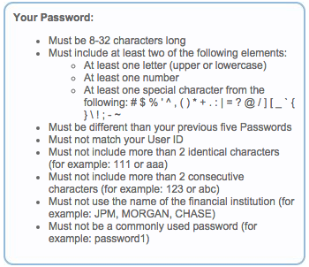

*User ID and Passwords Are a Pain to User*

  - Other personal information and identifiers we have that we could otherwise use to prove our identity are not trusted because it's impossible to tell if the data was actually issued to the person entering it. The many breaches of private identifiers make them impossible to completely trust (even in person), and verifying that information adds (sometimes significant) costs.
  - Since the identity attributes we could use are not trusted (they are not things only we know), we often have to resort to in-person delivery of paper documents to prove things about ourselves, adding costs for all participants.
  - Reviewers of the paper documents we present must become experts in the state of the art in forging and falsifying paper documents, a difficult role in which to be placed.
  - Verifiers must add costly techniques to mitigate their risks in accepting untrusted data from holders.
  - The identifiers we use are correlated across sites, allowing inferences to be made about us, and exposing information we don't intend to be widely shared. This is annoying at the least, and can have catastrophic results.
  - Centralized repositories of identifiers and data about the people associated with those identifiers are targeted by hackers because the data has high value. This exacerbates the problem of not being able to trust "personal" data presented online.
  - Centralized identifiers can be abused by those who control those identifiers. For example, they can be taken away from a subject without due process.

In the next chapter, we’ll look at how Hyperledger Indy, Aries and Ursa enable the same credential model as with paper, but one that is useful in person and online using an approach called the verifiable credentials model.

## Chapter 2: Adding a Layer of Trust to the Internet

### Introduction: Chapter Overview

How do we fix the issue of trust on the Internet? In the last chapter, we talked about a number of challenges with the current state of identity on the Internet. In this chapter, we’ll talk about solutions that are becoming available that will add that missing layer of trust. To do that, we will move from paper credentials discussed in the last chapter to verifiable credentials—credentials we can use (and trust!) online. We will also introduce the important concepts of self-sovereign identity (SSI) and trust over IP (ToIP). Lastly, we will explore the technology that enables verifiable credentials (for example, decentralized identifiers (DIDs) and agents), and how all of this together makes the Internet a much more trusted place.

### Learning Objectives

By the end of this chapter you should:

  - Understand how the verifiable credentials model works.
  - Be familiar with the core concepts of self-sovereign identity and the aspects of Indy, Aries and Ursa architecture that enable SSI.
  - Know what the term "trust over IP" means.
  - Know what a DID is and does.
  - Be familiar with the term zero-knowledge proof (ZKP) and selective disclosure.
  - Understand why blockchain is important for self-sovereign identity.

### The Verifiable Credentials (VC) Model

As we talked about in Chapter 1, a credential is (formally) an attestation of qualification, competence, or authority issued to an entity by a third party with a relevant or de facto authority or assumed competence to do so. Examples of paper versions of credentials are a driver’s license, passport and university degree. What if we could get credentials from the same sources as our paper credentials and use them online in a fully trusted manner both for the holder of the credential and the person or organization verifying the credential? Something digital that we can trust way more than just a scan of a piece of paper.

The Hyperledger projects, Indy, Aries and Ursa, which we will talk about in upcoming chapters, are tools and libraries that allow for the development of independent digital identities rooted on blockchains or other distributed ledgers. They help bring about the possibility of building applications with a solid digital foundation of trust by enabling the **verifiable credentials model**. 

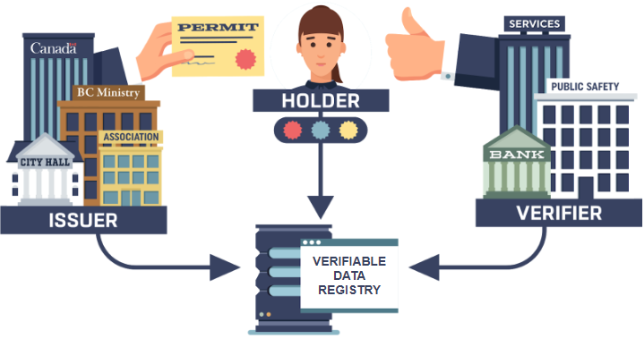

*The Verifiable Credentials Model*

For identity, verifiable credentials are digital, cryptographically-protected data from authorities that you can use to prove you are you! With Indy, the data can be used by their holder to generate privacy-preserving cryptographic zero-knowledge proofs (ZKPs—we will talk about these shortly) that can be checked by a verifier.

> **NOTE:** For the more technically inclined, credentials are JSON docs, constructed and cryptographically signed by an issuer and countersigned by the holder.

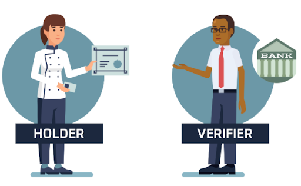

*A Holder Will Generate a Presentation that Will Be Checked By Verifier*

### Verifiable Credentials (2)

Referring to the following illustration from the World Wide Web Consortium (W3C), there is an **issuer**, a **holder** and a **verifier**, just like in the paper credentials model. Unlike the paper credential model, which depends on the skill of the verifier to recognize an altered or forged credential, the verifiable credentials model includes a **verifiable data registry**—containing cryptographic keys and identifiers—that enables the proving of the data. That’s the blockchain part of verifiable credentials.

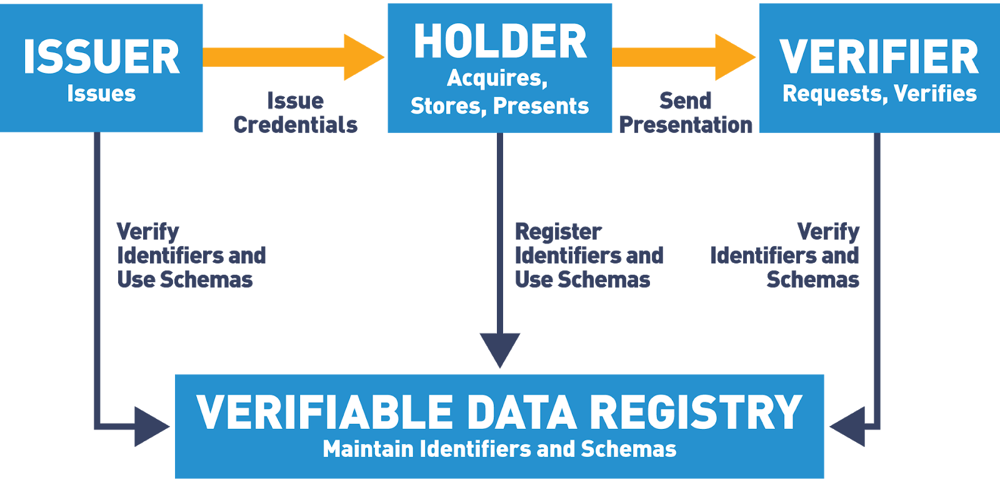

*The W3C Verifiable Credentials Model*

Compared to the paper credentials model that we talked about in the last chapter, verifiable credentials are far more secure. The verifier is not a person trying to identify a forged document. Instead, if the cryptographic verification succeeds, the verifier can be certain of the validity of the data—those same three attributes proven when verifying a paper credential. That means that the problem of whether the verifier trusts the holder more or less goes away. The holder cannot forge the cryptography protecting the verifiable credentials and so the data acquired can be accepted without further concern.

However, there does remain a challenge with a verifiable credential—and it's actually the same thing with a paper credential:

*Do you trust the issuer and the process by which the issuer decided to issue the credential?*

To trust the information in a credential, it is necessary that the verifier trust the issuer and that the issuer’s processes are carried out with integrity. For an official government-issued identity document (driver’s license, passport, etc.) that might be an easy decision. In many cases, the verifier will require the holder to present credentials only from issuers known to the verifier.

But what about use cases when the issuers may be from anywhere in the world, such as a university transcript? For example, when you get a verifiable presentation from Faber College that says Alice has received a degree and you verify the presentation, you will know that Faber did indeed issue the credential to Alice, that Alice did not tamper with it and it’s not been revoked. But is Faber College an authorized (and by whom?) degree-issuing entity or an unregulated diploma mill? Does it show that Alice legitimately earned her degree or did she pay $100 to be issued that degree? These same questions come up with both paper and verifiable credentials. However, with verifiable credentials some interesting options become available for automating the research into the “should we trust the issuer?” question.

### Credentials and Claims/Proofs and Presentations

You probably noticed that in the previous sections we used the terms **credential** and **claim** seemingly interchangeably. Actually, we were quite intentional about it. Claims are assertions about a person (or business).

For example:

  - "The name of the holder is Bob. He was born on June 18, 2000"

or,

  - "Cloud Compass Computing was incorporated in 2011."

A credential is made up of a set of individual claims. For example, in the case of a driver’s license, the claims would be a person’s name, address, height, weight, hair color, driver’s license number and so on.

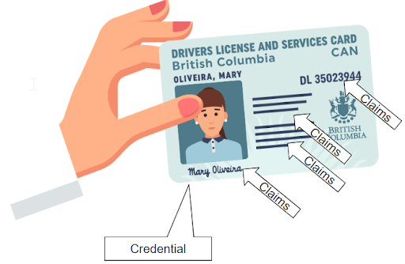

*Claims versus Credential*

In all uses of a verifiable credential, what is issued is a credential. However, in some implementations, when a credential is presented the credential is proven, while in others (including in Hyperledger Indy), the claims within the credential are proven individually. As we’ll see shortly when we talk about selective disclosure, this subtle difference can be quite important!

Another pair of terms that might seem to be used interchangeably are **proof** and **presentation**. A proof is evidence of the claim (for example, a birth certificate, passport or driver’s license, or in the case of a business, incorporation papers). In the early days of Indy, the term “proof” was used when talking about a verifier requesting verifiable (signed) claims from a holder and the holder providing those claims to the verifier. Presentation was selected for essentially the same thing by the W3C Credentials Community Group and is used in the W3C Verifiable Credentials data model specification. This was done because in the W3C verifiable credential data model, “proof” is a more generic term for the cryptographic **signatures** across any data—for example, the data in a credential or in a presentation.

As such, we mostly use “presentation” in this course to refer to the verifiable data received by a verifier from a holder. However, at times we may use “proof” as well. For example, we’ll often use the phrase “present a proof,” which sounds a little better than “present a presentation.” For developers, recognizing both terms in context is important because the underlying Indy and Aries source code uses both terms as well.

### Uses and Impact of Verifiable Credentials

So what does the availability of verifiable credentials mean? Well, in the past, you have probably shared identity attributes online as text (such as your name, address or government ID) or perhaps shared a paper credential you were given by scanning it and uploading it to an online service. Verifiable credentials are very different because of the cryptography used to secure the data such that once verified, the information can be trusted to be authentic. That is really powerful!

For example:

  - Instead of typing in your name, address and government ID, you provide a presentation of that information from verifiable credentials issued to you by an authority trusted by the verifier. This saves you typing in the data, and the verifier can automatically accept the claims in the presentation (if they trust the issuer) without any further checking, saving them money and time.
  - Anyone that knows your government ID (the string of numbers) would not be able to impersonate you on a site that checks verifiable credentials because the information they have does not come from a verifiable credential issued by the government.
  - A doctor can be issued a professional accreditation credential from the relevant authority (e.g., the College of Physicians and Surgeons) and the claims verified (and trusted) by medical facilities in real-time. Should the doctor lose his or her accreditation, the credential can be revoked, which would be immediately in effect. This would hold true for any credentialled profession be it lawyers, engineers, nurses, tradespeople, real estate agents and so on.

Since this course was first introduced in November 2019, the world has changed. A global pandemic—and the ensuing rollout of vaccines—has introduced the idea of people being able to prove they have been vaccinated as a way to once again be able to travel, attend a concert, etc. A secure, digital record issued by a known authority that verifies that someone has been vaccinated is appealing, but not without its risks in the areas of equity, privacy and security. Enabling citizens to prove their vaccination status in a privacy preserving, secure manner, without revealing any more data than is necessary—such as can be done with verifiable credentials—substantially reduces that risk. As a result, the “proof of vaccination” use case has brought the idea of verifiable credentials into the mainstream. We will discuss this use case in several sections of the course.

The verifiable credential model has other important ramifications:

  - Your verifiable credentials are issued to you, stored in your digital wallet, and you decide when and where you want to use them. That improves your privacy—you are in control of when and with whom you share your information.
  - Verifiable presentation data is proven without needing to call back to the issuer. Just as when you use your driver’s license to prove your age without a call back to the government, there is no need to call back to the government when you use the verifiable credential version of your driver’s license.
    - Instead of getting the data directly from the issuer, the data from the issuer comes from the holder, and the cryptographic material to verify the authenticity of the data comes from the blockchain.
    - This reduces the number of integrations that have to be implemented between issuers and verifiers. Imagine if every company needed to integrate with every degree-issuing institution to see if a job applicant’s claim of a degree was valid? That’s a lot of interfaces to be built!
  - Verifiable credentials go beyond identity to enable the digitization of almost any paper-based verification process. For example, regulatory processes that are currently implemented with paper submissions that are manually verified can be reworked to use verifiable credentials that provide authenticity (supposedly) achieved with paper through human review, using data that can be processed automatically.

### Paper Verifiable Credentials

So far, we’ve talked about paper credentials (a physical driver’s license or passport) and also about new verifiable credentials (that you store in your digital wallet). The race for a credential related to being able to prove receipt of a COVID-19 vaccination or negative test has led to the idea of a “paper verifiable credential.” While digital credentials are appealing, there will be in every nation a proportion of the population that does not have access to digital tools such as a smartphone. To empower that population, one idea that has been proposed is to use a W3C standard verifiable credential in a form that can be printed onto a piece of paper that it is impossible to forge. Photoshop will not help you make your own Dark Web “proof of vaccination” verifiable credential!

VCs on paper can be done in a couple of ways. If possible, the credential is embedded into a QR code to be scanned. The “if possible” comes into play because the capacity of a QR code (especially a printed one) is limited to about 400-500 bytes. Any more than that and the QR code is so dense that it can’t be read by a mobile phone camera. The density issue with QR codes is demonstrated in the image below. This restriction forces a balance between that data needed in the verifiable credential with the number of bytes in its presentation. For context, the first “sample” presentation in the W3C Verifiable Credential Specification has about 1000 characters in it **_before_** any data about the verifiable credential subject is added! There are ways to compress the number of bytes in the credential (such as using something called [Concise Binary Object Representation](https://cbor.io/), or CBOR), so it is possible, but the amount of data is still limited.

*QR codes*

QR Codes, one with the URL of this course (114 characters),
the second with the text of the next paragraph (332 characters)

Alternatively, the QR code can contain just a URL to a web service that in turns returns the presentation. This gets around the size of the presentation issue, but there are drawbacks, including that the URL must be unique per credential, and the issuer of the credential knows each time a credential is used. Those issues can be mitigated, but they must be considered in any implementation.

There are also privacy trade-offs in using paper verifiable credentials. The primary concern is that verifiers of paper credentials get a machine-read, unique identifier for the credential, and hence, a globally unique identifier for the person presenting the credential. This is a correlating identifier that verfiers can use in the same way that surveillance tracking is done in browsers. Further, if personal information is included in the credential (especially if it is also printed in text), anyone finding such a document can see that data—a more likely scenario for a “one-time use” piece of paper than for something with known ongoing value such as a passport. A solution to that is to include only partially identifying data (e.g., part of the name or date of birth) such that there is enough to bind the holder to another document (e.g., a passport), but not enough to uniquely identify the person if the document is lost.

Paper verifiable credentials to eliminate forged documents without requiring everyone to use a smart device is an appealing approach—but the privacy implications must be kept in mind. Further, since the “presentation” of the verifiable credential is fixed at the time it is issued, there is no way to use selective disclosure, or for the verifier to ask for anything other than what the holder has on paper. So, while some of the verifiable credential capabilities are possible, a lot of the power is lost.

### Self-Sovereign Identity (SSI): What Is Self-Sovereign Identity?

Self-sovereign identity (SSI) is a term you may have heard in connection with the Hyperledger identity projects, Indy, Aries and Ursa. Together, these Hyperledger capabilities can be the basis for accomplishing SSI. So what is SSI—and what isn’t?

*There is No Central Authority with SSI*

SSI is the idea that you control your own data, you control when and how it is provided to others, and when it is shared, it is done so in a trusted way. With SSI, there is no central authority holding your data that passes it on to others upon request. And because of the underlying cryptography and blockchain technology, SSI means that you can present claims about your identity and others can verify it with cryptographic certainty.

SSI is not about you self-asserting information about yourself and demanding that everyone else accept it as fact. Recall that the verifiable credentials you receive and present to verifiers come from others and their usefulness relies on the trust verifiers have in the credential issuers. If you want, you can issue credentials to yourself ("I am the Queen of England"), but verifiers might not trust you as an issuer.

Drummond Reed, identity guru and Founding Trustee of the Sovrin Foundation, describes self-sovereign identity as:

*"Lifetime portable identity for any person, organization, or thing that does not depend on any centralized authority and can never be taken away."*

Sounds like something to strive for, doesn’t it?

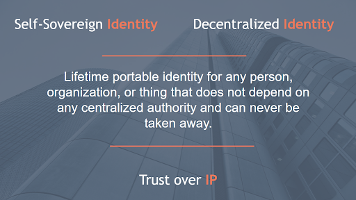

*Self-Sovereign Identity Definition by Drummond Reed*

### The Principles of SSI

The Sovrin Foundation is a private-sector, international non-profit that was established to govern and operate the Sovrin Identity Network, a public, permissioned distributed ledger purpose built (based on Hyperledger Indy) for identity. The mission of the Sovrin Foundation is to create the Internet’s long-missing trust layer and provide a global public utility for digital identity to people, organizations, and things. In addition to the mechanics of operating a global instance of Hyperledger Indy, Sovrin has brought together many leaders and deep thinkers from the self-sovereign identity community to collaborate on a series of foundational principles and governance and glossary documents. From that work, the Sovrin Foundation has published these [12 principles of self-sovereign identity](https://sovrin.org/principles-of-ssi/):

| Principle | What It Means |
| --- | --- |
| Representation | An SSI ecosystem shall provide the means for any entity—human, legal, natural, physical or digital—to be represented by any number of digital identities. |
| Interoperability | An SSI ecosystem shall enable digital identity data for an entity to be represented, exchanged, secured, protected, and verified interoperably using open, public, and royalty-free standards. |
| Decentralization | An SSI ecosystem shall not require reliance on a centralized system to represent, control, or verify an entity’s digital identity data. |
| Control & Agency | An SSI ecosystem shall empower entities who have natural, human, or legal rights in relation to their identity (“Identity Rights Holders”) to control usage of their digital identity data and exert this control by employing and/or delegating to agents and guardians of their choice, including individuals, organizations, devices, and software. |
| Participation | An SSI ecosystem shall not require an identity rights holder to participate. |
| Equity and Inclusion | An SSI ecosystem shall not exclude or discriminate against identity rights holders within its governance scope. |
| Usability, Accessibility, and Consistency | An SSI ecosystem shall maximize usability and accessibility of agents and other SSI components for identity rights holders, including consistency of user experience. |
| Portability | An SSI ecosystem shall not restrict the ability of identity rights holders to move or transfer a copy of their digital identity data to the agents or systems of their choice. |
| Security | An SSI ecosystem shall empower identity rights holders to secure their digital identity data at rest and in motion, to control their own identifiers and encryption keys, and to employ end-to-end encryption for all interactions. |
| Verifiability and Authenticity | An SSI ecosystem shall empower identity rights holders to provide verifiable proof of the authenticity of their digital identity data. |
| Privacy and Minimal Disclosure | An SSI ecosystem shall empower identity rights holders to protect the privacy of their digital identity data and to share the minimum digital identity data required for any particular interaction. |
| Transparency | An SSI ecosystem shall empower identity rights holders and all other stakeholders to easily access and verify information necessary to understand the incentives, rules, policies, and algorithms under which agents and other components of SSI ecosystems operate. |
 
A number of these principles are technical in nature and are enabled by Indy, Aries and Ursa. Some are about how those technical projects are managed—for example, transparency by using open source software based on well-defined standards. Others are about how the technology is used, and while Indy, Aries and Ursa focus on making it easy for entities to implement SSI solutions, governance—such as the European Union’s General Data Protection Regulation (GDPR)—is still necessary.

### Decentralized Identifiers (DIDs): What Are Decentralized Identifiers?

While verifiable credentials are an important component of SSI, a thing called a **decentralized identifier** (DID) is a key enabler for verifiable credentials. DIDs are a new type of identifier that is in the process of becoming a World Wide Web Consortium (W3C) [standard](https://www.w3.org/2019/did-wg/). As we discussed, the verifiable credential model requires a decentralized ecosystem in order to work. Such an ecosystem is brought about with DIDs and agents (discussed further in the chapter).

DIDs are a special kind of identifier that are created by their owner, independent of any central authority. Per the [DID specification](https://w3c.github.io/did-spec/), a DID looks like the following and is similar to an HTTP address but used differently.

### What does a DID look like?

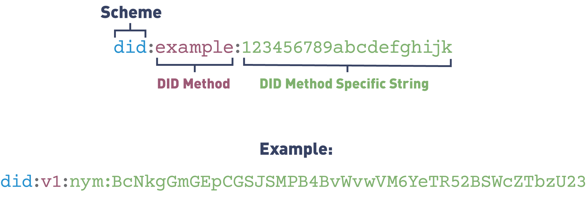

*An Example of a DID Updated*

> **NOTE:** This section gets a little technical, but don’t worry, we’ll go through this and then come back to what DIDs mean from a business perspective.

DIDs are:

- A new type of uniform resource identifier (URI).
- Created by anyone at any time.
-  Globally unique.
- Highly available.
- Cryptographically verifiable.

What does all that mean? Let’s go through each of those attributes in turn:

- Like the URLs (universal resource locator) that we are familiar with (such as the one for this web page that is in the address field of your browser), DIDs can be resolved. When we pass a valid DID to a piece of software called a DID Resolver, it works like a browser given a URL, resolving the identifier (URL or DID) and returning a document. However, instead of a browser returning a web page, a **DID Resolver** returns a **DID Document** (DIDDoc). A DIDDoc is a JSON document whose format is defined in the DID specification. We’ll talk about the elements of a DIDDoc in a moment. A
- DID can be created by anyone, not just a central service such as a Certificate Authority (CA). People, organizations and things can all create, publish and share DIDs. Further, at any time, the controller of the DID (usually the creator) can update the DID—change the DIDDoc that is returned when resolving the DID. That ability can be important in certain situations.
- That DIDs are globally unique means that properly generated, each DID is unique across the globe. The “properly generated” caveat means that if you follow the rules for creating a specific type of DID, it will be globally unique. That’s the type of detail that Hyperledger Indy takes care of for you.
- Highly available means that DIDs can be resolved even if some servers are down. Since DIDs are often resolved by reading from a blockchain, and there can be many copies of a given blockchain on servers across the world, DIDs are highly available. Put another way, DIDs are not susceptible to a central implementation with a single source of failure.
- Cryptographically verified means that the control of a DID can be verified by asking the DID controller (the person, organization or thing that created the DID) to prove their control over the DID by having them prove control of a private key that is related to a public key.

This last point brings us to what is in the DIDDoc. Notably, a DIDDoc contains (usually) public keys whose private keys are held by the entity that controls the DID, and (usually) service endpoints that enable communication with that entity. This means that with a DID, you can:

- Resolve a DID to get a DIDDoc.
- Within the DIDDoc, find a public key and an endpoint for the entity that controls the DID.
- Use the endpoint to send a message to that entity.
- In the message, ask them for proof they have the private key related to the public key.
  - Since often a public key in the DIDDoc is used to encrypt the message sent, just being able to respond to the message is “proof” of control of the DID. Without the private key they could not have decrypted the message.
  - What the sent message might ask is that the controller of the DID provide a verifiable credential presentation.
- Receive back the proof.
- Verify that proof.

### DIDs from a Business Perspective

OK, we’ve seen technically what DIDs are, but why do we care? There are several characteristics of DIDs that are crucial from an SSI and verifiable credentials perspective.

### DIDs from a Business Perspective: User Control

DIDs are identifiers that you create and share under your control, which is a core tenant of SSI. Most identifiers that you use today are created or controlled by someone else:

  - your government ID
  - your phone number or email address
  - your account at a particular website.

If a central authority decides to take that identification away from you, they can remove your ability to use it. Since you created a DID and hold the private key(s) for it, only you can “delete” the DID. A DID (and DIDDoc) on a blockchain can never be removed, so “deleting” a DID really means no longer responding to requests for proof of control of the DID. Technically, you can update the DIDDoc to delete the public key(s), but assuming earlier versions of the DIDDoc are on a blockchain, those earlier versions are still available.

### DIDs from a Business Perspective: Provable

There are no easy, trusted ways for you to prove your control over commonly used identifiers today. From the list of identifiers above, the only ones that you are commonly asked to prove control over are your email address and phone number, and those have become prime targets for hackers, often by attacking the central authority that gave you the identifier. The association of public/private keypairs with a DID makes ongoing proof of control trivial.

As we’ve talked about, one of the attributes proven with a verifiable credential presentation is the identity of the issuer. In fact, what is proven is just the public DID of the issuer and, because of the characteristics of DIDs, that’s enough. Using the DID, the verifier can retrieve the DIDDoc and public keys to verify signatures and (if necessary) connect to the issuer and get information about who the issuer is, such as (likely using verifiable credentials) their authority to issue credentials.

### DIDs from a Business Perspective: Non-Correlatable

One of the problems with the common identifiers that we use today is that it is often necessary to reuse them. On almost every site we visit, we provide an email address so that the site can send us notifications. That means that many sites can share information about us just by correlating our email address. Since we create our own DIDs and choose how we want to share them, we needn’t have just one DID, but rather one DID for every service to which we connect. The expectation is that you will have many DIDs—one for each relationship you have on the Internet. Note that both sides of a relationship provide a DID for the other to use to communicate with them, as shown below.

*DID Relationships*

Just as today when you first register with a site, you create an account userID and password; with DIDs, you will create and share a new DID (and DIDDoc) with the site. When you return to the site, providing the DID and proving that you control the DID are sufficient for the service to know who you are. Hey, a way to eliminate user IDs and passwords!

### DIDs from a Business Perspective: Secure Communications

As described earlier, a DIDDoc contains public keys and service endpoints for the entity that controls that DID. This enables a powerful capability: a secure, end-to-end encrypted messaging mechanism. Given a DID and its corresponding DIDDoc, an entity can encrypt a message for the controller of the DID (using the public key in the DIDDoc) and send it to the designated service endpoint. Upon receipt, the DID’s controller can decrypt (using the corresponding private key) and process the message. We’ll cover this capability a lot more in later chapters, including the fact that with this capability, there is no need to share an email address to receive notifications from a service. The service can just use the messaging capability inherent in DID communications.

### DIDs from a Business Perspective: Public Versus Private DIDs

Let’s look at the types of DIDs for a minute because there are important differences between public and private (pairwise) DIDs.

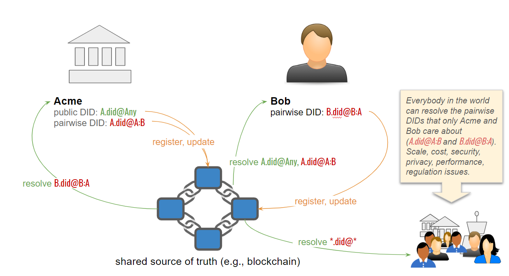

*Public DID*

This [demonstration](https://github.com/cloudcompass/ToIPLabs/blob/master/docs/LFS172x/PublicAndPrivateDIDs.md) goes over the following information about public and private DIDs. The pictures are a bit complicated!

A **public DID** is one that is intended to be widely available—visible to anyone that is presented with the DID. Since anyone can both resolve the DID and contact the owner, if the DID is used many times, it is correlatable. In this case, correlation isn’t a bad thing. A company or government, for example, will often use public DIDs. A prime example of a public DID is the DID of a verifiable credential issuer. Since the holder of the credential may present the credential to anyone, the identity (via the public DID) of the issuer must be part of what the verifier learns from the presentation. That way, the verifier can investigate (as necessary) to decide if they trust the issuer. Public DIDs are usually put on blockchains so that they can be globally resolved.

On the other hand, an important use case of DIDs is that they enable two (or several) parties to connect with one another. In this case, it’s not important that everyone in the world be able to resolve the DIDs for the parties—just the parties themselves—and **private DIDs** (often called **pairwise DIDs**) are used. Instead of publishing the DIDs on the blockchain for anyone in the world to see, the entities create the DIDs and DIDDocs and then send both directly to the other party(ies) to hold. If they need to update the DID, such as to change the endpoint, the update is sent directly to the other party(ies) to update their copy of the data. No one other than the parties involved can see or resolve the DIDs.

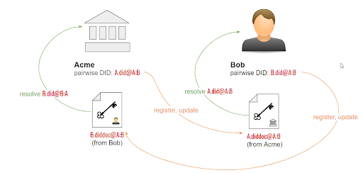

*Private DID*

Why are private DIDs important? There are two reasons:

  - First, since the DIDs are only intended for use by a small, specific group (usually just two), the DIDs are not shared beyond that group.
  - Second, writing to a blockchain is expensive and by not writing DIDs that don’t have to be public to the blockchain, the costs (resources, time, transaction fees) are reduced.

Happily, private DIDs far (far) outnumber the DIDs of verifiable credential issuers and as a result, the l`oad on `a public blockchain serving DIDs is massively reduced.

In the Aries section of the course, we’ll learn about the DID method called “`did:peer,`” which defines the mechanism for sharing and using private, pairwise DIDs.

### DIDs and Verifiable Credentials

Let’s come back to cover how DIDs are used, including how DIDs are used with verifiable credentials. It’s not always clear!

First, in an Aries ecosystem of issuers, holder/provers and verifiers, DIDs are used to establish secure, point-to-point messaging channels between the agents of the participants. In this use of DIDs, there are no verifiable credentials involved, just messages encrypted and sent to participants using the information in the DIDDocs (notably, public keys and endpoints) to allow a sender to encrypt (using the recipient’s public key) a message to the recipient and send it (using the recipient’s endpoint). The recipient must have the associated private key to decrypt and process the message.

Second, with a verifiable credential, DIDs are used as the identifier for the issuer. The issuer DID is used to uniquely identify the issuer and is resolved to get a public key related to the DID. That public key is then used to verify the data in the verifiable credential did indeed come from the issuer—to check the cryptographic signature using the public key of the DID.

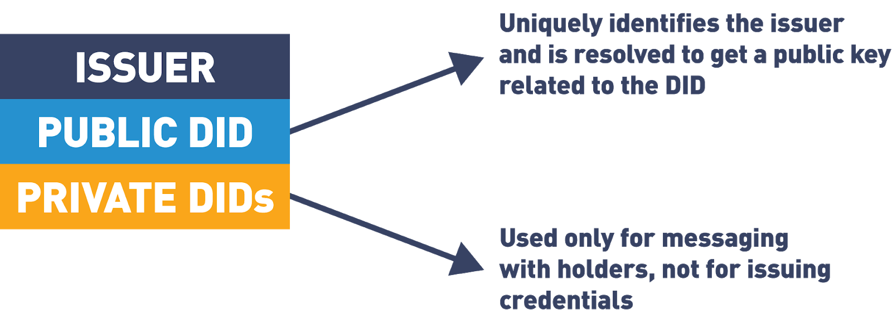

*Uses for Public and Private DIDs*

> **NOTE:** To reiterate, all participants have private pairwise DIDs for messaging. In addition, issuer’s have a public DID that is with the verifiable credentials they issue to holders. That DID ensures the verifier knows who issued the credential a holder presents.

### Zero-Knowledge Proof (ZKP) and Selective Disclosure

**Zero-Knowledge Proof**

A [zero-knowledge proof](https://en.wikipedia.org/wiki/Zero-knowledge_proof) (ZKP) is about proving attributes about an entity (a person, organization or thing) without exposing a correlatable identifier about that entity. Formally, it’s about presenting claims from verifiable credentials without exposing the key (and hence a unique identifier) of the proving party to the verifier. A ZKP still exposes the data asked for (which could uniquely identify the prover), but does so in a way that proves the prover possesses the issued verifiable credential while preventing multiple verifiers from correlating the prover’s identity. Indy, based on underlying Ursa cryptography, implements ZKP support. This approach is called **Anonymous Credentials (AnonCreds)**.

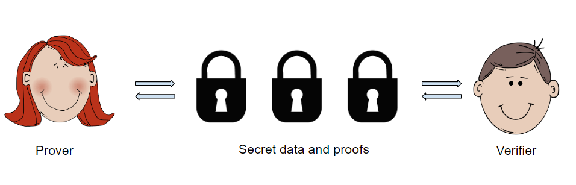

*ZKPs*

There are other types of verifiable credentials that do not use a ZKP-based approach. In a non-ZKP proof, the holder/prover proves control over a DID to an issuer and the issuer embeds that DID in the issued credential. Later, a verifier extracts that DID from a presentation of the credential and has the holder/prover prove they (still) control that DID. This proves the credential was issued to the holder. Thus, a non-ZKP proof includes a public DID for the issuer (like the Indy ZKP model) and a public DID for the holder/prover (unlike Indy). Usually in the non-ZKP model, the entire credential (with the embedded DIDs) is cryptographically signed by the issuer (proving the claims and the DIDs).

> **NOTE:** In the non-ZKP model, the DID of the holder/prover is included in the credential and hence any verifiers of the credential know a common, globally unique identifier for the holder/prover, which is a privacy concern as it is a point of correlation.

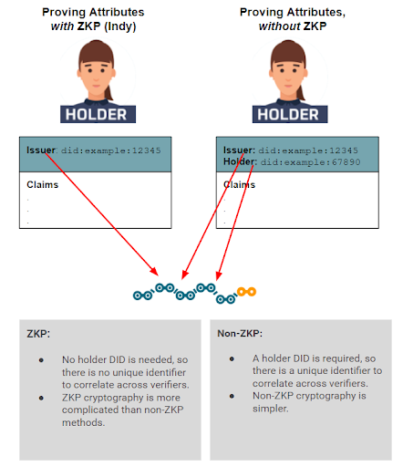

*The Indy Anonymous Credentials (AnonCreds) ZKP versus Non-ZKP Approach*

**Selective Disclosure**

The Indy AnonCreds ZKP model enables some additional capabilities beyond most non-ZKP implementations. Specifically, that claims from verifiable credentials can be selectively disclosed, meaning that just some data elements from credentials, even across credentials can (and should be) provided in a single presentation. By providing them in a single presentation, the verifier knows that all of the credentials were issued to the same entity. In addition, a piece of cryptography magic that is part of ZKP (that we won’t detail here—but it’s fascinating) allows proving pieces of information without presenting the underlying data.

A useful example of both selective disclosure and a ZKP supported in Indy AnonCreds is a proof that a person is older than a given age based on the date of birth in a verifiable credential driver’s license without disclosing any other information, including name or date of birth. The image below demonstrates how that might look in an SSI-enabled app at a pub.

*An Example of Selective Disclosure*

The verifier (a bartender) can confirm:

  - The issuer is the appropriate authority.
  - The picture shows the same person presenting the verifiable credential.
  - The person is old enough to drink in the pub (the check mark).
  - The credential has not been revoked.

That information is proven ***without*** the person having to reveal their personal information (address, eye color, etc.), or even their date of birth.

Combined, ZKPs and selective disclosure enable a massive reduction in the data exposed during an identifying process. By not revealing a correlating identifier, and using selective disclosure to only expose the data needed for a transaction—including being able to prove possession of a credential without disclosing any information from the credential at all—is an important step in being able to keep private data private.

It is important to remember that ZKPs are not a panacea for privacy. For any business transaction, the verifier must collect enough information from the prover as to mitigate their risk for the given transaction. That may mean requesting enough claim data to uniquely identify the prover. For example, the verifier may be required by government regulations to collect identifying information about the prover for auditing purposes. Selective disclosure enables verifiers to be much more precise in collecting that data than existing technology, but does not eliminate the collection entirely. As well, once claims are given to the verifier in a presentation, the verifier has that data, and can technically (if not legally) do anything they want with it. There is no technical capability in this model that allows, for example, a prover to “revoke” a presentation and take the data back from the verifier.

### Beyond Indy AnonCreds: BBS+

When talking about useful ZKP-based verifiable credentials for self-sovereign identity, Indy AnonCreds has been the “only game in town” since 2017. Indy AnonCreds is a complete ZKP implementation, including predicates (e.g., “older than 21”), powerful proof request capabilities, and a full credential revocation model. However, Indy AnonCreds is not perfect and its faults have been criticized. The biggest issue with Indy AnonCreds is that they are not compatible with the W3C Verifiable Credentials standard—largely because the standard didn’t exist when Indy AnonCreds was implemented. To address that, the Indy community started down a path called “Rich Schemas” to merge Indy AnonCreds with the W3C Verifiable Credentials standard. Unfortunately, the design for rich schemas was fairly complex and relied even more heavily on the Indy ledger. It was going to be a tough path.

*An Example of ZKP Supported by Indy AnonCreds*

Then, in early 2020, a team from Mattr Global in New Zealand, provided a better answer—W3C Standard Verifiable Credentials using JSON-LD with BBS+ Signatures. It’s quite a mouthful, so it’s often shortened to **BBS+ VCs**. BBS+ VCs use a slightly newer form of cryptographic signatures (but still more than 15 years old!) to provide some of the key features of Indy AnonCreds in a W3C standard package. In particular, BBS+ VCs provide ZKP support by not having to disclose a unique identifier for the holder and by supporting selective disclosure. While still not quite there yet, it is expected that BBS+ will also provide a scalable revocation mechanism without the need for a unique credential identifier. Not anticipated any time soon, but not out of the realm of possibility is a way to do ZKP predicates—the ability to prove an expression (e.g., older than 21) without revealing the underlying (date of birth) data.

 

| Verifiable Credential Capability | Indy AnonCreds | BBS+ VCs |
| --- | --- | --- |
| ZKP for holder/subject identifier | Yes | Yes | 
| Selective disclosure | Yes | Yes |
| Predicates (e.g., “age > 19”) | Yes | No |
| ZKP revocation | Yes | Not Yet |
| W3C Standard format verifiable credential | No | Yes |
| JSON-LD format (semantic schema) | No | Yes |
 

So why are BBS+ VCs interesting to the Hyperledger Indy/Aries community, given there are some fairly significant trade-offs with Indy AnonCreds? The reason is that BBS+ VCs and their ZKP/selective disclosure capabilities are of keen interest **outside** of the Indy/Aries community. That interest across ecosystems increases the likelihood of the dominant VC format including the (to those in the Indy/Aries community, absolutely vital) capabilities of ZKP and selective disclosure.

BBS+ VCs are still (as of this writing) just being added into Aries implementations so they have yet to be really put to the test. It’s an element of Aries that will be interesting to watch over the next year or so.

### Wallets Are Agents

A third key component of SSI, along with verifiable credentials and DIDs, is the software that you use to process verifiable credentials and DIDs—what we’ve called your digital wallet to this point in the course. Indy, Aries and Ursa use the term **agent** to mean the software that interacts with other entities (via DIDs and more, as we'll find out). For example, a person might have a mobile agent app on their smart device, while an organization might have an enterprise agent running on an enterprise server, perhaps in the cloud.

All agents (with rare exceptions) have secure storage for securing identity-related data including DIDs, keys and verifiable credentials. As well, all agents are controlled to some degree by their owner, sometimes with direct control (and comparable high trust) and sometimes with minimal control, and far less trust. We’ll cover different uses and types of agents in a later chapter.

*A Mobile Agent App*

For those familiar with a [password manager](https://en.wikipedia.org/wiki/Password_manager) such as 1Password or LastPass, you’ll find a personal agent is quite similar—there is a name for each relationship and associated data. However, unlike password managers that use things such as your copy/paste clipboard for user IDs and passwords and screen-scrape applications and websites, agents communicate directly with other agents to accomplish identity-related tasks. As agents use messaging to communicate with one another, users will also see a similarity between agents and the messaging apps we use today, such as WhatsApp and Facebook Messenger. Unlike those apps, agents use messaging for far more than just sending text, images and links, including for transactions around the exchange of credentials and presentations. Further, we expect agents to be the cornerstone of self-sovereign identity, which is different from the foundations of those apps. We dig into agents in Chapter 5 of this course.

### Trust Over IP (ToIP) (1)

Along with SSI, another term you will hear surrounding Indy, Aries and Ursa is **trust over IP (ToIP)**. ToIP is a layered set of technical protocols to enable trust on the Internet and the parallel set of governance frameworks that define how those protocols are used. An instance of those technical protocols at layers 1-3 of the ToIP technical stack are embodied in Indy, Aries and Ursa. ToIP includes self-sovereign identity in that it covers identity, but goes beyond that to cover any type of authentic data. Authentic data in this context is data that is not necessarily a credential (attributes about an entity) but is managed as a verifiable credential and offers the same guarantees when proven.

ToIP is defined by the “Trust over IP Dual Stacks,” as represented in this image from the [Trust over IP Foundation](https://trustoverip.org/):

*Trust over IP (ToIP) Technology Stack*

You should recognize most of the components of the ToIP Technology Stack from what we’ve already talked about in this course. At the bottom right, the foundation of the technical stack are public ledgers that store decentralized identifiers (DIDs) and (in some cases) other data necessary for the higher layers. Above that are agents and the protocols that enable agents to establish connections and exchange messages (information). We’ll talk about agents in Chapter 5. The next layer up is the data exchange protocols layer, where verifiable credentials are issued and presented to enable trusted information flow—data cryptographically signed by the participants.

> **NOTE:** The ”Technical Trust” is enabled by cryptography at layers 1 and 2, while “Human Trust” is enabled through data exchange protocols and application ecosystems at layers 3 and 4.

### Trust Over IP (ToIP) (2)

We’ll talk more about **governance frameworks** later in the course. The entire governance stack outlines the rules that the participants at each layer agree to use to enable that layer (and those below) to work in practice. Example governance frameworks include the following topics we’ll cover in this course:

  - How the readers and writers of the blockchain operate.
  - How the agents know the meaning of messages that form a protocol.
  - What the claims in credentials signify to the verifier.
  - By what authority an issuer is able to issue a credential.

For the purposes of this course, we will talk largely about self-sovereign identity (SSI)—it’s a big topic. Do remember though as you consider the capabilities of this technology that it can be applied beyond identity and into any domain where authentic data is important. The following are a few examples.

  - Many supply chain use cases can be handled using authentic data. As events occur to items being tracked (e.g., transferred from one carrier to another), verifiable credentials can be issued to capture the state of the item and event. Verifying the claims in the credential provides proof of that data later, demonstrating the provenance of the item. Food, shipping, diamonds, oil and gas and many, many more supply chains can be tracked this way.
  - Regulatory processes that are based on paper trails can be replaced with authentic data. Rather than relying on paper for documenting and manually verifying compliance, verifiable credentials could be generated from the source and digitally verified. Since the verifiable credentials are generated at the source and signed (immutable), they provide a reliable audit trail of events and actions.
  - The Government of British Columbia has demonstrated the use of authentic data in the handling of mine inspections in BC. Rather than a notebook being used for tracking mine inspections, the inspection data is digitally collected, recorded in a database and an inspection verifiable credential generated about the report that guarantees its authenticity. Should there be a need later to present the report (for example, in court), the inspection credentials can be proven, verifying the accuracy of the inspection report.

> **NOTE:** *In all of these cases, even though the use case is not centered on identity, there is an element of identity in each one. Specifically, in all cases, the identity of the credential issuer must be known to determine if they have the authority and capability to issue the credential, and the holder/prover must be able to generate a presentation of the claims in the verifiable credential.*

### Summary

We’ve introduced a lot of new capabilities in this section and along the way alluded to how these capabilities help solve the Internet identity problems outlined in Chapter 1. Verifiable credentials, DIDs and agents are at the core of self-sovereign identity and although they get you a long way towards solving the problems we talked about in Chapter 1, we need to provide a little more background about the technical elements that make a new trust layer for the Internet possible. In the next chapter, we will learn about the software components necessary to receive, store and transmit both verifiable credentials and DIDs.

Let’s go back to bullet points in the Chapter 1 summary and see how the capabilities introduced in this chapter address the problems we find on the Internet today:

| Internet Challenges Today | How Verifiable Credentials, SSI and ToIP Address These Challenges |
| --- | --- |
| User IDs/passwords are the norm, but they are a pain to use, and as a result, are susceptible to attack. They are the best we have right now, but not a solid basis for trust. Further, IDs work only one way—users don't get an ID from a service they use. | Websites can use DIDs and, as needed, verifiable credentials to get enough information about users to establish sessions. We’ll see later that using DIDs and verifiable credentials are a lot easier and safer for users than passwords. |
| Other personal information and identifiers we have that we could otherwise use to prove our identity are not trusted because it's impossible to tell if the data was actually issued to the person providing it. The many breaches of private identifiers make them impossible to completely trust, and verifying that information adds (sometimes significant) costs. | Presentations of claims from verifiable credentials and knowing who issued the credentials mean that we can trust the claims to be correct. This is based on the four attributes we learn when verifying a presentation. |
| Since the identity attributes we could use are not trusted (they are not things only we know), we often have to resort to in-person delivery of paper documents to prove things about ourselves, a further cost for all participants. | We can use verifiable credentials online instead of having to use paper documents in-person. |
| Reviewers of the paper documents we present must become experts in the state of the art in forging and falsifying paper documents, a difficult role in which to be placed. | The trust of the claims is in cryptography and knowing about the issuer. People don’t have to be experts at detecting forgeries. |
| The identifiers we use are correlated across sites, allowing inferences to be made about us, and exposing information we don't intend to be shared across sites. This is annoying at the least, and can have catastrophic results in the worst case. | By using private DIDs and verifiable credentials based on ZKPs, we can radically reduce the online correlation that is happening today. |
| Centralized repositories of identifiers and data about the people associated with those identifiers are targeted by hackers because the data has high value. This exacerbates the problem of not being able to trust "personal" data presented online (see above). | If high value data is only accepted when presented as a claim from a verifiable credential, there is no value in having data from breaches. |
| Centralized identifiers can be abused by those who control those identifiers. For example, they can be taken away from a subject without due process. | You create your own DIDs and those identifiers cannot be taken away by a centralized authority. You control your DIDs, no one else. |

## Chapter 3: SSI Using Indy, Aries and Ursa

### Introduction: Chapter Overview

In Chapter 2, we introduced the concept of self-sovereign identity and how the verifiable credentials model adds a needed layer of trust to the Internet. In this chapter, we will introduce Hyperledger Indy, Aries and Ursa and how the technologies from these projects (surprise!) enable SSI. Along the way, we’ll continue to dig into the verifiable credential model and learn more about decentralized identifiers, agents, zero-knowledge proofs and selective disclosure.

### Learning Objectives

By the end of this chapter you should:

  - Have an understanding of how each of the Hyperledger identity projects came about.
  - Be familiar with the capabilities of each of the Hyperledger identity projects.
  - Be familiar with how agents communicate and exchange credentials.
  - Have some hands-on experience working with agents!

### In the Beginning, There Was Indy: Hyperledger Indy, Aries and Ursa

Here we are, into the third chapter and we’ve barely mentioned anything about the stars of the course: Hyperledger Indy, Aries and Ursa. We’ve talked about the problems with trust on the Internet in Chapter 1. In Chapter 2, we presented some new approaches enabled by blockchain technology that are the building blocks of decentralized identity—approaches that make SSI possible! And, as you might be able to guess, Hyperledger Indy, Aries and Ursa are (awesome) implementations of those building blocks. However, before we dig too deeply into these projects, let’s introduce them by way of a brief history lesson on how they came about in the first place.

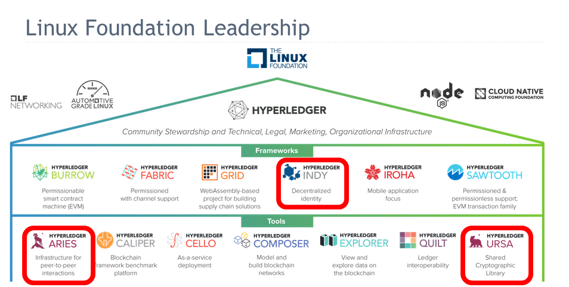

*The Linux Foundation Frameworks and Tools*

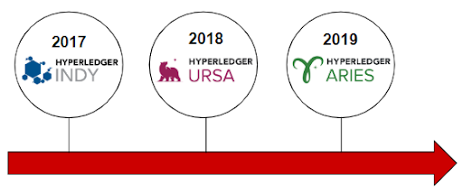

*The Linux Foundation Frameworks and Tools*

### Hyperledger Indy Overview

[Hyperledger Indy](https://www.hyperledger.org/projects/hyperledger-indy) was Hyperledger’s first "identity-focused" blockchain framework, joining Hyperledger in 2017. The code for Indy was contributed by the Sovrin Foundation, an organization that we’ll cover a little later, after we’ve dug a bit deeper into Indy. Indy is a purpose-built distributed ledger for decentralized identity, supporting the concepts we talked about in Chapter 2. Indy includes verifiable credentials based on zero-knowledge proof (ZKP) technology, decentralized identifiers, a software development kit (SDK) for building agents and an implementation of a public, permissioned distributed ledger. We’ll be talking more about all of these things in this and later chapters.

 

*Hyperledger Indy Logo*

### Hyperledger Ursa Overview

As Indy evolved within Hyperledger, there was a realization that the cryptography in Indy could be used in a number of Hyperledger projects, and even outside of Hyperledger. In 2018, the decision was made to migrate the `indy-crypto` code repository out of Indy and into its own project: [Hyperledger Ursa](https://www.hyperledger.org/projects/ursa). Like the Linux kernel, cryptographic algorithms and software are the domain of a few experts in the field and should not be coded by other than those experts. Ursa gives those experts a place to work together to build and package cryptographic primitives—combinations of low-level cryptography elements that only experts should build, test and make available to "ordinary developers". Just as important, it’s an open source space for experts to review those primitives and find and eliminate flaws in the implementations. Ursa packages the primitives in a way that can be consumed by Indy, Aries and any other software that needs a solid, vetted cryptographic base. The initial transfer of code from Indy to Ursa was pretty straightforward, involving a lot of renaming and updating references, but little change. As we’ll see, splitting up a project isn’t always as straightforward.

*Hyperledger Ursa Logo*

### Hyperledger Aries Overview

The `indy-sdk` repository is the Indy software that enables building components (called agents) that can interact with an Indy ledger and with each other. Until mid-2018, groups working on building on top of Indy did so in silos, making agents that talked only to other instances of their agent, not to agents built by others. The *Indy Agents Working Group* was established to change that, by defining standard protocols to enable agent interoperability. By early 2019, at a "Connect-a-thon" in Utah, USA, the fruits of that effort were realized as developers from a variety of organizations gathered to demonstrate interoperability across a set of independently developed agent implementations. At that time, a further idea developed that led to the creation of [Hyperledger Aries](https://www.hyperledger.org/projects/aries). Although Indy is an excellent implementation of core SSI capabilities (ledger, verifiable credential model), it is not the only implementation. In the long term, it’s likely that there will be multiple implementations that are used by different organizations and communities. What if we had agents that could use DIDs and verifiable credentials from multiple ecosystems? [Aries](https://www.hyperledger.org/projects/aries) was [proposed](https://wiki.hyperledger.org/display/HYP/Hyperledger+Aries+Proposal) on that basis and accepted as a Hyperledger project in March 2019.

Aries is a toolkit designed for initiatives and solutions focused on creating, transmitting, storing and using verifiable credentials. At its core are protocols enabling connectivity between agents using secure messaging to exchange information. Aries is all about peer-to-peer interactions between agents controlled by different entities—people, organizations and things. Using the standardized messaging channel, verifiable credentials can be exchanged based on DIDs rooted in different ledgers (based on Indy or other technology) using a range of verifiable credential implementations.

Unlike when Ursa was separated from Indy, the separation of Aries from Indy evolved from the original vision and it took until February 2021 for [Aries to graduate into an “Active” Hyperledger project](https://www.hyperledger.org/blog/2021/02/26/hyperledger-aries-graduates-to-active-status-joins-indy-as-production-ready-hyperledger-projects-for-decentralized-identity). Some elements from the early “Indy agents” clearly remained with Indy (for example, Indy ledger interactions), while others moved to Aries (for example, secure storage and the use of non-Indy ledgers). But there was a lot in the middle (for example, Indy verifiable credentials) that fit in both places. And, while the original idea was to have a single core Aries implementation, instead, the core of Aries are the protocols that define the behavior of Aries agents, and there are multiple open and closed source implementations of those protocols for different use cases.

*Hyperledger Aries Logo*

### The Hyperledger Identity "Stack"

Together, Indy, Aries and Ursa make the Hyperledger Identity "Stack."

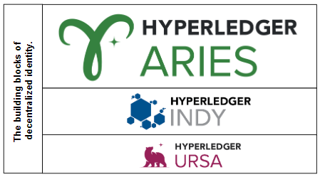

*The Hyperledger Identity "Stack"*

The ordering and logo sizes in the image are intentional. The ordering is about the exposure of the project to external users, while the logo sizes correspond to the size of the customer base for each of the projects. The vast majority of those working with the Hyperledger identity stack will build on top of Aries and have relatively little interaction with Indy, and almost none with Ursa. Only those contributing code directly into Aries, Indy and Ursa will have significant interaction with Indy and Ursa. Those building on top of Aries will interact with Aries, but only to understand how to build agents.

### Indy, Aries and Ursa Working Together

**Demo Time**

With that bit of history out of the way and a basic understanding of the three projects and their relationship to one another, let’s go through an example of verifiable credentials being created, issued, held and then proven. We’ll go step-by-step through a demonstration of the interactions and how the different components of Indy, Aries and Ursa come into play.

To see the demonstration and optionally run it yourself, click on this [link](https://github.com/cloudcompass/ToIPLabs/blob/master/docs/LFS172x/running-aries-browser-lab.md). Please come back here when you are done!

### Hyperledger Ursa: Introduction

The Hyperledger Ursa project produces cryptographic packages that can be used to build higher level applications. The packages Ursa produces are used by Indy and Aries for all of the uses of cryptography by those projects, including:

  - generation of public/private key pairs
  - data encryption and decryption
  - data signing and verifying
  - data hash generation and verification
  - zero-knowledge proof (ZKP) technology, including issuing and revoking ZKP credentials and generating and verifying ZKPs

These capabilities are used throughout Indy and Aries, as we will see when we get deeper into these projects. The need for and importance of Ursa is best understood by looking at how cryptography, an extremely complex technology, is able to be used in everyday applications. The following is a brief summary of how cryptographic algorithms are developed, implemented, standardized (in libraries such as Ursa) and deployed.

### Basic Research

Core cryptographic techniques are the work of mathematical researchers. They think of and subsequently prove (or not) the viability of the algorithms using pure math. It is those researchers that are responsible for the cryptographic capabilities we use in everyday life. But for the average software engineer, their work is inaccessible—the concepts are too complex to convert to software requirements and products.

*Crypto Research Is Not For Everyone!*

Over time, such researchers have created breakthrough algorithms, and have evolved and enhanced existing algorithms to improve their usefulness and effectiveness. For example, creating a new encryption algorithm that is more effective than existing techniques but too slow to be useful, and then evolving the algorithm to be practically useful. The well-known [Diffie-Hellman algorithm](https://en.m.wikipedia.org/wiki/Diffie%E2%80%93Hellman_key_exchange) was one such breakthrough, as was the use of [elliptic-curve cryptography](https://en.m.wikipedia.org/wiki/Elliptic-curve_cryptography).

"Effective" in practical cryptography means that an algorithm is both useful and (relatively) safe from attack. An encryption algorithm is effective if the data cannot reasonably be decrypted except with authorized access by the intended recipient. For example, if the encryption algorithm uses a key, the key cannot easily be discovered, or the data cannot "easily" be decrypted without the key. Often that means a brute force attack (e.g., trying every possible key) cannot be completed in a reasonable time (e.g., at least 10s to 100s of years) using technology anticipated to be available for a reasonable period in the future. There are many such attack vectors and both cryptographers and their adversaries (aka hackers) are constantly thinking about what new attack vectors are possible.

### Implementation

The next step towards practical use of the research results is the implementation of the algorithm in code—converting the mathematical equations into software. Again, that is an exclusive domain of expert researchers/developers that know the math, the code and where weakness might show up in the algorithm or (more likely) the implementation. Implementations are packaged into well-known and well-tested open-source libraries (for example, [libsodium](https://download.libsodium.org/doc/)). It is common for the algorithm to be named and evolutions of the algorithm to be given versioned names (for example, elliptic curve algorithms, with variations for different purposes (for example, signatures, hashes, etc.), different parameters (for example, key length), with versioned standards defined by (often) the year of implementation). An example is:

> `Ed25519VerificationKey2018`

which is interpreted as “standard signature suite created in 2018 for the Ed25519 signature scheme using Curve25519.” It is a cryptographic suite currently used in Hyperledger Indy.

You really have to be paying attention to follow and understand all the options! What non-crypto developer has time for that? Further, having an algorithm implemented in an open source library, and using it properly, without introducing vulnerabilities in the security of an application, is yet another challenge. That’s where Ursa comes in.

The "open source" reference in the previous paragraph is extremely important. With trust comes verification, and the open sourcing of cryptography implementations is crucial to establish trust in the implementation. Very few put trust in such important code that they can’t evaluate, line by line and build from scratch.

### Packaging

Ursa takes the "raw" cryptographic algorithms and packages them up so that they can be embedded in, for example, Indy and Aries and used safely. Ursa curates what implementations to support and how to manage support for different versions as the implementations evolve (e.g., 2018 versus 2019). Where higher level standards have been defined, such as the so-called JW* mechanisms (JWE, JSON Web Encryption, JWT, JSON Web Token, JWS, JSON Web Signatures, etc.), Ursa takes care of the details in producing and consuming those data structures.

### Usage

With the Ursa packages embedded in Indy and Aries, cryptographic features are relatively easy to implement. When a write transaction is sent to an Indy ledger, it is signed (via a call to an Ursa function) by the transaction author and the signature is verified (via a call to an Ursa function) by the nodes of an Indy ledger that receive the transaction. When a message is sent from one Aries agent to another, it is encrypted and packaged up via a call to an Ursa function.

If you are contributing to Indy and Aries, you do have to be aware of the Ursa libraries being used and the capabilities they provide. However, if you are building applications on top of Aries and using the Indy ledger and verifiable credentials, it’s all hidden from you. Calls your application makes to Indy and Aries functionality in turn make calls to Ursa to handle the cryptography needs. In fact, the main impact the cryptography will have on developers is not how to use the cryptography (phewww!!), but rather trying to debug code when so much of the data is encrypted. That can be a major pain—but MUCH easier than having to write safe and secure cryptography code!

That’s all we’ll cover on Ursa itself in this course. If you are trained in cryptography and interested in working at the cryptography level on Ursa, you’ll know a lot more about this topic than we’ve covered here. Hop right over to the Hyperledger Ursa Rocket.Chat channel and start talking with the project maintainers!

For everyone else, we’ll give a quick overview of Hyperledger Indy and Aries in this chapter and cover each of them in depth in the following chapters.

### Hyperledger Indy: Introduction

Hyperledger Indy is the core component of Hyperledger’s identity system. Indy provides code that implements the public **distributed ledger technology (DLT)** and the code to build applications that interface with the ledger. The project consists primarily of two types of repositories (repos) that contain the two parts:

  - `indy-sdk`, `indy-vdr` and `indy-shared-rs`: software that enables Indy clients (such as Aries agents) to be built that interact with the Indy blockchain
  - `indy-node`: the blockchain/DLT component of Indy

Let’s look at the two artifacts.

### Indy Client: indy-sdk, indy-vdr and indy-shared-rs

The Indy client repositories contain the code that allows a piece of software, such as an Aries agent (introduced in the previous chapter and that we’ll cover in detail in Chapter 5), to interact with an Indy public ledger and to keep track of the keys and other identity-related data. The `indy-sdk` is the first generation of these capabilities, while `indy-vdr` and `indy-shared-rs` are a subsequent generation.

The `indy-sdk` consists of a series of modules written mostly in the programming language Rust that are compiled into a "C-callable" library (called "`libindy`"). C-callable means that the library components have a standard interface such that they can be called from a majority of languages (Java, C#, Python, JavaScript, etc.), eliminating the need for an implementation in each language. The `indy-sdk` repository also includes a number of language specific "wrappers" for the library. The wrappers, currently available in Python, Java, C# (.NET) and node.js, allow the creation of Indy agents in each of those languages.

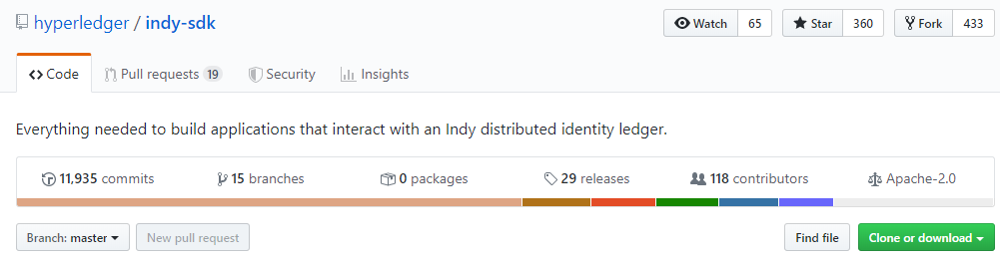

*GitHub indy-sdk Screenshot*

The two repos `indy-vdr` and `indy-shared-rs` are new implementations of a subset of the `indy-sdk` capabilities that better support the Hyperledger Aries goal of being able to work with Indy and non-Indy ledgers, and Indy and non-Indy verifiable credential formats. The two repos, plus a new Aries-level component (called `aries-askar`) are all written in Rust and have the same C-callable interface as the `indy-sdk`. At the time this course is being edited (April 2021), the newest version of the Aries framework Aries Cloud Agent Python is being updated to remove the `indy-sdk` in favor of the new generation of components.

Let’s go through the major subsystems of the `indy-sdk`, covering some important details about each. As we do, we’ll talk about how these capabilities are implemented in the new generation of Indy client software—including how some of these capabilities have been removed from Indy entirely.

### Indy Ledger Client

Core to the `indy-sdk` is the code that enables an Indy agent to interact with an instance of an Indy network. The newer `indy-vdr` component does just that, leaving secure storage, verifiable credential handling and so on to go into other components.

The functionality is implemented as a series of messages that enable the client application to read from and write to an Indy network. The high level process for interacting with the ledger is the same for each call:

  - The application prepares the data for the message to be sent, e.g., the type of message and all of the parameters necessary for that type of message.
  - If the message is a write, the application calls cryptographic functions to sign elements of the message with a private key held by the application for that purpose. This is necessary to prove that the application has permission to write the transaction to the network.
    - Multiple signatures from different parties may be needed depending on the roles of the parties and the impact of the message on the network. For example, if the application is not authorized to write to the ledger, the transaction must be sent to an application that is authorized to write to the ledger (called an "endorser") to sign the transaction. Once signed, either the author or the endorser can submit the transaction to the ledger (the next step).
  - The message is sent to a verifier node that is part of the Indy ledger.
  - The application waits until a response is received from the ledger with the result code (success or failure) and any related data.
    - If a write transaction succeeds, one of the returned values is the transaction’s sequence number on the ledger. That information should be stored immediately by the agent so it can be used when referencing that object in later operations.

The ledger objects relevant to participants in verifiable credential exchanges (issuers, holders/provers and verifiers) are covered in the next chapter when we talk about what goes on the blockchain. There are also a number of transactions that control the operation of the ledger itself, such as adding and removing verifier nodes from the network and controlling permissions about who can write what ledger transactions. We’ll not cover those further in this course, but are relevant to those who want to participate in the operation of an Indy network.

The read transactions support retrieving all of the types of transactions that are stored on the ledger. Reads don’t require permissions so anyone can read data from an Indy ledger. For each read, the agent must know either the transaction sequence number of interest or the identifier. For example, the identifier for a DID is the DID string itself (e.g., `did:sov:1213423e239f9g095hg2`).

A surprise for many that are new to Indy is its ledger does not support any form of querying by value or discovery. For example, you can’t just make a single query on an Indy ledger to get a list of all of the DIDs on the ledger. In the common cases, the agent must know about the transactions of interest on the ledger either because that agent wrote the data in the first place, or because the agent is configured (“hardwired”) to know about the transaction. Although you can’t query the ledger, it is a public ledger, so you can read its entire contents and if you want a query capability, you can put it in a database. How? Since the transactions are sequenced, you can just start from one and iteratively query the ledger for all the transactions (one, two, three, four…). Once you have read them all (e.g., the ledger returns “no such transaction”), every few minutes ask for any new transactions that have arrived. It’s onerous and so several people have published websites of “ledger browsers” ([Sovrin Main Net](https://sovrin-mainnet-browser.vonx.io/) and [IndyScan](https://indyscan.io/home/sovmain)) that continually query the Sovrin MainNet and provide a web interface for searching. Here is a short [demonstration of browsing an Indy ledger](https://github.com/cloudcompass/ToIPLabs/blob/master/docs/LFS172x/BrowsingAnIndyLedger.md).

> **NOTE:** Adding a querying/discovery capability that works in a similar way to the ledger browsers but that is implemented by Indy is likely not a difficult task. It’s just not risen high enough on the priority list to be implemented as a core feature.

As noted, the only feature of the `indy-vdr` component is to provide an interface to read and write to an Indy ledger. Having it in an isolated package makes it easier for an Aries agent to use it to integrate with an Indy ledger alongside resolvers for other ledgers. `indy-vdr` includes in its repo a web server wrapper that allows deployment of indy-vdr as a service for a set of Indy clients. For example, an enterprise might have Aries agents for a number of sub-organizations in the enterprise all sharing the same robust, scalable `indy-vdr` service to handle all of the reads and writes to Indy networks.

### Secure Storage

The `indy-sdk` implements a secure storage component that is used to store the Indy data collected by an identity on an Indy network—DIDs, private keys, verifiable credentials and more. Unfortunately, in the early days of Indy, the term “wallet” was selected for the storage component of the `indy-sdk`, resulting in an application called a digital wallet containing a wallet. Confusing, right?

In the “next generation” of Indy components, there is no secure storage at the Indy level. Instead, an Aries component called `aries-askar` implements secure storage for Aries agents, handling both Indy and non-Indy data.

> **NOTE:** Askar (from Arabic, meaning guard or soldier) is one of the names of the star Hamel, the head of the Aries ram.

Both `aries-askar` and the Indy wallet sub-component of the `indy-sdk` provide a pluggable API for data storage, meaning a capable developer can create another storage implementation should they need one. By default, both use the open source SQLite database and the Government of British Columbia implemented and contributed to both an implementation using the PostgreSQL database for enterprise deployments.

Both use a simple storage data model with just a handful of tables implementing essentially a key-value pair system. Almost all of the data is encrypted, a detail we’ll cover later in the course. The storage is logically divided into two parts:

  - “Secrets”—data associated with ledger entries and verifiable credentials, and
  - “Non-secrets”—any other data stored by an agent.

In all cases, for security reasons, operations that use private keys happen within the storage API code; the private keys are never handed out to “user code” (less scrutinized application code that might have security vulnerabilities).

### Verifiable Credential Handling

Indy verifiable credentials (“AnonCreds”) handling is currently built into the `indy-sdk`, and is the major subsystem of the new `indy-shared-rs` software. In both, the code is used to create credentials to be issued, generate presentations to be provided to verifiers, and to verify those presentations upon receipt. As necessary, that code calls the ledger interface (with the `indy-sdk` or the new `indy-vdr`) to retrieve the necessary ledger data to carry out those operations. We’ve already gone into detail about those operations (and we’ll talk about them again), so no need to dig too much into them now.

The move to separate out the Indy verifiable credentials from the monolith `indy-sdk` into an Indy-specific verifiable credential library was done to make it easier to allow an Aries agent to use Indy and other verifiable credentials formats. This matches the reasoning for breaking out the Indy ledger interactions into the `indy-vdr` component. `indy-shared-rs` also includes a number of common cryptographic operations needed by `indy-vdr` and `aries-askar`.

### Wrappers

As noted earlier, both the first and second generation Indy components are written in Rust and expose a C-callable interface to allow their use in other programming languages. Each of the repos also include wrappers of language specific bindings that make it easy for an application in another language to call the Rust functions. The wrapper functions tend to be one-to-one with the Rust calls. Although most of the wrappers were hand-coded, the idea is that there is so little extra value in the wrappers that the code can be machine generated. Auto-generation would eliminate the manual effort to update the wrappers as the Rust code evolves.

### Tests

A key part of the first and second generation Indy components are the test suites that are automatically executed with each update to the repo. While it's comforting to know the test suite is executed (and updated) with each change, another useful aspect of the suite for those new to Indy is that the tests are working code that can be used to understand how the calls into Indy work. Not sure what exactly are the parameters to a specific Indy call? Check out the test suite and you'll find a working instance to study.

### Command Line Interface (CLI)

A useful feature of the `indy-sdk` that has not been replicated in the new generation of Indy components is the Indy command line interface (CLI). The CLI allows a user to execute a number of Indy-related commands such as creating a secure storage database, creating a DID, connecting to an Indy network and writing that DID to the network. In fact, with the CLI, any Indy transaction can be created, signed (if needed) and then sent to a connected Indy network. While not strictly necessary, since Aries frameworks provide ways of doing the same things, the CLI is extremely convenient for Aries and Indy developers experimenting with Indy.

### indy-node

The second major component of Hyperledger Indy is `indy-node`, the blockchain/distributed ledger (DL) component of Indy. Written in Python, this codebase embodies all the functionality to run nodes that implement a distributed ledger. To be a little more precise, the repository `indy-plenum` contains most of the DL code for Indy, including the consensus implementation, while the code in `indy-node` handles the transactions to read and write to the ledger. We’re going to talk a lot about the ledger and what data goes on the ledger in the next chapter, so we’ll not spend any more time on it here.

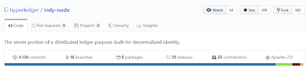

*GitHub indy-node Screenshot*

### Hyperledger Aries: Introduction

Indy (and its underlying Ursa cryptography) enables issuers, holders and verifiers to generate verifiable credentials and presentations by interacting with the ledger and executing cryptographic operations. To exchange those credentials and presentations, all of those issuers, holders and verifiers will use agents (software) that send data to one another using messages. Those agents will be built by many different organizations—open source tools, commercial agents available for purchase and custom-built proprietary agents. How do all those different agent makers build agents that will work with all the other agents in the world? Further, what if you decide you want to switch from the agent you have now to a new one that is even better? You must be free to take your credentials and related data, move them to another agent and continue to use them.

Those are the challenges that started the Hyperledger Aries project. Aries is about collaborating to define and share the message exchange protocols, an agent architecture and tests that enable organizations to independently build agents that work together. Since there are other verifiable credential ecosystems being developed in parallel to Hyperledger Indy, Aries is also intended to be “verifiable credential-agnostic”—the architecture of Aries should be able to support different verifiable credential implementations within a single agent. And, since Hyperledger and the Linux Foundation is about building open source software, Aries includes implementations of the protocols, architecture and tests.

### It’s All About Message Protocols...

Messaging in Aries is defined at several conceptual layers. At the lowest is simply the ability for one agent to send a chunk of data and for another agent to receive that data and understand it. At the next layer is the ability for agents to exchange data in a sequence of messages to accomplish some shared task. That’s a protocol. Messaging protocols are just like human protocols. For example, going out to a restaurant for a meal is a protocol, with both the guests and the restaurant staff knowing the sequence of steps for their roles—greeting, being seated, looking at menus, ordering food, etc. In Aries, an example is the “issue credential” protocol where an issuer agent coordinates with a holder agent to offer, be asked for and deliver a credential. Unlike human protocols (etiquette), Aries messaging protocols need to be carefully specified and then implemented (and tested!) by multiple participants.

It’s All About Message Protocols

Aries provides messaging at both layers. In Chapter 5, we’ll dig into Aries messaging, covering the DIDComm (DID Communications) protocol that covers the envelopes used to address and send messages from agent to agent, and content protocols—messages with specific data used between agents to accomplish a task. As indicated by the name, DIDComm uses the data associated with DIDs (public keys and service endpoints) to secure and address messages, respectively. DIDComm is an extremely powerful capability!

### ...And Interoperability

As we’ve discussed in Chapter 2, Indy is not the only game in town when it comes to DID and verifiable credential implementations. With a goal of global use of verifiable credentials (and all the goodness that it brings), it’s crucial that interoperability across different Aries, DID and verifiable credential implementations be a goal. Not all DID and verifiable credential implementations will last but we’re certain that there will be more than one and we will need interoperability across the major implementations. The Aries architecture defines how different implementations can be plugged into an agent to support Indy and other DID and verifiable credential implementations at the same time. The goal is to bring developers from these communities together to extend Aries to enable verifiable credential interoperability.

### ...And Portability

In the previous section, we talked about implementations of DIDs and verifiable credentials. But there will also be many implementations of Aries agents, built by many different organizations. As a person, organization or thing begins to use a digital wallet, they will immediately begin to collect data that is valuable—things they don’t want to lose. And, since digital wallets are just specialized pieces of software, they will at some point discover a digital wallet that is even better than the one they started with. Or perhaps the one they started with will become obsolete—no longer supported. One part of the Aries definition (albeit one that has not yet had a lot of focus) is about data storage, and more importantly the export of data from one implementation and the import of that data into another without loss.

### Summary

This is the linchpin chapter of the course and should be considered carefully. From this chapter we hope you understand how the problems with identity on the Internet (Chapter 1) and the solutions defined based on self-sovereign identity and the verifiable credentials model (Chapter 2) are manifest in Hyperledger Indy, Aries and Ursa. In subsequent chapters, we’ll delve deeper into the projects by looking at what goes on the blockchain (Chapter 4) and how there is more than meets the eye with agents (Chapter 5).

As we did in Chapter 2, let’s go back to bullet points in the Chapter 1 summary and see how Indy, Aries and Ursa address the problems we find on the Internet today:

| Internet Challenges Today | How Indy, Ursa and Aries Address These Challengess |
| --- | --- |
| User IDs/passwords are the norm, but they are a pain to use, and as a result, are susceptible to attack. They are the best we have right now, but not a solid basis for trust. Further, IDs work only one way—users don't get an ID from a service they use. | Aries agents used by individuals and online services exchange at least DIDs, and often verifiable credentials, to reliably identify one another as peers each time they connect. Ursa cryptography underlies the exchange, and Indy credentials are exchanged as needed. |
| Other personal information and identifiers we have that we could otherwise use to prove our identity are not trusted because it's impossible to tell if the data was actually issued to the person providing it. The many breaches of private identifiers make them impossible to completely trust, and verifying that information adds (sometimes significant) costs. | When collecting information from users, services can use their Aries agent to connect with, request and receive back proofs of claims from a users Aries agent. |
| Since the identity attributes we could use are not trusted (they are not things only we know), we often have to resort to in-person delivery of paper documents to prove things about ourselves, a further cost for all participants. | The cryptographic guarantees from Ursa and Indy inherent in the proving of claims allows for the delivery (via Aries agents) of digital data in place of paper. |
| Reviewers of the paper documents we present must become experts in the state of the art in forging and falsifying paper documents, a difficult role in which to be placed. | The cryptographic guarantees from Ursa and Indy inherent in the verification of claims replaces human verification. Humans may be needed to assess the trustworthiness of the issuer, but not of the data. |
| The identifiers we use are correlated across sites, allowing inferences to be made about us, and exposing information we don't intend to be shared across sites. This is annoying at the least, and can have catastrophic results in the worst case. | Aries agents use private, secure messaging to enable interactions without monitoring or correlation exposure. Indy credentials use ZKPs to reduce correlation when proving credentials. Ursa provides the necessary cryptographic primitives to support Aries messaging and Indy credentials. |
| Centralized repositories of identifiers and data about the people associated with those identifiers are targeted by hackers because the data has high value. This exacerbates the problem of not being able to trust "personal" data presented online (see above). | Aries agents make it easy to decentralize the data, giving it to the subject of the data (us!) to use how and when we want. At the same time, this frees organizations currently managing those repositories from the liability of holding such toxic data. Indy provides the credentials that ensure that the data provided by the subject can be trusted. Ursa provides the cryptography to support the Indy credential model. |
| Centralized identifiers can be abused by those who control those identifiers. For example, they can be taken away from a subject without due process. | Aries enables you to create (and delete) DIDs that you share with others how and when you want. Indy allows you to put those DIDs on a global ledger for others to access, if that is necessary. Ursa provides the cryptography that allows you to prove control over those identifiers. |

## Chapter 4: A Blockchain for Identity

### Introduction: Chapter Overview

Hyperledger Indy implements (based on cryptography from Ursa) a purpose-built blockchain specifically for identity on the Internet—enabling certainty about who is talking to whom in a digital transaction. Since Indy is designed for such a special purpose, how does that affect the underlying blockchain implementation? Does it have the same components of other blockchains? What goes into the transactions on the blockchain?

In addition to talking about the Indy blockchain, we’ll talk about some of the live implementations of Indy that you can use today, including one operated by the Sovrin Foundation, introduced briefly in the last chapter. We’ll talk about how these implementations make it easier to get started using verifiable credentials because you don’t have to operate your own instance of Indy.

*Chain*

### Learning Objectives

By the end of this chapter you should:

  - Be familiar with different types of blockchain and the terminology surrounding them.
  - Understand how consensus is reached on the Indy blockchain.
  - Know what the Sovrin Foundation is and how it relates to Indy.
  - Be familiar with the term trust or governance framework.
  - Understand what gets written to the ledger and more importantly, what does not!
  - Learn about the “network of networks” issue, as more and more ledgers come online.

### Indy's Blockchain: What Is Indy's Blockchain?

In most courses on blockchain-based solutions, the core focus is about how the blockchain works and how applications interact with the blockchain component. Not so much with Indy, Aries and Ursa. The Indy blockchain plays a crucial role in enabling trust on the Internet, but when you are building applications using the technology, the focus is much more on verifiable credentials, the agents, relationships between agents and on the entities that control them. The blockchain is hidden behind the scenes, operating on a relatively small number of nodes. Regardless of its visibility, it’s important in this course that we go over the implementation of Indy’s blockchain. In the following, we’ll cover how Indy operates versus other blockchains, how consensus is reached and so on.

> **NOTE:** As mentioned at the beginning of this course, we use the terms blockchain, ledger, decentralized ledger technology (DLT) and decentralized ledger (DL) interchangeably. While there are precise meanings of those terms in other contexts, in the context of the material covered here, the differences are not meaningful.

Like all blockchain implementations, an Indy ledger is immutable—data is written once and never changed. Since Indy is focused only on identity, it does **not** support the concept of assets being exchanged (with a caveat, mentioned below), nor any sort of smart contract capability. It does have multiple, (largely) independently operated nodes that write transactions to the ledger. The nodes communicate to agree (reach consensus) on what transactions should be written and in what order. As well, client applications (agents) that need transactions written to the ledger must prove they are authorized to not only write to the ledger but are authorized to write that specific transaction to the ledger. For example, an update to a DIDDoc (e.g., to change the public key in the DIDDoc) can only be written by the entity that can prove it is authorized to do so based on the information in the DIDDoc itself.

*A caveat to the point about Indy not being about the exchange of assets:*

*Although assets are obviously not the purpose of an Indy ledger instance, there is a capability in Indy to support a pluggable implementation of a payment token. The token isn’t used to enable general-purpose smart contract capabilities, or for storing or exchanging value such as on Bitcoin-like networks. Rather, it is to support payments for certain network operations—for example, writing to the ledger, issuing a credential or proving information about an entity. The token could be used to prevent denial-of-service (DoS) attacks (an attacker flooding the network with free ledger write operations, thus preventing legitimate operations) and might serve as a mechanism for funding an instance of the network. The term "pluggable" means that as transactions are processed on the ledger nodes, calls are made to an application programming interface (API) based on when events occur that might involve payments. Anyone operating an Indy network can write a plugin (component) that implements what happens when those API calls are made. Indy’s reference implementation is called “libnullpay,” meaning that when the API is called it just returns with no action taken.*

### Types of Blockchain—What Type Is Indy?

There are several different types of blockchain systems characterized along two dimensions: access and validation. You have likely heard of Bitcoin and Ethereum—they are public permissionless networks. That means that anyone can access them (public) and anyone can participate in the validation process (permissionless). Bitcoin mining is the validation process on that network and anyone can run a mining rig—no permission needed.

Similarly, the Hyperledger frameworks (Fabric, Sawtooth, Iroha and Burrow) are (primarily) used for private and permissioned networks, limiting who can access them (private) and who can participate in the validation process (permissioned). As shown in the diagram below, Indy falls between these two models.

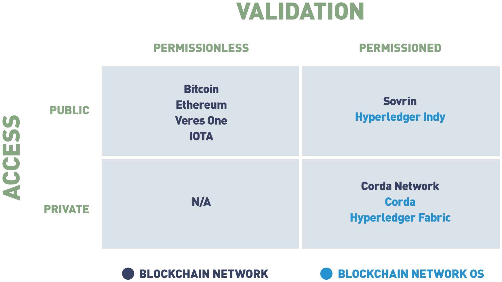

*Types of Blockchain*

Indy is designed to be operated such that everyone can see the contents of the blockchain (public), but only pre-approved participants, known as stewards, are permitted to participate in the validation process (permissioned). Since only designated stewards can write blocks to the blockchain, there is no need for the high (and environmentally unfriendly) energy use associated with public blockchains such as Bitcoin and Ethereum. Rather than racing each other for the reward for writing the next block, Indy steward nodes reach consensus collaboratively, while monitoring each other for faulty or malicious behavior.

> **NOTE:** *Although Indy is designed to be run as a public network, an instance of Indy (or any other public blockchain) could be run as a private network accessible only to those using the network.*

The ramification of Indy being designed to be public puts a significant constraint on what data can be put on an Indy blockchain. Specifically, ***only public data can go on the blockchain—no other data, even if it is encrypted***. That last part about encrypted data might not be obvious. If the data is encrypted, it can only be accessed by those with the decryption key, so shouldn't we be able to put any data safely on a public blockchain? Well, that might be true—today. However, Indy is being built to last from decades to generations. What happens if an encryption algorithm used today is broken sometime in the future? Since the data on the blockchain is open to everyone to see and is immutable, encrypted data that can be easily decrypted becomes public information. The Indy designers don't want that, hence the rule—no private data on the blockchain. Later in this chapter, we'll cover "What Goes On The Ledger?"—a favorite question from everyone getting up to speed on Indy, Aries and Ursa.

Did you catch that part about ***NO PRIVATE DATA ON THE BLOCKCHAIN?*** Good!

*There Is No Private Data on the Indy Blockchain!*

### How Is Consensus Reached?

As with all blockchain implementations, Hyperledger Indy uses a consensus algorithm to decide the contents of the next block added to the chain. Specifically, Indy uses **Plenum**, an implementation of a Byzantine Fault Tolerance (BFT) algorithm. BFT algorithms are designed to achieve consensus when many of the nodes are not operable or accessible. The number of faulty nodes (f) in a properly operating BFT network is f = (N -1)/3, where "N" is the total number of nodes in the network. Thus, for a 25 node network "f" is 8 ((25 -1)/3). This means that if more than 8 nodes fail (either malicious actors or nodes isolated from the rest), the network can no longer achieve consensus. Plenum performance degrades less than other BFT algorithms (on the order of 3% versus up to 78% for others) when faults occur in the network. As well, underlying Indy's consensus algorithm is a secure and robust messaging system amongst the nodes of the network, including a multi-signature scheme for returning ledger state information. This improves the overall security of Indy—agents reading data from the ledger can verify the signatures of the nodes to verify the accuracy of the data. The Plenum implementation has been found to be useful enough to be separated out from the core Indy code base into a [separate repo that is used by Hyperledger Indy](https://github.com/hyperledger/indy-plenum—and) can be used by other blockchain implementations.

Indy also implements a novel deployment of stewards—the nodes of the network that have permission to participate in the validation process. Since Indy is designed to be a global public network, an instance will have many available nodes located around the world—more nodes available than can be effectively used in the validation process. The validation process needs enough stewards to be robust in the face of faults, but not too many as to degrade the performance in reaching consensus. Interestingly, those testing the performance of Indy have found that the sweet spot is 25 nodes—robust, able to survive the failure of eight nodes, but fast enough to support the expected number of write transactions on the network—on the order of 10s of transactions per second.

What if you have more stewards available? Indy's planned solution is to have an optimal subset of stewards as validators nodes actively participating in the Plenum consensus algorithm, and the rest as observer nodes, tracking the growing blockchain, serving reads (thus offloading that work from the validators) and ready to be called on to be validators should they be required. The image below from Sovrin (covered in the next section) shows the division of validator nodes (those currently participating in writing to the ledger) and the observer nodes (read-only nodes, but ready to become validators if needed).

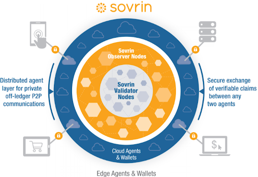

*The Division of Validator versus Observer Nodes*

### Hyperledger Indy and Sovrin: The Sovrin Foundation

At this point in the course, you’ve heard the name Sovrin a few times. The Sovrin Foundation ([sovrin.org](https://sovrin.org/)) is a global non-profit that organized the first public deployment of Hyperledger Indy as the core of its “Identity for All” mission. To understand the goal of the Sovrin Foundation, think of the Sovrin instance of Indy as the identity equivalent of the Domain Name System (DNS), which has enabled the global routing of data on the Internet since 1985. The production Sovrin network (called MainNet) has been running since July 31, 2017, its launch immortalized in this blog post, "[Launching the Sovrin Network](https://www.windley.com/archives/2017/07/launching_the_sovrin_network.shtml)" from then Sovrin Chairman Phil Windley. MainNet is a utility upon which digital identity solutions can be built.

The Sovrin Foundation provides the three foundational components of the Sovrin Network in the form of a BLT (not the sandwich):

- Business - The Sovrin governance framework.
- Legal - A series of legal agreements signed by the Sovrin Network participants.
- Technical - The underlying software of the Sovrin Network, Hyperledger Indy.
 
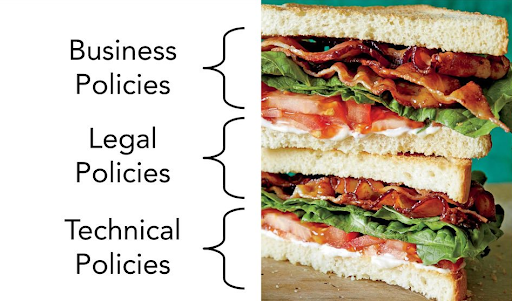

*The Foundational Components of the Sovrin Network*

All three parts are necessary to enable a global, trusted system for identity. The need for legal agreements and a sound technical foundation are fairly obvious, but what is a governance framework? You may recall we mentioned governance frameworks when we talked about trust over IP (ToIP) in Chapter 2.

### Governance Frameworks

**Governance** (also called **trust**) **frameworks** are common in the digital identity world, but are also used in other contexts, sometimes using other names, such as "operating regulations" and "operating policies." In all cases, they define how to govern multi-party systems where participants desire the ability to engage in a common type of transaction with any of the other participants, and to do so in a consistent and predictable manner. That’s a bit of a mouthful, so here’s an example. Credit card networks are operated based on a trust framework. The participants (credit card holders, merchants, clearing houses, banks and credit card companies) all operate independently, but according to the rules that have been defined. As a result, the merchant can safely accept a credit card for payment from a holder, confident that the other participants will make sure that the merchant receives in their bank account the funds for the payment. There is not one huge piece of software written by one company that makes all that work. Rather, each participant knows there is a set of rules—the trust framework—to follow and they write code (and test and verify) for their part of the overall process.

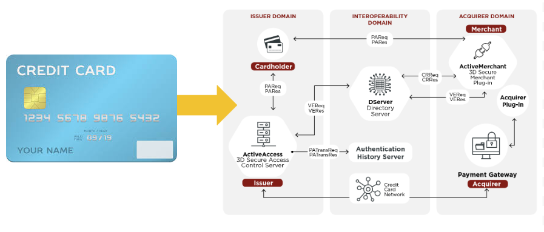

*The Credit Card Network - An Example of a Trust Framework*

A governance framework enables an organization to count on the business and/or technical processes carried out by another organization. In many cases, trust frameworks have been able to work and most importantly, to scale. Common examples include credit card systems, electronic payment systems and the Internet domain name registration system, which all rely on a set of interdependent technical specifications, rules and agreements.

An identity governance framework defines the rules for interactions between organizations for handling identity, authentication (who you are), and authorization (what you are allowed to do). The Sovrin governance framework defines those rules for the participants using the Sovrin Network utility, including stewards (those operating Sovrin nodes), endorsers (those writing transactions to the ledger), authors (those creating transactions to be written to the ledger) and readers (anyone reading data from MainNet). Sovrin’s volunteer-based working groups have also defined a higher-level, generic governance framework that can be the basis for domain-specific governance frameworks. For example, banks and credit unions might use Sovrin’s generic governance framework as the basis for publishing a governance framework for what credential schemas to use and what processes an issuer must carry out before issuing a credential. Recall what we said in Chapter 3 about the need for a verifier to trust the issuer. It’s through a governance framework that a verifier can know about the issuers processes prior to issuing a credential so they can decide if they trust the issuer.

### Elements of the Sovrin Foundation

So what is the Sovrin Network? The Sovrin Network is a single, global instance of Hyperledger Indy. Each node is operated by a Sovrin steward, an organization (company, government, university, etc.) that has agreed to a legal agreement that defines how they will operate their node (minimum hardware, network access, monitoring, security, maintenance, etc.) within the rules defined in the Sovrin governance framework. As of April 2021, Sovrin stewards number more than 70 and include banks/credit unions, universities, law firms, and technology companies around the world (see the following image). The Sovrin Foundation, following the governance frameworks created by the Sovrin working groups, provides governance for the network, including executing legal agreements with participants, monitoring the operation of the nodes, and coordinating software upgrades. The Foundation includes a Board of Trustees to oversee the business and legal aspects of the network and a Technical Governance Board to oversee the technical aspects. The Sovrin technical team publishes a network dashboard showing statistics on the network.

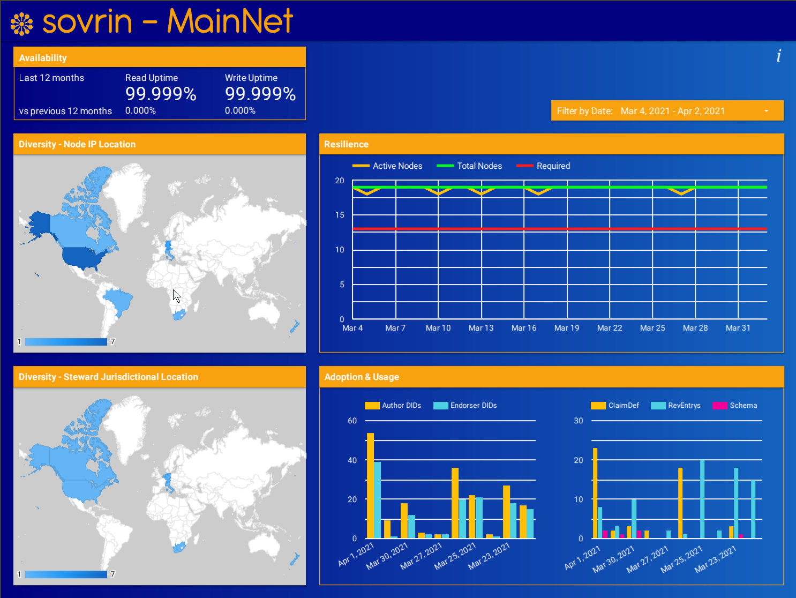

*The Sovrin Dashboard (April 2021)*

And of course, the Sovrin Network has participants that use the network. Some users, called “endorsers” are entrusted through reputation, legal agreements and their adherence to the Sovrin governance framework to write data to the public ledger for themselves and others. The remainder of the participants in the system (identities) use the steward-operated nodes to read and (via endorsers) to write to the Sovrin public ledger.

With a global network in place, Sovrin can be used to solve the identity on the Internet problem. Users can create and write decentralized identifiers (DIDs) and verifiable credential metadata to the Sovrin ledger, and use that data to issue verifiable credentials to holders. And, as we know from Chapter 2, holders can prove claims from those credentials to verifiers to enable trusted digital transactions without the verifier having to ask the issuer about the holder.

### Transaction Author Agreement

An example of the Sovrin governance framework in action is the **transaction author agreement (TAA)**. Think of it as equivalent to an end-user license agreement (EULA) that every software package and website makes you acknowledge (and that no one ever reads). Unlike blockchain implementations such as Bitcoin, where anyone can operate nodes and write transactions, with Sovrin, a group of permissioned, known organizations (stewards) operate the nodes and reach consensus on what data to write to the blockchain. Further, those organizations have lawyers that want to mitigate the risk that their organization will be liable if someone submits a transaction that puts illegal information on the blockchain (such as in this example: [illegal prime](https://en.wikipedia.org/wiki/Illegal_prime)). As such, with every transaction, the writer (called the transaction author) must acknowledge that they agree to the TAA. The TAA itself is not in the transaction, but the location of the TAA they acknowledged, and the hash of the agreement are in the transaction, along with a code indicating how they reviewed the TAA. You see why it’s like the EULA—an agreement that few (no one?) will read, but is written by lawyers, and that they think will protect their organization. That’s a lot different from Bitcoin!

> **NOTE:** *Like the pluggable payment interface, Hyperledger Indy enables the TAA interface, but does not require an instance of Indy to use one. Each Indy blockchain instance is configurable and one set of configuration parameters covers the TAA, if it is required, where the text of the current TAA resides, the hash, and the enumeration of the ways that the TAA can be acknowledged. For the Sovrin instance of Indy, the TAA is enabled, and the TAA used is one agreed upon by the Foundation and its steward members.*

### Cost of Using Sovrin

At the time this course is being updated (April 2021), the Sovrin Foundation charges those writing transactions to the ledger to help offset the cost of operating the utility. Recall from the earlier discussion that only those with the “endorser” role can write to a Sovrin ledger. They can write transactions to the ledger for their own purposes, or they can sign transactions authored by non-endorsers before the transactions are submitted for writing to the ledger. In both cases, their signature (in the cryptographic sense) on the transaction is sufficient to have the transaction written. And, in both cases, the responsibility for paying the Sovrin Foundation for the transaction comes back to the endorser. The relationship between the endorser and the author is between those two parties, as are any costs involved in the endorsing of transactions.

The transaction write [charges are modest](https://sovrin.org/issue-credentials/), are likely necessary as a mechanism to prevent abuse of the network and are used to fund the operation of the Sovrin Foundation. Since only issuers of credentials need to write to the ledger, they bear the brunt of the costs. Later in this chapter, we’ll go into what transactions are necessary to issue credentials and we can calculate the costs that issuers will face.

### Beyond Sovrin: Other Indy Networks

For the past several years, the Sovrin MainNet was the only public production instance of Hyperledger Indy. However, there are some new networks that are coming online. [Indicio.Tech](https://indicio.tech/) launched a TestNet in 2020 and as of this course update (April 2021) has launched a production MainNet. Like Sovrin, Indicio’s network is intended to be a global utility, available worldwide, with nodes operating in a number of jurisdictions. As well, in April 2021, the IdUnion Indy network project kicked off in the European Union (EU). Like Indicio, IdUnion started a test network in early 2021 and has funding to launch the IdUnion MainNet later in 2021. Unlike Sovrin and Indicio, the IdUnion network is intended to serve only users in the EU for writing transactions. Of course, by necessity, verifiers may be anywhere so anyone in the world can read from the IdUnion ledger. The idea of national/regional Indy networks comes from the idea that as the use of verifiable credentials becomes ubiquitous, the reliability of ledger utilities becomes critical. Since the ledgers are critical, they need to be part of a nation’s critical infrastructure, just like the Internet, emergency telephone systems (for example, 911 or 112), the electrical grid, etc. Other countries have also begun exploring creating their own ledger.

Each of the networks mentioned here (including Sovrin) operate test networks in addition to their production network. The test networks serve two purposes:

- They provide a sandbox for testing upgrades to the network before they are applied to the production network.
- They allow ToIP application developers to run test or proof-of-concept implementations prior to going to production.

The networks can also be used by developers building apps, although they generally use locally hosted ledger instances.

With more networks though, we have some new challenges that are still being addressed. The Indy “networks of networks” problem (and solution) is discussed later in this chapter.

### So, What Goes on the Blockchain?

As we have mentioned, there is no private data on the blockchain. Such data is stored in the verifiable credentials that go directly to the person (or enterprise) and into their personal, encrypted storage—into their wallet. There is absolutely nothing from a credential on the blockchain. So what does go on the blockchain, and why do we need it?

When you present claims for a credential to somebody in a proof, you don’t want the verifier to go to the issuer to ask, “Hey, can you confirm this information?” Just as when you go into a pub and have your driver’s license validated, you don't want the bartender calling the government to ask, “Can you confirm this person is over 18?” It’s the same with verifiable credentials—the verifier goes to a public location, usually a ledger (a blockchain), where they get the cryptographic material (public keys and other information) necessary to verify the proof they have been given.

So, what exactly does go on the blockchain? Let’s go through the two, three or four pieces of data that an issuer puts on the ledger. As well, you can use these [instructions](https://github.com/cloudcompass/ToIPLabs/blob/master/docs/LFS172x/BrowsingAnIndyLedger.md) (also used in Chapter 3) to look at what the different transaction types look like on an Indy network.

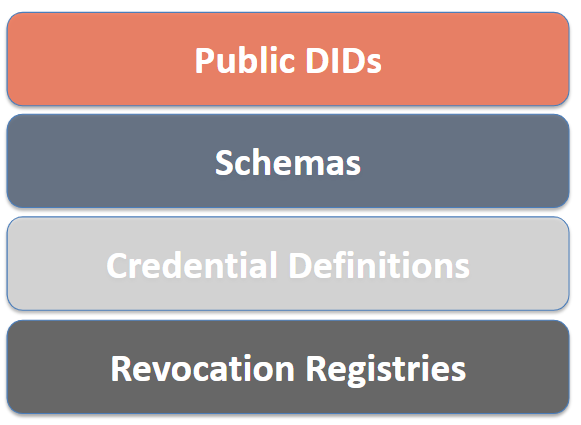

*What Goes on the Blockchain*

### Public DIDs

When the issuer wants to issue a credential, they **must** have a DID on the blockchain that allows verifiers to find out who they are, and in the process, why the credentials they issue can be trusted. Note that the verifier does not get any information from the blockchain other than the DID of the issuer. Whether the verifier can trust the issuer is determined in other ways, that we’ll talk about later in the course.

### Schemas

Next, the issuer **may** put a schema on the blockchain that says in effect, “When I issue a credential, it's going to have these fields in it.” An issuer might put their own schema on the ledger, or they can use one that someone else put on the ledger. In the current iteration of Indy, the schema is just a list of claim names. We’ll talk later in the course about other ways that the verifier can learn more than just the claim names.

Why might an issuer use someone else’s schema? If the issuer is one of many that issue credentials of a common type, it is much easier for everyone if they use a common schema. For example, while every university in the world could define their own “diploma” schema, verifiers would be much happier if one common schema was defined and it was used by all universities. Indy doesn’t require common schemas be used but it’s easy to do and encouraged.

### Credential Definitions

Before an issuer can issue a credential using a schema, they **must** put a credential definition on the blockchain. A credential definition says, “I'm an issuer using this DID, I'm going to use this schema for my credentials, and here are the public keys (one per claim) that I’m going to use to sign the claims when I issue a credential.” In all, an issuer must have a DID, a schema and a credential definition on the blockchain before issuing credentials. A credential definition is also called a claim definition and, internally on Indy, a **CLAIM_DEF**.

### Revocation Registry

The issuer **may** want to be able to revoke credentials and if they do, they must also write a revocation registry to the ledger before issuing credentials. The revocation registry links back to the credential definition and allows the issuer to unilaterally revoke credentials, independent of the holders. Only the holder of a credential can tell if their specific credential has been revoked by looking at the revocation registry. But, with the magic of a zero-knowledge proof (ZKP), a holder can prove (and a verifier can verify) that the holder’s credential has not been revoked—provided of course it has ***not*** been revoked. Constructing that “proof of non-revocation” is done by the holder/prover when creating a presentation.

While we won’t go into the math behind the revocation scheme, here are the mechanics of using Indy/Aries revocation:

- Each revocable credential that is issued has a unique identifier known only to the issuer and holder. Further, there is a number stored on the ledger (called an accumulator) that is updated every time the issuer revokes one or more credentials. If the holder’s credential has not been revoked, the holder can calculate and put in the proof a pair of numbers that the verifier can combine with the accumulator (from the ledger) to get a known result proving non-revocation.
- If the holder’s credential has been revoked, the holder is unable to generate the numbers necessary to be combined with the accumulator to get the known result. In other words, once the credential has been revoked, the holder cannot prove non-revocation. Yes, that is a double-negative, but that is what is happening.

Through the process, the unique identifier of the credential is not exposed to the verifier. To check again for revocation, the verifier must ask the holder for another proof, which may at first glance seem a little odd. Here’s why Indy revocation works that way:

- The verifier is not given an ID for the credential so the verifier has no way to check that a credential referenced in a proof they received earlier hasn’t subsequently been revoked.
- The verifier is not given a unique credential ID because it would provide the verifier with a correlatable identifier for the prover—exactly what the ZKP properties of Indy verifiable credentials are designed to prevent. Such an identifier isn’t exposed in the presentation of claims, and it is also not exposed in proving non-revocation.

The expectation is that for the most part, issuers will revoke credentials on a periodic basis, such as once an hour, or once a day. The issuer will monitor the revocations through the period, track the IDs of the credentials to be revoked, calculate an update to the accumulator to revoke those credentials and write the new accumulator value to the ledger. If the business use case needs more immediate notifications of revocations, the issuer can update the accumulator as each credential is revoked. On the Sovrin Network, there is a [cost to write updates](https://sovrin.org/issue-credentials/) to a revocation registry, and that will no doubt play into the business requirements of when revocations occur.

### Recapping What Goes On the Ledger

So that’s all that goes on a ledger. An issuer can issue a million (or a billion!) credentials, but none of them go on the blockchain. All of them refer back to those few other pieces of data that did go on the blockchain and they are:

- DID (required)
- schema (required, but could be written by the issuer or someone else)
- credential definition (required)
- revocation registry (optional, used only if it is necessary to be able to revoke credentials)

So, for all the issued credentials of one type from one issuer, there are only two, three or four blockchain transactions executed.

### Sovrin Costs of Writing

As mentioned before, there is a cost to writing to some ledgers, such as the Sovrin ledger. Here is a back-of-the-envelope calculation of what an issuer will pay (as of April 2021) for issuing credentials on the Sovrin ledger. For this, we’ll assume the following transactions:

- a DID for the issuer - $10US
- a schema (the issuer creates their own) - $50US
- a credential definition - $25US
- a revocation registry - $20US

There is an ongoing cost for revoking credentials and updating the issuer’s DID. We’ll assume the following annual costs:

- one DID update - $10US
- a revocation registry update each business day - 200x$0.10US
- one every second business day real time credential revocation - 100x$0.10US

That’s a total of $105US for an issuer to begin issuing credentials, plus an ongoing annual cost of $40US for DID updates and revocations.

Other potential transactions include issuing more credential types (no new DID needed, possibly a schema, a credential definition and likely a revocation registry), additional revocation registries (if the issuer runs out of credential IDs to be issued for a given credential type), and updates to multiple revocation registries. And of course, the rate of revocations might be different than assumed above.

> **NOTE:** *If your application is not using the Sovrin ledger but rather some other instance of an Indy network, there may or may not be a transaction cost, and if there is a cost, it may be quite different from that of the Sovrin Network.*

### Indy’s “Network of Networks” Challenge: The “Network of Networks” Issue

As we mentioned earlier, for a long time the only public production Indy network was the Sovrin MainNet. With more Indy networks coming online, a missing feature in Indy has been exposed. Specifically, the identifiers for DIDs and other ledger objects do not define on what ledger the object resides. While that was fine when there was only the Sovrin network, it’s a serious issue when there are many ledgers. In the Indy community, this is known as the “network of networks” challenge, where the goal is to allow each Indy network to operate as one of many coordinated networks.

### Indy Identifiers

An example of the “network of networks” problem is demonstrated by the following DID and schema identifiers as referenced in current Indy data structures such as credentials and presentations:

- DID: **`did:sov:BWmxvSzWSs5mjftrKZN4hL`**
- Schema: **`Nkm6Gvyb5wCru52raJ8DkV:2:L1_DOC:1.1`**

With the DID identifier, the DID type is specified (“**sov**”), but not what instance of Indy is being used. Even before there were other public production instances of Indy, the lack of a way to tell what ledger an object was on was a bother because Sovrin in fact had three networks (Main, Staging and Builder). With the schema identifier, the problem is about the same—the identifier for the DID that created the schema is present (“**Nkm..DkV**”), but again, there is no reference to what ledger the schema resides on.

The assumption made in Indy was that an agent would, on startup, connect to a single Indy instance and all identifiers that were encountered would be created or found on that ledger. Easy! However, as soon as there was more than one ledger, this assumption became a problem that has still (as of April 2021) not been fully addressed.

The first cut at the solution was to provide a way for agents (such as mobile wallets) to change what ledger they are using through settings. In the image below, an example “pick your network” screen is displayed from a popular wallet. This is not a great approach. First, it’s really lousy for users to have to know what network they have to use--or even what an Indy network is! Worse, it doesn’t deal with the situation where a holder needs to create a presentation using two credentials, and one issuer is on one network and the other issuer is on a second network.

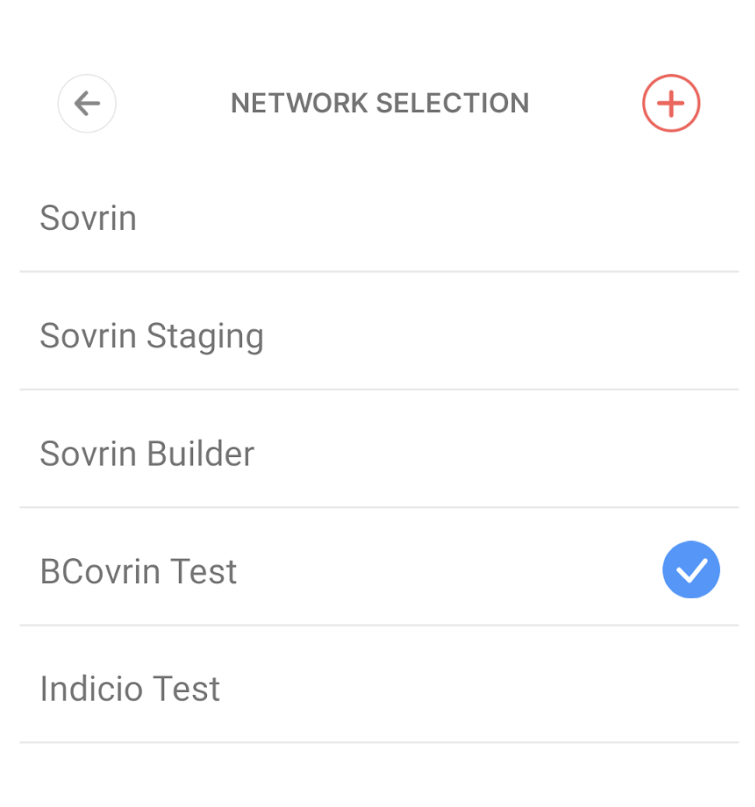

*Mobile Wallet Network Selection Setting Screen*

A better, but still far from perfect solution was first implemented by the folks at LISSI in Germany (the same folks behind the IDUnion Indy network). Rather than having the user pick the network to use, the LISSI wallet has some preconfigured networks defined, connects to all of them, and when needing to read an object from a ledger, checks all the connected ledgers for the object. It’s not efficient, but it’s a lot easier on the users. It still has the problem that only the networks that LISSI already knows about can be used.

### Solving the “Network of Networks” Challenge: did:indy

The real solution for the Indy “network of networks” challenge is being created by the Indy community as this course is being updated (April 2021). A new DID method called “**did:indy**” is being specified that defines a new format for ledger object identifiers that includes a “namespace” for each identifier that defines on which ledger the object resides. Specifically, after the **did:indy** part of the identifier, and before the ledger-specific identifier is placed the name of the network on which the object resides. For example, for the two objects (DID and schema) we listed earlier, the new identifiers would be:

- DID: **`did:indy:sovrin:staging:BWmxvSzWSs5mjftrKZN4hL`**
- Schema: **`did:indy:idunion:Nkm6Gvyb5wCru52raJ8DkV:2:L1_DOC:1.1`**

The namespaces within the identifiers are highlighted such that we can tell that the DID resides on the Sovrin staging network, while the schema resides on the production IDUnion network. With references to those objects in credentials, presentations and other Indy data structures, it is easy for an agent to connect to the appropriate network to access the object data.

For example, when a verifier receives a proof from a prover, they can tell what Indy instance to use to get the credential definition (and hence the public keys used to sign the claims) and the revocation registry information. It’s likely that both parties are using “well known” Indy ledgers, but if not, the verifier can decide if it wants to automatically find and connect to the previously unknown ledger being used by the prover.

Once specified, **did:indy** will take a little bit of time to become readily available. First, the ledger component of Indy (**indy-node**) will have to be updated to support the new DID method specification. In parallel, the Indy components used by agents will need to be updated (**indy-sdk** and **indy-vdr**). Finally, the new capabilities must be built into Aries agents, including Aries wallets.

The LISSI “try all the networks” approach will work for a while, but it will be a race between completing **did:indy** and more production Indy networks spinning up.

### Summary

In this chapter, you have learned that the Indy ledger is a public, permissioned ledger and that consensus on the ledger is arrived at using the Plenum algorithm. The concept of a “governance framework” was discussed as the business parallel to the technical components of Indy. We talked about public production instances of Indy, such as the Sovrin Foundation’s MainNet, a global instance of Indy that has been running for almost four years, and some new production instances that are just starting to come online. And we discussed the “network of networks” challenge these new networks are highlighting. We looked at exactly what goes on the blockchain, reiterating (again and again) that no private data ever (ever!) goes on chain. The main takeaway from this chapter is that blockchain is enabling us to move away from identity challenges we discussed in Chapter 1 and move towards a more trusted, self-sovereign identity Internet. In the next chapter, we will delve into Aries and how agents will enable secure, peer-to-peer communication and facilitate the exchange of verifiable credentials.

## Chapter 5: The All-Important Agent, Or Rather, Agents!, Incomplete section

### Introduction: Chapter Overview

In the last chapter, we looked a lot at Hyperledger Indy and in particular, what happens on the ledger. This chapter delves into Aries—specifically, Aries agents, how your digital wallet will work and how keys and the crypto behind it all keeps your data your data!

Remember our goal. We want to move away from centralized identifiers, unwanted correlation of data and the issues that come with user IDs, passwords and personal data on servers across the Internet (Chapter 1). The Aries agents and agent protocols we are about to discuss will enable an Internet where the user is in charge and where they control their own data! Also remember that the goal of Aries is to be blockchain agnostic so people can start building Aries agents regardless of the blockchain they want to use. Pretty cool stuff!

### Learning Objectives

By the end of this chapter you should:

- Know that there are many types of agents, with different roles.
- Be familiar with the components of an agent, including the storage and ledger interfaces.
- Understand at a high level how agent messaging works and connections are established.

### So Many Agents! What Is an Agent?

Formally, an Aries **agent** is a piece of software that enables an entity (a person, organization or thing) to assume one or more of the roles within the verifiable credential model—an issuer, holder and/or verifier—and allows that entity to interact with others that also have verifiable credential roles. Agents may do (many!) other things but it’s their ability to handle verifiable credentials that is their defining characteristic.

Agents use private, pairwise DIDs to secure their peer-to-peer communications. With a different pairwise DID for every relationship, each with keys and endpoints that you control, communication between agents is end-to-end encrypted, secure and safe. And by asking for and verifying presentations of data from trusted issuers, you can be certain who is on the other end of the connection.

There are a number of categories of agents that can be created for different purposes, some obvious and others less so. Let’s take a look.

### Personal Agents

For a person, an agent will most commonly be a mobile app that feels much like the messaging apps you use today—WhatsApp, Messenger, etc. Your mobile agent will help you establish connections, manage the set of relationships you’ve created, and you will exchange messages with those connections. Some of those messages you receive will be offers of credentials and others will be requests for you to prove claims from one or more of those credentials. You may be able to (and should!) also initiate requests for presentations, so that you can verify attributes of those with whom you are messaging. And, like any messaging app, some of those messages can be, well, just text messages that tell you something or ask you something or provide you with a picture of a cat. Of course, with the goal of self-sovereign identity in mind, despite having the feel of a messaging app, the privacy and security offered by the Aries agents are the primary focus.

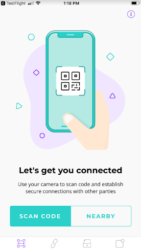

*Example of an Aries Agent App By [Streetcred.id](https://streetcred.id/)*

But personal agents don’t have to be mobile. They could be run on a laptop or desktop computer as applications. Agents directly controlled by individuals might also be operated by a service and run entirely (including all keys) in the cloud. That model, however, is at odds with our goal of controlling your own agent—and your data. If an agent is running in the cloud, someone else is operating the agent and you are not fully in control. At that point, it is about how much you trust that service.

### Enterprise Agents

An enterprise, like a company or a department within a government, will have agents that run on servers to verify proofs of claims submitted by their clients and issue credentials to clients. For example, a health department, prior to issuing an operating permit, might use an Aries agent that messages with the Aries agent of a bakery owner to verify (using proofs) that:

- The bakery is appropriately registered as a company.
- Has proper insurance.
- Has received safe food handling certification.
 

*Health Department Enterprise Agent Could Verify Bakery’s Proof of Claims*

Periodically, inspectors might visit the location, verify the operating permit using their agent, and after a manual inspection, trigger the health department’s agent to issue inspection certificates (good and bad) as verifiable credentials to the owner’s agent. In extreme cases, the health department’s agent can revoke the bakery’s operating permit.

As the saying goes, corporations are people too. Well, maybe not, but corporations in the future will likely need to have their own wallet to receive, hold and prove verifiable credentials about the enterprise itself. Just as people have birth certificates, companies have papers that document their registration with the jurisdiction in which they operate. As the example above shows, organizations receive various licenses and permits (as verifiable credentials) related to the business they operate and from time to time must present claims about themselves from those credentials. These identity enterprise agents may be separate from the “issuer/verifier” type enterprise agents talked about above. Enterprise issuer/verifier agents are part of the business processes between the enterprise and its clients, while an enterprise’s identity agent is responsible for managing and proving attributes about itself.

An enterprise wallet might also be used to empower individuals associated with the enterprise to take actions for that enterprise. While an enterprise wallet may do much of its work based on rules for handling transactions (offers of credentials, requests for presentations), the people that have authority in the organization will ultimately make the decisions. Thus, the enterprise wallet might issue verifiable credentials to individuals that delegate authority to that person to act on behalf of the enterprise. For example, the head of Finance at Mary’s Bakery might be given a credential from the enterprise wallet that shows her relationship to the enterprise, and could then use that to start a process with a bank to open a business bank account for the bakery. We’ll talk more about this scenario in the last chapter of this course.

### Device Agents

Internet of Things (IoT) devices might embed agents capable of issuing verifiable credentials based on data from the device’s sensors. The devices themselves might be certified by a standards organization, and by immediately putting the sensor data into a verifiable credential, the data can be tied to the device and proven not to be tampered with as it is used. For example, sensors in your car can generate verifiable credentials to track mileage and maintenance on the vehicle and that data can be proven when the car is sold. Or, inspection stickers on gas pumps could be handled by the pump issuing verifiable credentials that could be monitored and only inspected when generating faulty data.

*Another Example—Device Agent*

### Routing Agents

Another category of agents are routing agents. These are agents that serve as intermediaries to facilitate the flow of messages between other types of agents. And it turns out, there are lots of places we want or need to have such intermediaries. Because you cannot directly address a mobile agent across the Internet, a primary example of a routing agent is one that allows a mobile agent to send and receive messages. For example, an enterprise agent (or any other piece of software) can’t send a message containing (for example) an offer of a credential directly to a mobile agent (or any other app) on Alice’s phone. It’s just not technically possible. Instead, a mobile agent must have something that holds its messages until that mobile agent asks for them. In the Aries community, routing agents that hold messages for mobile agents are called “mediators.”

We’ll dive into this concept later in the chapter but for now it’s enough to know that the idea of the routing agent is not to be a destination for a message, but instead just a facilitator to move messages along, kind of like being a part of the postal system. And, like the postal system, a routing agent should not know anything about the contents of a message, just where the message needs to go. As such, whenever a routing agent is involved in handling a message, the sender puts the message into an envelope so the agent can’t see the message, just where it’s supposed to go. As you might imagine, such handling is done with encryption.

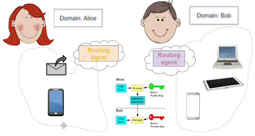

*Routing Agents Move Messages Along*

### Components of Agents: Architecture

All Aries agents, regardless of the category, have a similar architecture. In this section, we’ll review the major components of Aries agents and talk about how the implementations of these components can be used to give an agent its personality. We’ll reference the picture below in summarizing the components.

*Agent Components*

### Key Management Service (KMS)

An Aries agent (usually) has secure storage (called the key management service, or KMS) that is used for all of the information collected by the agent. At a low level, an Aries KMS is wrapper code around a standard database for storing DIDs, keys, connections, credentials and any other information the agent tracks. KMS implementations are pluggable (new implementations can be independently created and used) and two common reference implementations have been created for a range of use cases. An SQLite implementation can be used for small-scale agents, and a PostgreSQL implementation can be used for enterprise scalable deployments. SQLite might be used on a mobile phone to store thousands of records and Postgres on a server to store millions (or billions) of records. In either case, (almost) everything in the database is encrypted before it is stored.

There are two caveats in the paragraph above:

- A static agent is a special type of agent that does not have a wallet. Instead, a static agent is configured at deployment time with the keys and connections necessary to do its work. In memory and CPU limited IOT devices, a static agent can be used if there are not enough resources for a wallet. No doubt other scenarios will arise where a static agent will be useful.
- The only unencrypted data that goes into a wallet are optional tags that might need to be queried in other-than-equality expressions. It’s pretty obscure, but if your app needs to search the wallet for a record where the stored data is (for example) greater than a given value, you have to store the to-be-queried data in plaintext. Yes, that’s very obscure.

As mentioned, KMS storage data is encrypted. Ideally, the management of the handful of keys for the encryption of the KMS data is handled by special hardware on the device (mobile phone, enterprise server, etc.) on which the agent runs, such as the biometric services (fingerprint, face ID) available on modern smartphones. Further, anything requiring processing using the many (many) keys stored in the KMS, including creating, storing, querying, retrieving, encrypting, decrypting, signing and verifying data, is only possible through calls to the KMS code. This layering is to prevent private keys from being accessed by generic agent code written by an arbitrary developer. Keeping keys secured within the open source KMS reduces the risk of security vulnerabilities in “user” code resulting in keys being exposed.

### Agent Messaging Interface

The **agent messaging interface** enables an agent to establish and manage connections with other agents and send and receive messages to those agents. The mechanisms an agent supports to transmit and receive messages depends on where that agent is deployed. Aries uses DIDComm (DID Communication) messaging protocols and is designed to be “transport-agnostic,” meaning that any communication method can be used to send messages. Many agents use the Web’s HTTP (or HTTPS) transport to send and receive messages, but any mechanism can be used for a given agent—web sockets, SMTP (email), XMPP, even hand-written notes (really!) can be used for transporting messages.

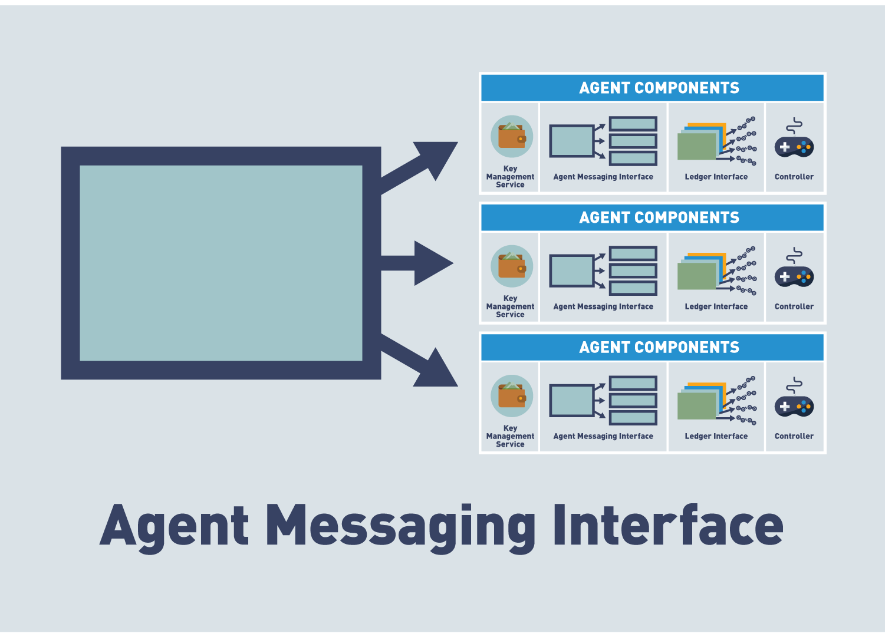

Although some of those transport methods might support encryption, Aries messaging does not rely on that, so even plaintext transport methods can be used. This is possible because the entire Aries message is encrypted (using Ursa), assembled into a standard structure (using JSON Web Encryption (JWE)), converted into a string of characters (usually using base64 encoding) and then sent as the payload using the selected transport mechanism. Anyone looking at the message sees only a really long string of characters. The intended recipient reverses the process to get back the delivered Aries message. The basic structure of Aries messages and the encoding/decoding of the messages during delivery is defined by the **DIDComm envelope protocol**, something we’ll discuss later in this chapter.

In addition to sending and receiving messages, the agent interface manages the relationships the agent has with other agents and each conversation the agent has with each of those other agents. As we’ll learn, many conversations between agents require a sequence of messages and the agent interface tracks the state of those sequences (threads).

### Ledger Interface

The **ledger interface** enables all of the blockchain operations that we talked about in the previous chapter about Indy—reading and writing DIDs and other transactions to/from the ledger. While we’ve talked in this course about the Indy ledger, with Aries, Indy is not the only game in town. An Aries agent can be implemented with a pluggable interface to empower it to talk to other ledgers. As this course is updated (April 2021), most of the real world deployments of Aries to date have been based on Indy ledgers (especially, Sovrin’s global instance). However, in 2021 there has been a lot of activity in the community related to the use of Aries agents working with other ledgers.

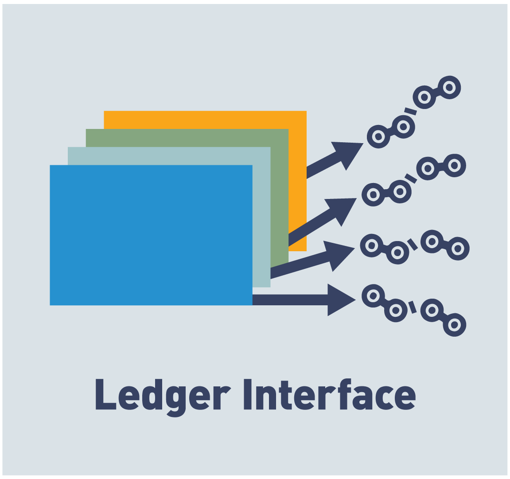

An Aries ledger interface consists of three parts:

- a DID resolver
- a writing mechanism
- a verifiable credential handler

### Ledger Interface: DID Resolver

The simplest part of the ledger interface is the DID resolver for reading DIDs, which is architecturally similar for every DID method—given a DID, resolve it to return the DID’s DIDDoc. Ideally, the work to resolve any DID can be done by code within an Aries agent by deploying a pluggable resolver for each DID method. For example, most current production deployments of Aries agents handle three DID methods: Indy DIDs, peer DIDs for messaging and the special “`did:key`” method that allows a simple public key to be resolved using a standard transformation to a DIDDoc. However, as of this writing (April 2021) additional resolvers are being added to Aries implementations to enable reading data from other DID ledger instances.

A problem with the plan of supporting all DID methods is that there are lots and lots of DID methods—too many to support as plugins within every agent. The plan to solve that in Aries (for agents that want to allow that) is to use a centralized **universal DID resolver** service. If a DID is encountered that cannot be resolved using local code in the agent, it is sent to a universal resolver, which will (try to) support all DID methods. The universal resolver will perform the resolution on behalf of the agent and return the result. The use of such a service implies that the agent must trust that service to respond with accurate data.

### Ledger Interface: Writing Mechanism

The second part of the ledger interface is the mechanism to write data to the ledger. This must be implemented within the Aries agent to ensure full control over the private keys involved in the transactions. Further, different ledger implementations will involve writing different transactions to the ledger, resulting in both the code and interface being different per ledger implementation. As with the resolver part, an Aries agent implementation will, out of necessity, only support writing for a small number of DID methods, often just one.

### Ledger Interface: Verifiable Credential Handler

The third part of the ledger interface is the verifiable credential handler. In this case the interface is likely to be pretty much the same across verifiable credential formats, with essentially the same sequence of events occurring for issuing credentials and presenting proofs. That said, the specific actions within the steps are different from one verifiable credential format to another. The actions to process an Indy zero-knowledge presentation are quite different from the verification of a credential-based presentation.

### The Controller

The final component of an Aries agent is the controller—the element that gives the agent its personality. The controller provides the “business rules” (for lack of a better term) that define what actions the agent will initiate and how the agent will respond to events. For a mobile agent, the controller is a mobile user interface that presents the options to a person who then supplies the business rules. For a verifiable credential issuer/verifier-style enterprise agent within an organization, the controller might be a legacy database system that manages customer data. Such an agent might enable customers to submit data by presenting claims from verifiable credentials instead of typing the information into a web form. That is a win for the organization—better quality data that does not need to be manually reviewed and verified, and a win for the customer—less typing and faster responses because the data does not need to be manually verified.

A controller is the software Aries developers build using Aries. All the capabilities that make up Aries go into the agent framework, and then an Aries developer, as an external party, writes the code (and business rules) to create an agent-enabled application. We’ll talk more about building such applications later in this chapter.

### Agent Messaging: Peer-to-Peer Messaging

The key capability of an Aries agent is peer-to-peer messaging—connecting with agents and sending and receiving messages to and from those agents to accomplish some interaction. The interaction might be as simple as sending a plaintext message, or more complex, such as negotiating the issuing of a credential or the presentation of a proof.

Enabling both the exchange of messages and the use of messaging to accomplish higher level transactions requires participants to interact in pre-defined ways, following mutually agreed upon protocols. As we noted in Chapter 3, messaging protocols are just like human ones, a sequence of events that are known by the participants to accomplish some shared outcome. Think back to the example of going out to a restaurant for a meal, with both the guests and the restaurant staff knowing the sequence of steps for their roles—greeting, being seated, looking at menus, ordering food, etc. Unlike human protocols (etiquette), messaging protocols need to be carefully specified and then implemented by multiple participants. And tested!

With Aries, there are two levels of messaging protocols. Since all of the messaging is based on the exchange and use of DIDs, the messaging mechanism is called **DIDComm** for **DID communication**.

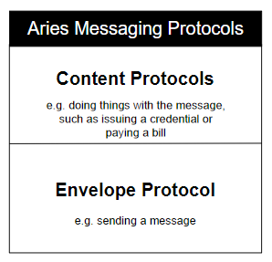

*The Aries Messaging Protocols*

At the lower level is the **DIDComm envelope protocol**, the method by which messages are exchanged, irrespective of the message content. You can think of the envelope protocol as being like the postal service. You write a letter, place it into an envelope, address it to a recipient, give it to the postal service and magically, it appears at the recipient’s door. And, just like the postal service, there is a lot of hidden complexity in the sending and receiving of messages.

At a higher level are the **Aries content protocols**, tens of protocols that define back-and-forth sequences of specific messages to accomplish some shared goal. The simplest of these is one agent sending another agent a text message (“Hi, how are you?”). A much more complex protocol is issuing an Indy-style credential, where it takes at least three messages back and forth to offer, request and issue a credential. The set of messages, the roles of the participants, plus some extra details such as acknowledgments and error handling, define each of the many Aries protocols.

With the DIDComm envelope protocol we don’t care about the content of the message, just the method by which a message gets delivered. With the Aries content protocols it’s the reverse—we know that the messages get delivered (we don’t care how), we only care about what to do with the content of each message.

### Aries Messaging: Walkthrough

In the following, we present a brief walkthrough of messaging between two Aries agents—establishing a connection and then using that connection for an issuer agent to issue a verifiable credential to a holder.

We start with two agents that are deployed, unknown to one another and that for some reason want to connect. For example, it might be a user trying to connect to an enterprise, or two users with agents trying to connect to one another.

### Establishing a Connection: The Invitation

Since the agents don’t have any sort of trusted communication path at the start of the protocol, they have to use some sort of out-of-band (non-DIDComm) mechanism to begin communicating. A common way to convey the invitation is that one of the agents generates an invitation and displays it as a QR code that a mobile wallet app can scan, convert into a string of data and process. The invitation can be sent in other ways as well: emailed, displayed on a screen and copied/pasted, written on paper, etc. An invitation may even be implied—the DIDDoc of the public DID of an issuer might contain all of the information another agent needs to request a connection with the issuer’s agent. Basically, any method of sending the necessary plain text from one agent to another.

*The Invitation*

The invitation is a chunk of plaintext (not encrypted) data (in JSON) that contains a unique identifier and the same sort of information that is in a DIDDoc—notably a public key and a service endpoint. It is the way an inviter says to the invitee “Hey, connect with me!” The invitation is in plaintext because the inviter has no public key for the invitee with which to encrypt the message.

### Establishing a Connection: The Connection Request

With the invitation in hand, the invitee can use the public key and service endpoint to get a secure message to the inviter. If the invitee wants to accept the invitation, it creates a new DID and DIDDoc for the relationship that is being formed and places the invitation identifier and the new DIDDoc into a connection-request Aries protocol message. It also creates in its secure storage a connection identifier and record that will hold all of the information it collects about the connection. The DIDcomm envelope protocol is used to package the content protocol message, encrypting it using the public key from the invitation and sending it to the service endpoint in the invitation.

*The Connection Request*

### Establishing a Connection: The Connection Response

The inviter listening for messages on its service endpoint receives the message from the invitee and decrypts it to find the connection-request message. The invitation identifier in the message informs the inviter with what invitation to associate this message. It too creates a connection identifier and record, saving it in the DID and DIDDoc from the invitee. It then creates a DID and DIDDoc, saves it in the connection record, and packages the data into a connection-response Aries content protocol message. That message is packaged (using the DIDComm envelope protocol) and sent to the invitee.

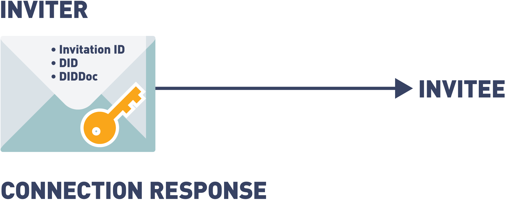

*The Connection Response*

### Establishing a Connection: The Connection Establishment

When the invitee receives the message, it saves the other agent’s DID and DIDDoc in the connection record and the connection is established. The two agents are connected with a secure, private, end-to-end encrypted messaging channel. That’s huge! Of course, the parties still don’t know much about each other (just each other’s DIDs), but that will come after—by exchanging presentations.

*The Connection Establishment*

We have skipped over a lot of the details that make this protocol reliable, reusable and secure. At this level, however, it not only shows how connections are established but also provides a good demonstration of Aries content protocols, showing how a protocol:

- Has participants with different roles (e.g., inviter, invitee).
- Uses a series of message types (e.g., invitation, request, response).
- Uses expected data elements in each message type (e.g., ID, DID, DIDdoc).
- Sends a threaded sequence of messages that trigger events to move the protocol through a series of states (e.g., invited, requested, established).
- Sends messages asynchronously. That is, the message is sent and the sender does not wait for a response. Responses are sent as new messages. This is different from the HTTP protocol, which is a synchronous (request-response) protocol.

This process encompasses two protocols called the **Out-of-Band** and **DID exchange** protocols which are documented in GitHub in the Aries Request for Change (RFC) repository, “[Aries RFC 0434: Out-of-Band Protocol 1.1](https://github.com/hyperledger/aries-rfcs/tree/master/features/0434-outofband)” and “[Aries RFC 0023: DID Exchange Protocol 1.0](https://github.com/hyperledger/aries-rfcs/tree/master/features/0023-did-exchange).” Because of the foundational nature of these two protocols (establishing a connection), the details we glossed over make them one of the most complex of the Aries protocols.

### The Issue Credential Protocol

To solidify the concepts, let’s take a quick look at another content protocol to show how an established messaging channel between agents is used. The **issue credential protocol** is used to enable an issuer to provide a holder with a verifiable credential. Again, we’ll gloss over some features of the protocol to keep it simple.

In this protocol:

- There are two participants (issuer, holder).
- There are four message types (propose, offer, request and issue).
- There are four states (proposed, offered, requested and issued).

At the start, the two participants have agents and have established a connection. To issue an Indy credential, the simplest instance of the protocol must have three steps:

- The issuer sends the holder an offer message.
- The holder responds with a request message.
- The issuer completes the exchange by sending the holder an issue message containing the verifiable credential.

Since we want the protocol to support other verifiable credential implementations beyond Indy, that sequence is not set in stone. Some verifiable credential implementations don’t have a technical requirement for an offer, so the protocol could be completed in just two steps, a request from the holder and an issue from the issuer.

The “propose” message is optional and can be used for two purposes. First, a holder can use a propose message to start the protocol, rather than waiting for an offer message from the issuer. As well, the propose message can be used as a way to negotiate with the issuer about an offer. If the issuer sends an offer for one type of credential, the holder can respond back with a propose message that says “Hey, thanks, but I would rather have this other type of credential.”

And of course, things can go wrong. In executing any protocol, things may not follow the “happy path.” A “problem report” message can be used at any time to notify the other side of a problem in the execution of the protocol.

### Lab Time

Let’s take a look at the envelope and content protocols in action by stepping through this short "[Aries Connections and Messages](https://github.com/cloudcompass/ToIPLabs/blob/master/docs/LFS172x/aries-messages-lab.md)" lab. DIDComm-based development is a major topic of the developer-focused follow-on course to this one, "[Becoming a Hyperledger Aries Developer](https://training.linuxfoundation.org/training/becoming-a-hyperledger-aries-developer-lfs173/)" (LFS173x).

### Aries Interop Profiles (AIPs)

The Hyperledger [aries-rfcs](https://github.com/hyperledger/aries-rfcs) code repository contains a growing list of documents about how DIDComm protocols work (the concepts folder) and about specific Aries content protocols (the features folder). The repository is a bit overwhelming to those new to Aries. There are many, many protocols in various states of endorsement in the community, from proposed (someone’s great/crazy idea—who knows?), to demonstrated (someone implemented it), accepted (several groups have implemented it), adopted (everyone must use it) and even retired (that’s so yesterday). Where to start?

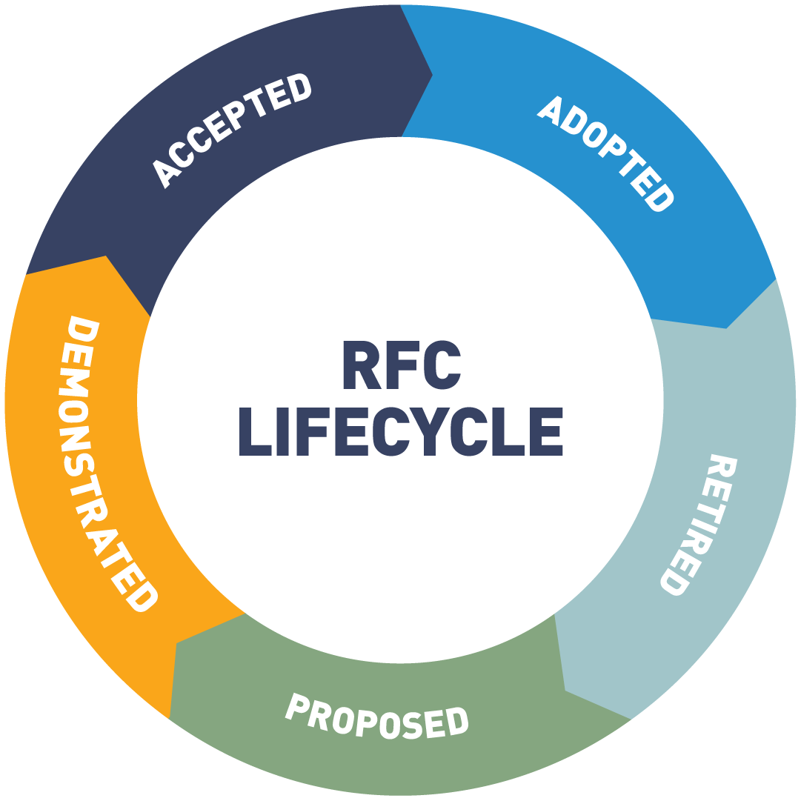

*Aries RFC Lifecycle*

In the fall of 2019, the Aries community realized that the state of the Aries RFCs was more than just confusing. It was making it impossible for those implementing agents to know what other implementers were doing—what protocols were they using, even what version of what protocols they were using. The solution the community came up with was to define Aries Interop Profiles (AIPs—[Aries RFC 0302](https://github.com/hyperledger/aries-rfcs/tree/master/concepts/0302-aries-interop-profile)) that formalize ***exactly*** what protocols and what version of those protocols (down to the GitHub “commit” identifier!) a “compliant” agent would support. In doing that, the community created AIP v1.0, referencing 19 Aries RFCs that allowed agents to connect, message and exchange Indy credentials. With an AIP formally defined, many software creators in the community created [AIP v1.0](https://github.com/hyperledger/aries-rfcs/tree/master/concepts/0302-aries-interop-profile#aries-interop-profile-version-10)-”compatible” agents and a level of interoperability was enabled. The quotes around “compatible” are there because there was not really a good way to test that the agents were compatible with one another other than to manually try them.

As this course is being updated (April 2021), AIP v2.0 is close to being finalized by the Aries community. While the goal of AIP v2.0 is much the same as AIP V1.0 (connecting, messaging and exchanging credentials), the ledger- and verifiable credential-agnostic nature of Aries is coming to the fore. Rather than being tied strictly to Indy, AIP v2.0 enables the use of other ledgers and other verifiable credential formats. It’s a significant move to making Aries interoperate with other verifiable credential ecosystems.

The other significant interoperability progress being made by the Aries community is the Aries Agent Test Harness (AATH), a mechanism to automate interoperability testing across implementations. Rather than testing each agent against a conformance test, the AATH consists of tests that exercise the AIP protocols using an arbitrary combination of implementations. Wondering if agent X works with agent Y? Check the AATH! You can see the status of Aries agent interoperability at the website [https://aries-interop.info](https://aries-interop.info/), where recent test runs of the AATH are regularly published.

### Building an Aries Agent Application

To wrap up this chapter, let’s talk about how one goes about building an Aries agent application. How do you create something on top of all the Indy, Aries and Ursa goodness? As we talked about earlier in this chapter, that requires building an agent controller application that integrates with Aries functionality.

The Aries functionality is built into an Aries framework. The framework contains everything needed to connect with other agents, send messages using the DIDComm protocol, execute Aries content protocols, interact with ledgers, issue verifiable credentials and create and verify presentations. However, by itself, it does nothing. The controller is what activates a framework and tells it what to do. As the framework does its work, it also calls back to the controller to say “Hey, this event occurred. What should I do?” That’s where the controllers business rules come into play and it can decide what to do.

Let’s look at how that works and what a controller really does.

*The Aries Agent Structure*

### Aries Controller

As noted, an Aries framework does nothing on its own. The controller must configure the Aries framework it is using and must initiate events and tell the framework how to respond to events. In providing this overview, we’ll use the case of an issuer agent that issues credentials to individuals and cover the important events in the life of an issuer agent, namely:

- starting up
- connecting with a holder
- issuing a credential
- revoking a credential (when necessary)

### Aries Controller: Starting Up an Issuer Agent

In starting up our agent, the controller must tell the framework to check the ledger for the objects necessary to be an issuer and to create them if necessary. As we’ve talked about, creating such things requires creating and managing public-private key pairs, calls to create the objects and calls to interact with the ledger to publish the objects. Those are all handled by the framework. The controller just needs to tell the framework the minimum details of what to create (and where), and the framework handles the rest. Going back to our “what goes on the ledger” from Chapter 4, the controller might tell the framework the ledger it wants to use, the name of the schema for the credential it will issue and the list of claims in the credential. From there, the framework uses its capabilities to create the Indy schema, credential definition and revocation registry objects, store them in the agent’s secure storage and publish them to the right Indy ledger. And once it has all that done, the framework notifies the controller and pauses, waiting for further instructions.

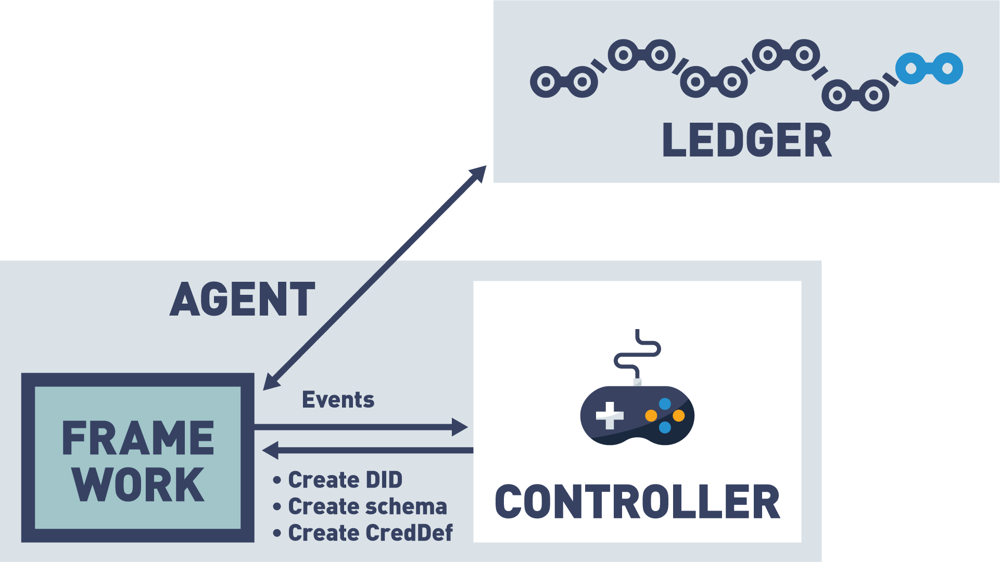

*Starting Up An Issuer Agent*

### Aries Controller: Connecting With a Holder

From time to time, the controller will want to establish a new connection. For example, the issuer might be a bank, providing clients a credential about their bank account. When the bank’s customer gets to a web page where they can collect their verifiable credential, the bank website might display a QR code for the customer to scan with their mobile wallet app. The bank’s controller calls to the framework to request the QR code data, displays it, and waits for the connection to happen. Remember all the things that happen in establishing a connection from earlier in this chapter? The framework handles all that. For the most part, the controller does nothing until it is notified by the framework “Hey, we’re all done! Here is the identifier for the new connection.” The controller does need to know the identifier for the connection and must save that in its own database, linked to the customer. Whenever it needs to interact with the customer’s agent, it tells the framework to do so using that connection identifier.

Alternatively, an agent might receive a request to connect from another agent. Should it accept? That’s a question for the controller, so the framework passes to the controller the information about the request and then waits. Once the controller decides (which may take a while, if a person is needed), it tells the framework what to do—either to accept, reject or ignore the request. The framework will have a number of things to do regardless of the decision and does so without the controller having to know all the details.

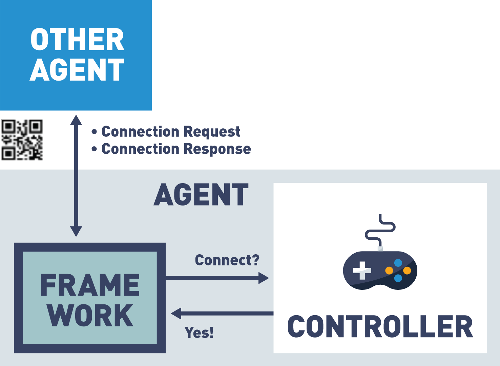

*Connecting With A Holder*

### Aries Controller: Issuing a Credential

With a connection with the customer’s agent established the bank issuer can interact with that agent. It might ask for a presentation to confirm the identity of the customer. Eventually, it will get to the point of needing to issue a credential to the customer. To do that, the controller passes to the framework the type of the credential, the data for the claims and the connection identifier for the customer, and the framework (for the most part) takes care of issuing the credential. Note that after offering the credential to the customer, the response might not come back for hours. No worries, the issuer framework will just wait. Once the credential is issued, an identifier for the credential is given back to the controller, which again stores that with the rest of the information it keeps on the customer.

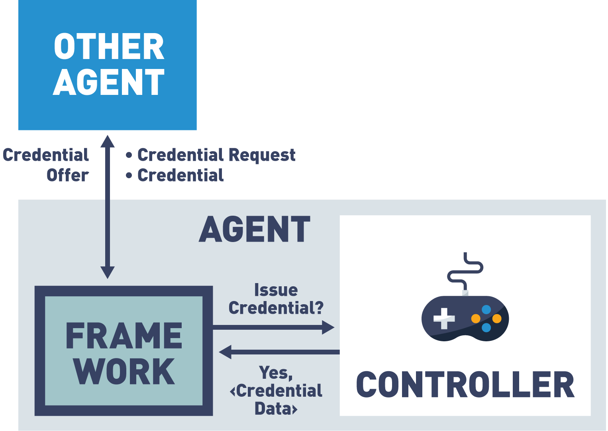

*Issuing a Credential*

### Aries Controller: Revoking a Credential

Suppose some time later the customer decides to close the bank account for which they have been issued a credential. The bank doesn’t want the customer to be able to continue to prove they have the account. Once again, the framework to the rescue! The controller retrieves the identifier for the credential and passes it to the framework to revoke it. The framework handles the interactions necessary to revoke the credential. Once done, it lets the controller know—”All done!” Note that the interaction is only between the Issuer Agent and the ledger. There is a new capability in Aries that gives the Issuer a way to tell an impacted credential holder “Hey, we’ve revoked your credential!”, but that is optional—not needed for the revocation to take effect.

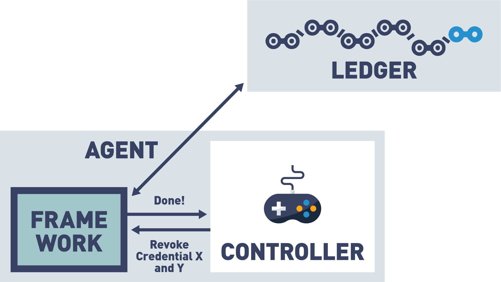

*Revoking a Credential*

### Aries Agent Frameworks

As of April 2021, there are four major open source Aries frameworks, a fifth on the way and some closed source implementations. Let’s do a quick review.

In the open source world, the frameworks are mostly identified by their language of implementation. The oldest are the Aries Cloud Agent Python ([ACA-Py aries-cloudagent-python](https://github.com/hyperledger/aries-cloudagent-python)) and Aries Framework .NET ([AF.NET aries-framework-dotnet](https://github.com/hyperledger/aries-framework-dotnet)). ACA-Py is a purely server-based agent, suitable for deployment as an enterprise issuer/verifier or an organizational wallet. ACA-Py has also been deployed on Raspberry Pi’s and so could also be used in IoT scenarios. AF.NET can be used both as a server-based agent and used with Microsoft’s Xamarin as the basis for a mobile wallet app. The better known (as of this writing) mobile wallets are all built on AF.NET. To now, both ACA-Py and AF.NET have been built around AIP v1.0, using Indy ledgers and Indy-format verifiable credentials. However, both are currently adding features to support AIP v2.0 including the use of other ledgers and other verifiable credential formats. Aries Framework JavaScript ([AFJ aries-framework-javascript](https://github.com/hyperledger/aries-framework-javascript)) is a relatively new framework that is being built primarily to support the mobile wallet use case, enabling the creation of JavaScript-based agents using technologies such as React Native and Flutter. AFJ is also AIP v1.0 right now, and moving quickly towards AIP v2.0.

The Aries Framework Go ([AFGo aries-framework-go](https://github.com/hyperledger/aries-framework-go)) was created in quite a different way than ACA-Py and AF.NET. The core AFGo framework was built from the ground up in golang and does not use either Hyperledger Ursa or Hyperledger Indy, bypassing AIP 1.0 altogether. Instead, the AFGo team started with a framework that integrated with other ledgers, including one based on Hyperledger Fabric, and using (non-Indy) W3C Standard JSON-LD verifiable credentials. AFGo was also built using protocols that will be part of the upcoming AIP v2.0. Now that AIP v2.0 is pending across the Aries community, a current focus is to get all of the open source frameworks interoperable, including AFGo.

> **NOTE:** *Some work has been done by contributors to AFGo to add support for both Indy ledgers and Indy-format verifiable credentials.*

The last and most recent (as of latest editing of this course in April 2021) open source Aries framework is the Aries Verifiable Credential eXchange ([AVCX aries-vcx](https://github.com/hyperledger/aries-vcx)). For several years AVCX was built into the Indy SDK. However, as we noted in our earlier discussion about the evolution of Aries from Indy, the verifiable credential exchange part of Indy really belongs at the Aries agent layer (Layer 2 of the ToIP technical stack). So, a group in the Aries community has extracted the VCX components from the Indy SDK to make them the basis of a new framework. The AVCX is written in Rust and as such can be embedded in controllers built in any language. We’ll talk about that in the next section of this chapter when we talk about Aries deployment models. AVCX is used primarily for enterprise agents at this time.

In addition to the open source implementations, there are companies offering closed source components that can be embedded in controllers. Most notable is Evernym, the company that originally created (with the Sovrin Foundation) the software that was to become Hyperledger Indy. Their Verity and Mobile SDKs can be embedded in controllers to build custom agents for any application. As well, Trinsic, the initial developer of Aries Framework .NET, offers closed source framework plus controller implementations of AF.NET for several use cases that can be run in the cloud (an “Agent as a Service” model) or on premise.

### Aries Enterprise Deployment Models

As Aries enterprise solutions become mainstream, they are becoming easier to deploy. Back in the early days when we started with Indy, you had to fork the Indy GitHub repos, get them running, and then design and build an agent yourself. We’ve come a long way since then!

The easiest way for an organization to start using Aries as an issuer or verifier is to use an Aries agency, such as the ones offered by Trinsic, Evernym and others. In the “agency” model, the agents are made available in an “Agent-as-a-Service” model. A web user interface lets you sign up, deploy an agent and then use that agent using a web interface and/or the agent’s API. It’s an easy way to get started.

If you want to run your own agents, each of the frameworks (open or closed source) provide guidance on deploying the framework to your own server (on premise or in the cloud). Once deployed, you can build your own controller to use the deployed framework. There are lots of example controllers associated with the frameworks providing higher level capabilities, such as “Issuer Kit” and “Verifier Kit” for quickly deploying issuers and verifiers. Recently, the Aries Cloud Agent Python has been enhanced to include a “multi-tenant” capability, making it easier to build your own agent-as-a-service implementation. For example, a government might want to deploy an internal service that provides agents for all of the potential issuers across the many organizations within that government. Those agents might have specific capabilities (for example, basic issuers) with a simple API, or have fully custom controllers tightly integrated with the organization’s line of business applications.

For the most part, organizations can build controllers in any language they want, regardless of the language of the framework. For example, both Aries Cloud Agent Python and Aries Framework Go expose an HTTP API and use HTTP callbacks to the controller so that the controller can be built in any language.

### Aries Mobile Agents

Like enterprise agents, “in the old days” it was difficult to get a hold of an Aries mobile agent. Today, there are many commercial implementations that you can get from the Google and Apple app stores that use AIP v1.0 functionality and will work with AIP v1.0 organizational agents. That’s the easiest way to get started with a mobile wallet—download one from the app store.

Early on, there was an open source mobile agent called Aries Mobile Agent Xamarin (Aries Max) that was built on Aries Framework.NET and Xamarin. However, Aries Max really didn’t take off, largely because for the casual mobile developer it was too hard to deploy. As we talked about earlier, a mobile agent can’t receive messages directly from other agents, it must have a routing agent, a mediator, to receive messages from other agents and hold them until the mobile agent requests them. Aries Max didn’t have an easy way to deploy a mediator. Developers wanting to work on a mobile agent gave up because it was going to be too much work to build a mediator first.

Since then, an Aries protocol to define how to integrate with a mediator has been defined and that protocol has been added to some frameworks (notably ACA-Py) so it is much easier to deploy a mobile agent. In fact, Indicio.Tech even provides [a free mediator](https://indicio-tech.github.io/mediator/) that anyone can use for development. As such, new open source mobile wallets, such as [aries-mobile-agent-react-native](https://github.com/hyperledger/aries-mobile-agent-react-native) have been added with built-in “connect to a mediator” protocol, eliminating the major stumbling block in easily deploying an open source Aries wallet for development. As such, we are anticipating a much larger focus on building a crowd pleasing open source wallet. Of course, for production use, someone will still have to deploy them to the app stores.

### Summary

There is a lot to get to know about Aries agents, their components and how they work. This is the area in the three projects where most of the activity is currently happening. That includes within Aries, the definition of Aries protocols (through the RFC process) and on top of Aries, with organizations building solutions using Aries. It’s an exciting world of “building on the shoulders of others,” with major new capabilities regularly popping up in the market. While Indy and Ursa are cool, Aries is where development can and should have the most impact and we encourage anyone interested in making a difference in this environment to dig deeper into the Aries agent world.

Want to learn more about Aries? If you are planning on building an Aries application, you’ll definitely be interested in the follow- on course to this one, "[Becoming a Hyperledger Aries Developer](https://training.linuxfoundation.org/training/becoming-a-hyperledger-aries-developer-lfs173/)" (LSF173x)!

## Chapter 6: When Things Go Wrong

### Introduction: Chapter Overview

What happens if you lose your wallet? Well, we all know what happens in the paper credential world. You run around like a chicken with its head cut off, frantically searching for it, worrying that it may have fallen into the wrong hands. Will your identity be stolen? How long will it take you to get a replacement credit card? How do you even get a new driver’s license? Where is it!? Such a pain!

That same scenario can also happen in the digital world we’re talking about. What happens if you drop your phone in a lake? What happens if you lose the device that holds your digital wallet with your credentials and private keys? Can others use them? How will you get your data back? Such a pain! You have probably heard stories of cryptocurrency keys being lost and [millions becoming completely inaccessible](https://www.cnn.com/2019/02/05/tech/quadriga-gerald-cotten-cryptocurrency/index.html). That’s way beyond a pain!

This chapter explores these challenges that are a reality even in a self-sovereign identity, Indy, Aries and Ursa world. As you’ll see, the full set of approaches for agent storage backup and recovery are not yet fully defined, and there are few implementations. Lots of thought has gone into approaches, but not yet enough action. These are areas that are ripe for innovation and implementation.

As we complete the second version of this course, one plus years after the first, updating it with all that has changed with Ursa, Indy and Aries in the last two years we find that...sadly, not too much has changed in the material in this chapter. We’ve seen some definite progress, especially by some of the leading commercial mobile wallet app providers, but it is still an area that is “ripe for innovation and implementation.”

### Learning Objectives

By the end of this chapter you should:

- Understand how agents can be backed up and restored.
- Be familiar with the the idea of a recovery key and how it might work.
- Be able to recall techniques that are being considered for protecting your recovery key.
- Be aware of the steps that you can take to protect your data if someone were to get a hold of your Aries agent.

### Recovering a Lost Mobile Agent Wallet: Mobile Agent Wallet

The first and most likely problem with having your own digital wallet is losing it. One minute your phone is working fine and the next, you drop it into the Grand Canyon and it is destroyed in a 1000m drop to the rock floor. Or, if you aren’t in Arizona, an even more likely (and much less dramatic) scenario is that the agent mobile app you are using has a bug, corrupts the data in your Aries agent key management service (KMS), you need to reset the app and all the data is lost. Now what?

*Eek! Your Wallet Stops Working*

Even for day-to-day use, backup and recovery capabilities are crucial. For consumer mobile agents, these functions must be automatic, with little effort to set up, no effort to carry out on an ongoing basis, and minimal effort to restore. As well, the backups must be safe. It must be extremely (!!!!) difficult for an unauthorized user to access the data in an Aries app backup.

For enterprise agents, the situation is a lot easier. Agent secure storage backup and restore should be straightforward in a modern enterprise Information Technology (IT) group since an agent’s database is more or less “just another database” from an enterprise perspective. In this section, we’ll assume a focus on the use case of restoring a mobile agent KMS, but the same principles apply in the non-mobile agent scenario.

The backup and restore solution falls into two parts. First, the backups must be protected through encryption, redundantly stored and periodically tested. Second, the private key needed to decrypt the backups must be protected separately from the backups themselves. Only when an authorized person is deliberately restoring the backups should the two come together. We’ll look at some novel ways of managing the private key to keep it away from the backups until it is needed.

If we can make sure that backup and recovery is going to be successful, the chance of permanently losing one’s wallet will be greatly diminished.

As of April 2021, the Aries Framework .NET Xamarin based wallets from Trinsic, esatus and LISSI all have both a backup and restore process and an export mechanism. Further, the export format they use is compatible across all three mobile wallets such that a backup from one can be restored on another. It’s not a perfect solution, as you still have to manage a long pass phrase (discussed in the next section), but it’s the most promising progress we’ve seen yet!

### Key Management Service (KMS) Keys

In normal operations, there is one key that is used to access all of the data in the Aries KMS. Recall from Chapter 5 that (almost) all of the data in the KMS is encrypted and it is with what we will call the private KMS access key that the data can be decrypted. The KMS access key should always be protected by the best capabilities offered by the platform on which the agent is running. For example, on a smartphone, the KMS access key is protected by the phone’s hardware and accessible only using the security features of the operating system, such as face or fingerprint recognition or other security features (e.g., a pin or pattern). The single KMS access key is in turn used to decrypt a set of additional key pairs that encrypt/decrypt the data in the database. Those keys are only accessible inside the Aries KMS.

We expect that the backing up of the KMS data store will be done using the tools provided by the manufacturer of the database tools. So, if an agent’s KMS is using an SQLite database, the backup of the database will be created by SQLite backup tools.

In addition to backing up the database, the keys necessary to decrypt the data in the database must also be backed up and those must be protected. Those keys will be encrypted into a package protected by a second crucial key pair, the recovery key pair. It’s the recovery private key that must be separated from the backup itself until it is needed together with the encrypted backups to restore the database. We’ll talk about managing the recovery key in the next section. For now, we’ll just focus on managing the backups.

So now we have two keys that can be used to access the data in the KMS. The one called the KMS access key is protected by the platform, ideally by hardware that prevents it from being accessed by anyone other than the owner.

> **NOTE:** *There could be exceptions. For example, a court order/other extraordinary measure that forces access through a manufacturer’s "back door" if one exists. See, for example, this story from the Washington Post: "[Apple Vows to Resist FBI Demand to Crack iPhone Linked to San Bernardino Attacks.](https://www.washingtonpost.com/world/national-security/us-wants-apple-to-help-unlock-iphone-used-by-san-bernardino-shooter/2016/02/16/69b903ee-d4d9-11e5-9823-02b905009f99_story.html)"*

The second, called the recovery key, has a public key that encrypts the package of key pairs and the database backups, and its corresponding private key that can decrypt the KMS keys and backups. The recovery “key” is often provided to the wallet owner as a long string of words that in turn are used to generate the public and private key pairs. The rationale is that the words are easier for the owner to manage versus a very long hexadecimal number. That said, if either get into the wrong hands, the protection provided by the encryption can be compromised.

### Key Management Service (KMS) Keys: Backups vs Exports

The current Indy secure storage mechanism supports creating an encrypted export of the agent’s KMS data. Although that mechanism could be used for backup and restore, we don’t expect that is how it will be used. That feature will be used for portability, when you want to move your data from one agent to another, even from one vendor to another. While it could be used for backup and restore, we expect that the database tools mentioned previously will be far more effective in managing backup data. For example, in the Trinisic wallet, there is both a cloud “backup and recovery” capability, used for ongoing backup of the wallet contents, and an “export” capability, to create a one time export of the database that can be imported into another wallet.

### Managing Database Backups

There are several places where a wallet backup could be stored:

1. On the device itself.
1. On the mediator agent.
1. On another device.
1. On peer-to-peer files.

Let’s discuss each idea and how it might work.

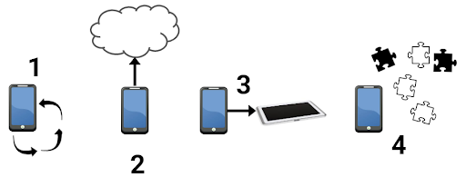

*Backup and Restore Ideas*

### Managing Database Backups: On the Device Itself

The easiest is storing the encrypted backup on the device itself, so if only the agent storage were to be deleted, a restore could be carried out immediately, on the device. Periodically, the mobile agent would initiate an incremental backup of the KMS database. We’ll cover another reason for keeping a local backup in the next section.

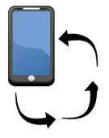

*On the Device Itself*

### Managing Database Backups: On the Mediator Agent

Since all mobile agents must have an associated mediator routing agent (see the “Routing Agents” section of Chapter 5), another obvious place to store a mobile agent backup would be with its mediator agent. Periodically, the mobile agent would initiate a backup of the wallet, pushing the encrypted data to the mediator for storage. A potential risk with that solution is the operator of mediator service has access to all of your data, although in an encrypted form. If they are also the maker of your smartphone app, they could in theory access the recovery key. If that is a concern, a separate service that provides backup storage might be an option—perhaps banks or other trusted entities might offer such services.

*On the Cloud Agent*

### Managing Database Backups: On Another Device

Another backup location might be on other devices that either you control or are controlled by a person that you trust. When one device is lost, another can be used to restore it. Of course, if you don’t have access to another device, or the device is not available when you need it, that’s a problem. Another option would be to push the backup to hardware on a device you own, such as a non-mobile device in your home. However, if a disaster occurs such as a fire, and both devices are lost...

*On the Another Device*

### Managing Database Backups: Using Peer-to-Peer Storage

Yet another option is to combine all of the above background targets using peer-to-peer file sharing techniques. Parts of the backup could be redundantly distributed to different backup holders, and when needed, the components would be collected from the backups and then restored once together on the target device.

*Using Peer-to-Peer Storage*

### Managing Database Backups: Creating Backups

Each of the non-local mechanisms could be managed by Aries content protocols such as we talked about in Chapter 5. Such protocols would include messages to initialize other agents as backup targets and periodically push backup data to the targets. Restoring a backup from other than the local device would take some additional effort as, with the original wallet lost, connections between the lost agent and the backup holder(s) would not be available. Some way of rebooting those connections and providing sufficient proof of who is asking for the backup would be needed before the holders would hand over the backup data they are holding.

### Managing Database Backups: Testing Backups

Recall that we mentioned other uses for keeping a local backup on the device. In addition to being available in scenarios where just the wallet is lost, the backup could be used to verify the restoration process. As anyone who has managed a backup and restore process knows, if you haven’t tested restoring your backup, you don’t know if you have a working process. The worst time to try your first restore is when you’ve lost the original and the backup is the only copy you have left! One solution is to test restoring using the recovery key with the local backup copy to ensure it can be used to produce a complete copy of your wallet. The local copy can also be used to periodically verify that the remote copies can be collected and assembled into a restorable local backup.

### Managing the Recovery Key

The second part of backing up and restoring an agent’s KMS database is managing the single recovery key that will be used to restore the backup. As discussed in the previous section, we have various ways of distributing and later retrieving backups, but to complete the restoration we need the recovery key. Further, we want to be sure that no unauthorized user can access the key and restore an instance of the wallet.

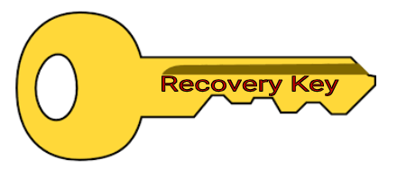

*Recovery Key*

The recovery key must be protected by its owner. A recovery key might be a seemingly random string of letters and numbers, or might be a string of words from a given dictionary. It cannot be a traditional, simple password as it must have sufficient randomness (“entropy”) to be essentially impossible to determine through trying all combinations of characters (called a brute force attack). The key must be created by the owner and then put in a place or places such that it can be retrieved when necessary. As with many security-related challenges, storage will be a trade-off between convenience for the owner and difficulty for attackers. The more convenient to access the key for the owner, the more likely an attacker can also access it. Here’s a list of where the recovery key might be stored:

- hot storage: on device
- cold storage: on paper or USB key
- sharded hot storage: social recovery
- memorizing: in your head

*The Recovery Key Must Be Protected!*

### Managing the Recovery Key: Hot Storage - On Device

Hot storage refers to any form of online storage, and in this case, it’s on the device itself. As with the idea of keeping a backup on the device, the recovery key might reside on the device, protected by the same platform-level security that protects the access key, usually a hardware module accessed with a biometric—a fingerprint or face ID.

The "on device" approach is not sufficient when we are protecting against the loss of the device itself. In theory, you could also save the recovery key in a password manager (for example, LastPass), in a file in the cloud, or on another device. However, the risk of loss in putting the key in those locations must be considered. Depending on how much value you place on your mobile agent, hot storage other than the device on which the agent operates may be risky as it makes it possible for a remote hacker (someone not physically present) to gain access to it.

### Managing the Recovery Key: Cold Storage - On Paper, USB Key

Cold storage is when the key is saved to a device that is not online. For example, the owner could write down the key, print it (perhaps as a QR code) or store the key on a USB key that is not left in a computer. Cold storage essentially eliminates the risk of an attacker getting your key remotely because it is not on the Internet. Of course, the definition of a safe place for a cold storage device is challenging for several reasons.

Keeping it only at home risks losing the key in a fire. Storing the key in a clever hiding place that thieves would never figure out might turn out to be impossible for you to remember when you need it three years from now. Keeping a copy in a bank safe deposit box might be a good idea, but is also costly and a hassle. Keeping a copy at work and/or with a friend or family member might be a good idea, although the more copies floating around, the higher the risk of unauthorized use. Another option is keeping a sealed copy with a lawyer. That approach has the added benefit that the key could be retrieved by a designated proxy should you be unable to retrieve it.

### Managing the Recovery Key: Sharded Hot Storage - Social Recovery

A novel approach to the dilemma of wanting convenient, online storage of your key, without the risk of a remote attack is to “shard” the key into pieces and distribute those pieces amongst a set of holders. The sharding process (called “[Shamir’s Secret Sharing](https://en.wikipedia.org/wiki/Shamir%27s_Secret_Sharing)”—a very cool algorithm!) is done such that a subset (for example, any three out of five) of the pieces can be combined to restore the entire key. You need a selection of holders, likely a mix of family members, friends and providers of a holder service. In the future, banks, law firms and cloud providers (such as Google or Amazon) might offer such a service. When you need the recovery key, you request the shards from enough holders through some authorization process where you prove (without your wallet, remember) that you should get the pieces. To prevent the shard holders from colluding to assemble the key without your permission, the holders should not be closely connected and you would not let the holders know who the other holders are.

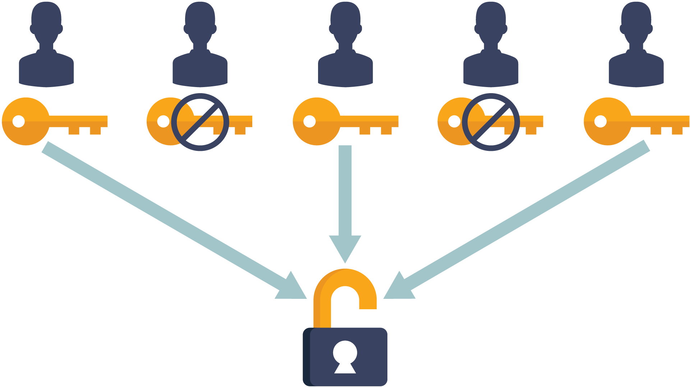

*Key Sharding and Social Recovery*

Interested in seeing an example of secret sharing in action? Here is [a lab](https://github.com/cloudcompass/ToIPLabs/blob/master/docs/LFS172x/SocialRecoveryLab.md) demonstrating [social recovery](https://www.youtube.com/watch?v=1c05mFuEQ5s) using [passguardian.com](http://passguardian.com/) service. The [passguardian.com](http://passguardian.com/) service provides functionality to let you encrypt a secret, create shards, and reconstruct the secret using an implementation of Shamir’s Secret Sharing.

While social recovery sounds complicated, a DIDComm content protocol to support the capability would likely be relatively easy to define and implement. The trickiest part will no doubt be recovery, as by definition, social recovery must occur after the owner has lost their agent storage and all their connections. However, as a second or third line strategy, it’s rare that it would be used, and if it is ever needed, the hassle will be worth the pain of having nothing.

### Managing the Recovery Key: Memorizing - In Your Head

Memorizing a recovery key is a safe way to “store” the key for easy access when needed. Since keys must be sufficiently long and random to be effective, they are also extremely difficult to memorize—and to remember when you really, really need them. A clever approach that might work for memorizing a sufficiently complex key has been developed by [SeedQuest](https://github.com/WebOfTrustInfo/rwot9-prague/issues/90), a team in the US. They’ve built a video game that looks and feels like a classic Nintendo game but whose purpose is to help you to memorize and (when needed) recover your key.

SeedQuest 3D works by first generating a sufficiently random key, and then guiding you through a game carrying out a series of 16 actions across four different scenes. Just doing that will produce a key with enough randomness (entropy) to make it impossible to determine using brute force techniques. Later, carrying out the same actions in the same order gives you the same key back. For a while, you keep the key in readily available cold storage and periodically practice, making sure you always get back your correct key. After you’ve practiced enough, your memory will (should?) retain the sequence (in theory, at least), and as long as you have access to the game, you can recreate your recovery key. If you have ever become an expert at a video game (Donkey Kong, anyone?), you will understand why this works and is such a clever approach. This can replace a locally stored cold storage key. You will likely also want an offsite copy or perhaps one accessible via social recovery, should you not be able to remember the sequence or become incapacitated.

The downside? Learning the recovery sequence is more effort than the average person may want to apply to backing up their wallet. Unless of course the game is really fun.

### No Backup, No Restore—What’s Next?

What if either you have no backup, or all of the recovery techniques you try fail? Your wallet is completely gone. If that happens, you have no choice but to start over, just like you must do if you lose your physical wallet today. Your first stop will likely be to get a foundational credential, such as one provided by a government. You will likely start with paper documents (too bad you didn’t keep your recovery key in your documents!) and an in-person visit to a government service center. From there, you will have to go back and collect your other credentials in order of importance, using your foundational credential as a starting point.

Remember we said that wallet backup and restore is crucial? We meant it. Early, small scale proof-of-concepts may be able to get away without reasonable (or any) backup and restore capabilities. However, as soon as there is value in the interactions and effort in restarting from scratch, backup and recovery is a necessity.

### Losing a Device

We’ve covered the case where you need to reinstate either your Aries agent application or your entire device because it is destroyed or you need to replace it. But what if you leave your working phone in a cab and off it goes? Or someone steals your phone. Can a person with your Aries agent pretend to be you? As with backups, the answer is in layers.

*Someone Gains Access to Your Agent and Credentials*

Your primary layer of protection are the mechanisms built into your phone. Presumably, your Aries agent requires the use of the most sophisticated access controls on your phone—ideally biometrics (fingerprint, face ID) or at least requires the entry of a pin or pattern for accessing the phone. This (should) prevent anyone finding the phone from accessing the Aries agent on it. If supported, you may also be able to remotely wipe the phone, preventing further use.

If the person (or organization) that has your phone ***is*** able to access your Aries agent despite the protections offered by the phone, there are not many options available today. This situation should be rare, because it is likely that anyone finding a phone would just reset the phone, deleting everything on it, including your Aries agent and KMS data.

The next layer of protection is used in a proof-of-concept, but has not yet been deployed in any practical way. It involves using the same ZKP proof techniques as Indy uses for credential revocation, but this time with device revocation.

- When you start to use a device such as a smartphone with an Aries agent, the device is registered in a **device authorization registry** on the Indy ledger you are using. Associated with that device authorization is a list of devices you can use for agent-y things—proving credentials and the like. Included would be a specific list of devices authorized to revoke the authorizations of other devices. The list of devices authorized to revoke other devices might even include the device of a friend or family member.
- When you create a proof, you use the device authorization registry to prove the device you are using has not been revoked. The cryptographic technique used is similar to proving a verifiable credential you are using has not been revoked. When a verifier looks at the proof, they can check the ledger to verify the device’s proof of non-revocation.
- What happens when one of your devices goes missing? The first thing you can do is revoke its authorization to generate proofs by using a device that is authorized to revoke the missing device. From that point on, the missing device cannot prove any credentials, eliminating the opportunity for someone to impersonate you online. A nice bonus? If you find the device is not missing after all (the cab driver returned it, or, you just left it at the office), you can reauthorize the device and keep using it for creating proofs.
 
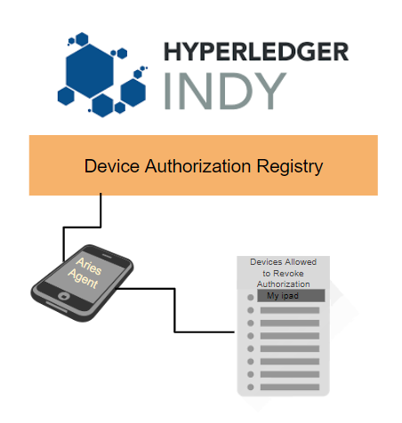

*Device Authorization Registry—An Added Layer of Loss Protection*

Another layer of protection that could be built on top of a device authorization registry is in the management of the pairwise DIDs your agent holds for every connection you have. Assuming you have revoked the authorization for the lost device, someone with that device can no longer create proofs using your credentials. However, they still can message contacts (at least the ones that don’t request proofs before acting). A feature of a future Aries agent will likely be the ability to cycle through all of the connection DIDs and update each DIDDoc. In this scenario, you restore a backup of your wallet to a new device, authorize it, and then update all the peer DIDs to remove the missing device from the DIDDocs, thus eliminating the ability of the device’s agent to message any of your contacts.

If you are interested in a longer dissertation on what happens when you lose your device, the Sovrin Foundation has published an article "[What If I Lose My Phone](https://sovrin.org/wp-content/uploads/2019/03/What-if-someone-steals-my-phone-110319.pdf)" that covers this topic in greater depth. Remember though, beyond the protections built into the phone’s OS, the techniques outlined have not been created as of April 2021. Recall as well, way back at the beginning of this chapter, we mentioned that these mechanisms “are ripe for innovation and implementation.” Still true...

### Summary

It sucks when things go wrong but know it will happen. In the case of your digital identity wallet, the need for backup and restore capabilities are paramount. Losing your digital wallet and having to start from scratch is just as painful as with a physical wallet, so the backup and recovery techniques we covered in this section are vital. Further, the techniques for recovery must be easy for everyone to use. Making backups will be automated and easy, but balancing the ease of recovery with the security of the backups will be a challenge. We’ve described some techniques, but they may not be easy for all users. There are many ideas on this topic and we welcome innovation. And speaking of innovation, this leads nicely into the next and final chapter of the course—all about the possibilities that surround this technology. Carry on!

## Chapter 7: Possibilities

### Introduction: Chapter Overview

Through the content and hands-on labs in the course, we hope you have gotten to see some of the potential for this technology—there are so many possibilities! Work is ongoing and ever-evolving as people from around the world use verifiable credentials to fix the Internet and address the privacy issues stemming from the missing trust layer. In this chapter, we will explore other possibilities and ways for you or your organization to get involved in this important and valuable work.

### Learning Objectives

By the end of this chapter you should:

- Understand the main areas where the Indy, Aries and Ursa technology might be applied.
- Be excited about the possibilities that exist for this technology to change the way the Internet currently operates.
- Be raring to delve further into the Indy, Aries and Ursa projects.
- Be sad that this course is coming to an end because it’s been fun, right?

### Endless Possibilities, Or At Least Nine Great Ones: Areas of Possibility

Here are many areas where this technology can play a key role, such as:

- authentication and authorization
- in-person verification
- proof of vaccinations
- proof of training
- consent receipts record permissions
- organizational wallets
- deciding whether to trust the issuer
- delegation of authority with transparency and control
- digital regulatory reporting

Let’s discuss each area of possibility.

### Authentication and Authorization

We’ve raised this topic throughout the course, but let’s end by asking this question: “Why do we build identity systems?” Two reasons: authentication and authorization.

In computer systems, authentication is the process of verifying the identity of an entity (person, other system, etc.) before allowing access. Who is it that is trying to access the system? Sometimes we need to know the unique person (name, address, etc.), other times, we don’t care who the person is, but we do care that when they come back, we connect them with the account previously created for them. Authorization in the computer system context is determining what an entity is allowed to do within the system—what data they can see, what changes they can make. As we described in Chapter 1, both are historically difficult to do, largely because information from the user cannot be trusted. Authorization and authentication have become enabled by identity providers (such as Facebook and Google) providing data about the user—giving them a central role in defining who is who. By building authentication and authorization on the foundation of verifiable credentials, the user is back at the center of the process, fully in control of with whom and how much data they share. The challenge is how to transition from the current identity provider world to one that uses verifiable credentials.

One exciting solution that has been developed by New Zealand’s Mattr Global, in collaboration with the Government of British Columbia (BC) in Canada, implements an identity provider (vc-authn-oidc) that uses verifiable credentials. The solution uses the same OpenID Connect (OIDC) protocols used by Google and Facebook but bases its trust on verifiable credentials. That provides a path for every online service that currently supports “Login by Facebook” to add a “Login by Verifiable Credentials” mechanism. Next, we will discuss a great example of this in practice.

### Authentication and Authorization: An Example

The Ministry of Justice in BC needs to provide access to some of its online services to actively practicing lawyers in the province. How does the service know someone asking for access (authentication) is currently permitted to practice law in BC? A traditional approach to this problem might involve an integration between the government service and the legal entity that authorizes a lawyer to practice—The Law Society of BC. When a person requests access, the government service must find out (exactly!) who they are and then ask the Law Society “Is Alice currently a practicing lawyer?” It’s complicated.

With verifiable credentials, the challenge becomes much easier. The Law Society tracks (as required by law), who are the practicing lawyers in BC. They have an online membership portal that is accessible only to lawyers. On that site, they provide a service where a practicing lawyer can request a verifiable credential that says “I am a practicing lawyer” (for example, not retired or currently suspended). On the BC government site, a user requesting access is challenged to provide a verifiable credential from the Law Society demonstrating they are a practicing lawyer in BC. If they are, they are granted access, based on the claims in the credential. If the lawyer retires or is suspended, the Law Society can revoke the credential, and access to the government system will be removed. And, since the BC Government already uses an OpenID Connect process to grant access, the vc-authn-oidc module built by Mattr Global fits right into the existing government IT infrastructure.

Expand that model out. Other government systems grant access to practicing lawyers. Private companies offer online services to lawyers. And not just lawyers use such systems. Other credentialed individuals—doctors, accountants, real estate agents, trades people and so on, do as well. In Britain, the National Health Service worked with [Truu.id](https://www.truu.id/) ([What is Truu?](https://www.youtube.com/watch?v=jB6D0MkgJQw)) and its partners to implement a medical professional credentialing system that reduces to minutes a paper process that previously had taken a month to authorize a new doctor privileges to provide medical services. Suddenly, a raft of one-off solutions, each with multi-party integrations, can be solved with a single question and integration: does the party wanting access have the right verifiable credentials?

### In-Person Verification

Online trust frameworks are often rigid and scripted (e.g., authentication systems, AirBnB, Lyft). In the physical world, trust frameworks are often more flexible, relying on trustworthy (paper) credentials. When you go into the pharmacy to purchase medications, they might want to know you’re over 18. In the US, at least, it’s common to ask for a driver’s license for this purpose. Why?

A driver’s license is an identity credential for use in a specific administrative domain: licensing drivers. Nevertheless, because of its implementation, it is used outside the administrative domain for which it was designed. A driver’s license is implemented as a decentralized, trustworthy credential that serves as a container for a specific set of attributes. Its veracity is (in theory) easily checked by recipients.

*In-Person Verification*

Two important properties allow this kind of use:

- The state is usually seen as a trustworthy party and people believe its attestations about the subject’s attributes.
- Driver’s licenses are difficult enough to forge that we believe they have not been tampered with.

Because of this implementation, people can be the conveyors of trustworthy attestations/claims about themselves. You can start a business today and decide you want to use a driver’s license for proof of address and start doing it immediately. No permission required. No integrations. No APIs. Your staff needs to be able to recognize fake licenses, including those from other parts of the country or places in the world.

Using verifiable credentials isn’t that easy—you do need some technology. But you don’t need permission, and the integration is peer-to-peer with a person, and a global entity (the blockchain), not with a lot of individual services. With verifiable credentials, in-person verification becomes more trustworthy and safer, and you no longer have to worry about fake credentials. Take proving you are old enough to drink in a bar, for example. At a VC-enabled bar, you can present claims from a source the bar trusts (such as a driver’s license authority) that prove you’re over the necessary age and your picture (that proves you are you), and you are admitted. No need to show your physical driver’s license with its abundance of extra information—your address, driver’s license number and so on. Since patrons can come from anywhere in the world, the bar’s verifier agent needs to know the identity (the DID) of many driver’s license issuers (every state, province, country, etc.), but that’s all they need to know about them. Most importantly, they don’t need to integrate with each of those issuers for the process to work. That makes forging a verifiable credential essentially impossible.

### Vaccination Credentials

This brings us to the hottest verifiable credential topic of 2021—vaccination credentials. For decades, vaccination credentials have been paper, signed and issued at the time of inoculation. This raised some risks of forged credentials, but they were minor. For example, to travel, the need to have a “[Carte Jaune/Yellow Card](https://en.wikipedia.org/wiki/International_Certificate_of_Vaccination_or_Prophylaxis)” to be permitted into some countries aligned with the desire of the traveller—they didn’t want to go to places where a vaccination was needed without getting that vaccine. In recent years, a bigger risk occurred because of the “anti-vaxxer” movement: faked vaccination cards in schools as children were not allowed to attend schools without them. Some jurisdictions have been working (slowly) on systems to address this risk.

*Carte Jaune/Yellow Card*

Then came COVID-19, COVID-19 vaccinations and the worldwide interest in being able to trust a person claiming to have been vaccinated. The backdrop is the same as both the Carte Jaune/Yellow Card and school scenarios above, but the risk of fraud is many, many times higher. COVID-19 vaccinations open up opportunities to participate in many more societal activities, not the least of which is travel. But getting a vaccination takes time and many are skeptical of vaccines. These factors significantly increase the likelihood of forged documents. As well, processing efficiency comes into play. If prior to an event (such as boarding a plane), everyone’s proof of vaccination must be verified, a paper process (especially during a pandemic) is less than ideal.

These factors have brought talk of digital credentials into the mainstream. However, with the interest has come concern about the security and privacy of any such digital documents. Who knows when a digital proof is presented? What personal data about the subject is shared? Is a huge, central database of vaccinated people being created and used? What happens to people without access to technology? And the concerns are justified. Done badly, such systems can indeed be a security and privacy disaster. Done well, they can achieve the goals of their use—enabling commerce while containing the pandemic.

### The Benefits of Vaccination Verifiable Credentials

As many have discovered in looking for solutions to the digital proof of vaccination problem, verifiable credentials are a “right way” to solve the problem—for all the reasons that we’ve talked about in this course. In the following short paragraphs, we’ll highlight why verifiable credentials are the right solution to this problem and then we’ll look at the challenges in getting a global verifiable credential solution deployed. Note that in addition to “proof of vaccination”, verifiable credentials could also be used for “proof of a negative COVID-19 test” and other related facts.

- **Privacy:** As we’ve talked about throughout the course, privacy and control by the subject (person) over their own data is core to verifiable credentials. Unlike a central vaccination database and queries back to the issuer, verifiable credentials allow the individual to hold their data and present it when necessary. Further, with selective disclosure, the amount of data shared can be minimized to the business case requirement. Ideally, just “yes, I’ve been vaccinated.” Further, if the verifiable credentials use a [ZKP-capable format](https://en.wikipedia.org/wiki/Zero-knowledge_proof), there is no unique identifier for the subject shared, preventing correlation amongst verifiers.
- **Security:** While in many cases there will remain databases managed by issuers of who they have inoculated, there is no need for further centralization of the data and opening it up to verifiers. Only the ability to issue a credential to an identified subject is needed. This greatly reduces the risk of large data breaches of health information.
- **Trust:** As we’ve talked about throughout the course, the use of verifiable credentials eliminates the ability of a person to forge their own credentials. The cryptography of the credentials prevents that. However, it leaves us with the challenge of how verifiers decide if they trust the issuers. We’ll talk about that in "The Challenges" section.
- **Separation of Concerns:** In the race to come up with digital vaccination credentials, many shortcut solutions have been proposed that combine vaccination (health) information with other concerns, such as travel. Done properly, verifiable credentials issued by authorities with knowledge of the vaccination status of the subject (person) should only cover exactly that information. Issuers should not try to extend their authority beyond that into either the possible implication of a vaccination (e.g., “immunity”) or to what a vaccinated person can participate in (e.g., a “vaccine passport” for travel). There must be clear separation between proof of vaccination issued by an authority and the use of that proof in specific scenarios associated with the opening up of society.
- **Paper Verifiable Credentials:** Paper-based verifiable credentials, as we’ve talked about earlier in the course, are an interesting option in preventing the “digital divide” between the technical haves and have nots. They prevent fraud by the person presenting the paper-based proof. However, as noted, paper-based verifiable credentials lack many of the privacy features of presentation request/presentation interactions between verifiers and holders.

### The Challenges

While those are the benefits of using a verifiable credential-based approach to proof of vaccinations, there are definitely some challenges in quickly ramping up a global solution.

- **Trusting Issuers:** The challenge of verifiers deciding whether or not they trust the issuers grows the broader the use case. Each verifier needs to have access to some form of a list of who are the trusted issuers of credentials that they will accept. If they are only getting proofs from the local population, that list is limited. However, for international travel, that list must cover the world—regional health authorities provide lists to national organizations, who in turn provide those to international organizations, such as the World Health Organization (WHO) or global travel associations. Ideally, such a list is continually maintained and available for all to use. How a verifier determines the issuer is trusted is a key part of the governance framework challenge that comes with the use of any credentials—verifiable or not. We’ll talk more about this a little later in this chapter.
- **Interoperability:** Many different approaches to trusted “proof of vaccination” digital documents are being proposed, many based on existing vendor-specific solutions. Even those using verifiable credentials are based on different technical stacks and verifiable credential formats, thus, getting all the solutions to interoperate is a challenge. Eventually, the “dominant design” will become obvious and all solutions will align with that approach, just as what happened with TCP/IP in the early days of the Internet. However, we have not yet reached that point with verifiable credentials and the need for proof of vaccination credentials is immediate. There will be bumps!
- **Paper Identifiers:** As mentioned above and earlier in the course, paper-based verifiable credentials can eliminate the problem of forged credential documents. However, with the common use of paper-based verifiable credentials comes a higher privacy risk. Great care must be taken to ensure that the ongoing use of paper-based verifiable credentials do not result in a global unique identifier for every person on the planet, enabling tracking of all that we do.

That’s all we’ll talk about specifically related to proof of vaccination credentials. It is a good and real example of why there is a need to transition from text-based paper to verifiable credentials. The vast majority of the material in this course is directly applicable to the “proof of vaccination” use case.

### Real-Time Credentialing

In most of the examples we’ve talked about to this point, the credentials are long-lived (professional credential, driver’s license, etc.) and it’s not difficult to imagine trusting those in paper form as a one-time check prior to giving a person long term authorization—for example, giving a lawyer a building pass to a courthouse by verifying their paper identity and lawyer credentials. If the lawyer loses the practicing lawyer authorization, the building pass will still work, but we accept that risk as “the best we can do.” But what about credentials that are short lived and that must regularly be renewed? How do we check those in the paper world?

*Proof of Training*

Often when a construction worker is given access to a site, they are required to have taken site-specific safety training consistent with the current state of construction. If you're in a building that is under construction, there needs to be constant updating of what is the best way to get out of the building in case of fire. That’s continuous safety instruction. Today, the certification of the training is paper, but it’s too much work to verify those credentials each time access is required. At most, only if there is a problem and an investigation is needed do the paper credentials get checked. With verifiable credentials, the process becomes proactive and near real-time.

Access becomes based on the presentation of the necessary credentials from the authoritative source. The check is fast, happening with messages going back and forth between the issuer and verifier devices. Since the credentials are carried by the person (e.g., the lawyer, the construction worker in the examples above), they can be checked in real-time as access is needed, regardless of an Internet connection. The check is not based on a stand-in for the real credentials (not a building pass) but of the actual credentials issued by appropriate trusted authorities.

The incentives for changing to this model are interesting. While perhaps there is little risk reduction in the lawyer use case, it does reduce the current “who has a building pass?” problem with which many companies struggle. In the safety case, the incentives are more powerful. At minimum, the construction company can be certain that only individuals with proper safety training are given access to the site. Further, there might be a financial incentive to the company in the form of reduced insurance costs, since they can now guarantee (with evidence) that only safety trained individuals can work on the site.

### Consent Receipts

On May 25, 2018, The General Data Protection Regulation (GDPR) was implemented. The GDPR is a regulation in EU law on data protection and privacy for all individual citizens of the European Union and the European Economic Area. It also addresses the transfer of personal data outside the EU and EEA areas.

*GDPR: Digital Privacy and Protection for Citizens of the EU*

The biggest direct impact on users has been all of the notifications appearing on websites asking your consent for the service to track information about you for some purpose. When you click “OK,” have you ever wondered where the consent goes? Presumably, it gets saved by the company, and associated with your usage on the site—likely with a cookie of all things.

What if instead of the company recording the event, the company gives you a receipt, just like the receipt you get when you buy something? If the receipt is a verifiable credential, you have indisputable proof of the agreement. What does that enable?

- Each time you go to the site, the consent receipt can be requested and proven, likely through an automated process.
- You can use your consent receipt to withdraw your consent, just as you use a store receipt to return merchandise.
- At any time, you can see to what companies you have given your consent.
- If a company has some sort of negative event (a data breach, a violation of GDPR, etc.), you can find out if you might be affected.
- If you want to participate in a court action because a company violated the terms of the consent agreement, you have evidence of exactly the terms to which they agreed.

The [Kantera Initiative](https://kantarainitiative.org/) is a global consortium improving trustworthy use of identity and personal data through innovation, standardization and good practice. Kantera hosts the [Consent & Information Sharing Work Group](https://kantarainitiative.org/groups/ciswg/), which created a [consent receipt specification](https://kantarainitiative.org/confluence/plugins/servlet/samlsso?redirectTo=%2Fpages%2Fviewpage.action%3FspaceKey%3Dinfosharing%26title%3DConsent%2BReceipt%2BSpecification). A number of Kantera members have products based on the specification, some of which are based on verifiable credentials.

### Organizational Wallets

In this possibilities section so far we’ve talked about wallets holding verifiable credentials for people. But people won’t be the only users of wallets and verifiable credentials. There is a need for organizations to have verifiable credentials about the organization and share those with verifiers in order to conduct business. For example, businesses have an authorization to operate, a business license, a set of bank accounts, insurance, auditor reports and so on. All of those can be represented as verifiable credentials issued to the organization, and presented by the organization’s wallet when needed. In this section, we’ll cover the basics of an organizational wallet, and then in the subsequent sections provide some possibilities around organizational wallets.

An organizational wallet is like a mobile wallet that a person might use but runs on a server (somewhere—more on that later) and is controlled by “the organization” itself. All organizations are operated by people, so ultimately, people acquire, configure, deploy and use the organizational wallet. What does that mean?

*An Organizational Wallet*

Let’s start with the idea of an organizational wallet operating in the same way as a personal wallet. Requests come in to connect with another agent, offer a credential, request a proof and so on. All of the same things we’ve seen in the course. A simple organizational wallet could operate exactly as a personal wallet, doing the bidding of its users and receiving requests from other agents and asking its users how to respond. To other agents, the wallet appears to be the same as any other, and on the organizational side, an internal website (the controller part of the agent) would notify users of the requests and wait on instructions. Likely, the controller component would be extended with a rules engine that allows the wallet to handle certain requests automatically (e.g., always answer requests from certain agents, always ignore requests from certain other agents and so on), and to route certain requests to specific individuals (e.g., always send banking information requests to accounting).

While in first creating the wallet, a certain user might be given access, it’s likely verifiable credentials would be issued to all of the rest of those granted access to use the wallet. Users would present (from their mobile wallet) a proof to get access to the wallet.

Since the wallet could not scan a QR code, establishing connections to issuers and verifiers would be a little different, likely facilitated by the organization’s wallet users. A user interacting with another organization (for example, a bank), might connect (using their mobile wallet) to the bank's agent, and then “‘introduce” the bank’s agent to the organizational wallet. Once the two enterprise agents connect, all the same flows (request presentation, issue credential, etc.) could occur.

### Deciding to Trust the Issuer (1)

With an organizational wallet in place, let's come back to an issue we’ve raised multiple times in the course. Once a verifier checks out the cryptography of a credential, they know they can trust the data. However, they still have to decide if they can trust the issuer. For many use cases, the verifier can constrain the problem by only requesting presentations involving credentials from trusted issuers, issuers they “know” by their DIDs and the credentials they issue. But what about when the universe of potential issuers is too large, such as global issuers of “proof of vaccination” credentials? Let’s look at how organizational wallets might be able to help with that.

Suppose you are a verifier and you are presented with a verified proof containing data from a credential issued by an issuer you have not previously encountered. What do you do? For a person facing that problem, the answer is pretty easy—you would “Google it”—search for the issuer, learn about them and then make a decision. With organizational wallets, it can be a lot more automated, although it still might come down to a person making a decision.

Here’s a possible approach: The verifier uses the DID of the issuer to find its public key and endpoint, and sends a presentation request asking (more or less) “what authority do you have to issue credentials of this type?” Ideally, that is a standard request, answered with a presentation about their authority to issue the credential. The verifier now has data from another credential from another issuer. If that other issuer is recognized, we’re done! If not, repeat the process with the next issuer. Recall that this process will happen with machine-to-machine efficiency, so it won’t take as long as it sounds. Ultimately, a trusted issuer will be found (all good!), an untrusted issuer will be found (reject!), or if neither, the verifier agent might provide all the collected data to a person to make a decision (remember that concept of “human trust?”). Once decisions are made about the (previously unknown) issuers, update the list of trusted and not trusted issuers, so next time, the decision can be handled automatically.

In practical terms, here is how this might be used in the “proof of vaccination” use case:

- The World Health Organization (WHO) Aries agent gives the Aries agents of member states a verifiable credential to indicate they are authorized to delegate the issuing “proof of vaccination” credentials.
- The member states issue verifiable credentials to their regional authorities to indicate they are authorized to delegate the issuing “proof of vaccination” credentials.
- The regional authorities issue verifiable credentials to authorized organizations that issue the actual “proof of vaccination” credentials.

### Deciding to Trust the Issuer (2)

Using the approach we just discussed, the verifier has at most three layers to climb to find (or not) a trusted issuer (worst case—they know the DID for the WHO issuer).

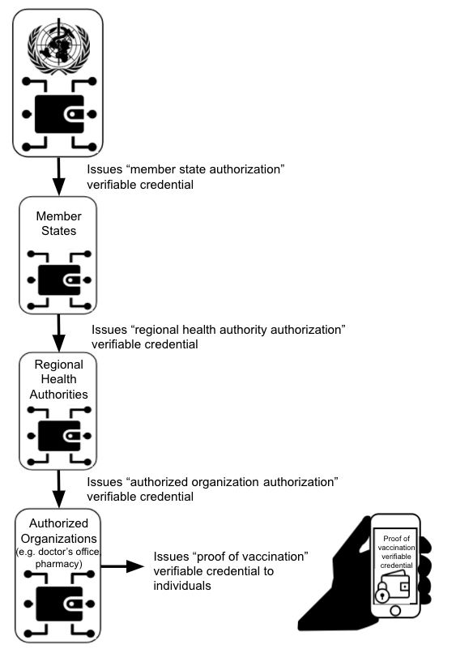

*Proof of Vaccination Use Case*

There can be optimizations in that process.

- Each “delegation of authority” presentation might be embedded in the credential issued to each delegate, so the entire chain of delegation is included in the “I am authorized” presentation from the initial issuer.
- An organization (such as the WHO) might coordinate with their member states to maintain a central list of trusted “proof of vaccination” issuers. With that in place, the verifier need only ask the WHO organizational agent if the initial, unknown issuer is on the trusted list.
- The WHO agent could coordinate with their member states such that the WHO agent issued (and revoked when needed) a “delegated authority” credential to every actual issuer of a “proof of vaccination” credential, shrinking the layers of authorization.

### Delegation of Authority with Transparency and Control

Delegation of authority as a use case is everywhere. Most of us are familiar with delegations in a personal context—a power of attorney that gives a trusted family member or friend the right to act on our behalf when we are unable to do so. Delegation of authority is everywhere in a business context as well. Any business is ultimately owned by someone or some group. Every employee is given some form of delegation of authority that derives from the ownership of the business. The board of directors delegates authority to the CEO, the CEO delegates authority to the executive team, and so on. Delegation goes outside the business as well, such as lawyers and accountants that act on behalf of the business in specific business dealings.

Delegation of authority is a prime use case for verifiable credentials. An issuer, the entity with authority, issues a verifiable credential to the holder, who is being given the authority. When necessary, the holder proves the authority to a verifier. When the authority is to be withdrawn, the issuer revokes the authority, thereby preventing the holder from using it in the future. That’s exactly the same as the verifiable credential model.

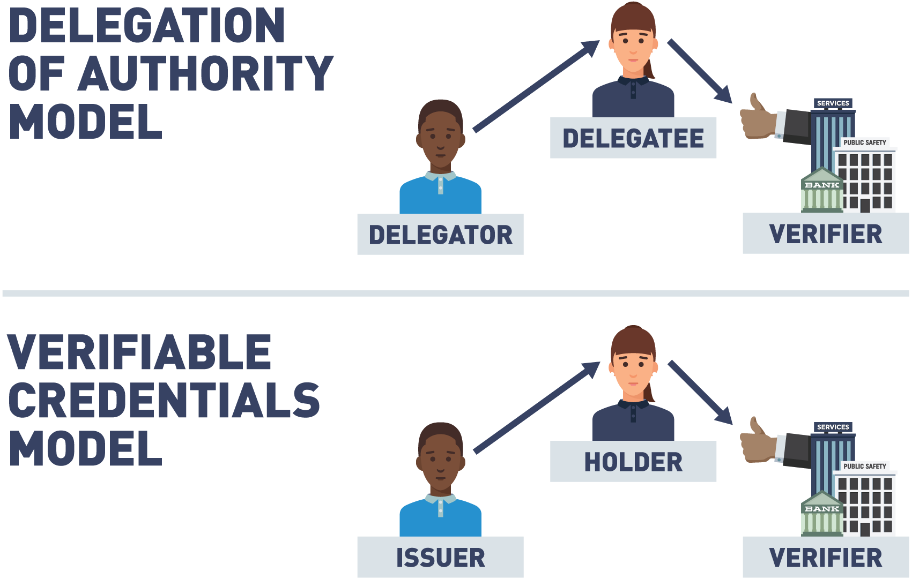

*Delegation of Authority Model Versus Verifiable Credentials Model*

### Delegation of Authority Example: Lawyers and Staff

An example of the use of delegation through verifiable credentials is an extension of the lawyer authentication use case from earlier in this chapter. Recall in that example that the authority for identifying lawyers in a jurisdiction (for example, the Law Society of British Columbia), issues a practicing certificate to a lawyer, and the lawyer can use that to authenticate at a government online service. That works in theory, but in a law practice, that’s not always sufficient. Using an online service is often done not by the lawyer directly, but by members of the lawyer’s team—delegates. Often the lawyer uses his or her credentials to access an online service, but has the work on that service done by a staff member. While this is necessary from a productivity perspective, it’s often against the service’s terms of use, and possibly a violation of the lawyer’s legal responsibilities.

A more effective and transparent approach is to allow the lawyer to delegate their authority to a staff member so the staff member can use their own credentials for authentication. Being considered in the BC use case is that the lawyer can request the Law Society issue a credential to their staff member(s). The responsibility for the behavior of the staff member in using the credential is with the lawyer, and all of the parties are aware of who is doing what on the system. Revocation of a staff member’s delegation can happen as needed, and the revocation of the lawyer’s credential triggers the revocation of all of the lawyer’s delegations.

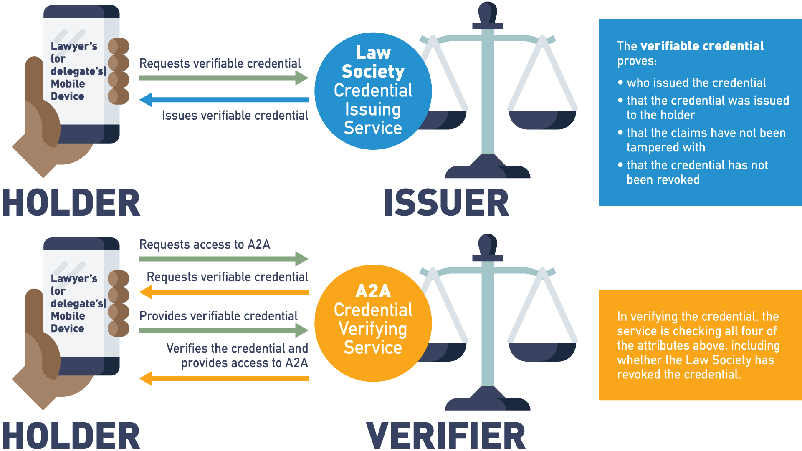

*BC Provincial Government Use Case*

Such a delegation approach can be implemented in many use cases with the verifiable credentials currently available in Indy. The delegating party asks the authority to issue a delegation verifiable credential to a delegate. The delegate can use that credential for authentication and authorization.

### Organizational Wallets and Delegation

Another model for delegation is where an organization can manage the delegation internally, through its own organizational wallet. As noted in the discussion above about delegated credentials for the legal staff, the delegation credential is coming from the Law Society. Another way to do delegation is for an issuing authority to give a credential to the organization, and the organization to issue delegation credentials to their staff. The benefit of this approach is that the issuing authority does not have to do any tracking of who has credentials. Instead, that is handled entirely by the organization delegating the authority.

Let’s look at an example. The Law Society might issue credentials for a law firm’s lawyers to the firm’s organizational wallet. In turn, the firm’s organizational wallet would issue credentials to their staff. On accessing a government site, the staff member would present the credential given to them by the firm, and the name of the lawyer for which they are working. The government site would connect with and request from the organizational wallet the Law Society issued credential for that lawyer. If everything checks out, access is granted. As staff turnover occurs, the management of the delegation credentials is handled entirely within the firm.

Note that this does make the coordination a little more complex. No longer is the interaction strictly between the verifier and the holder. Further, the meaning of the delegation credential needs to be understood by the verifier. This once again brings up the need for a governance framework—a set of rules under which the parties are operating within an ecosystem. Yes, it’s really important!

### Digital Regulatory Reporting

Regulatory reporting is a field ripe for innovation using verifiable credentials. There is an ongoing battle between pro-regulation and pro-business proponents about the value of regulation.

A pro-regulation view is that regulation is necessary to keep “bad actors” from reducing their costs by not paying for all the impacts of their products, and leaving it to society to foot the bill. The manufacturers of the 50’s and 60’s (and beyond) that quietly pumped pollution from their factories into nearby rivers and streams are prime examples of the long term costs of not regulating business activities.

A pro-business view is that regulation means endless paperwork and reporting that is costly to generate and rarely reviewed and monitored because it’s too expensive for the government to act upon. Good actors adhere to the regulations and reporting despite the costs, while bad actors continue to ignore regulation compliance to limit their costs with little chance of being caught.

*Digital Regulatory Reporting*

What if authentic regulatory reporting data could be generated from its source, digitally shared and digitally processed for compliance? The cost of regulatory paperwork would drop and the effectiveness of the regulations would increase. Good actors would be able to prove, at a low cost, their compliance with regulations, and bad actors would be forced to either comply or shut down. That is all possible based on verifiable credentials.

Consider the energy industry, a contributor of carbon emissions that drive climate change. As the world transitions to other energy sources, incentives will grow for those reducing their carbon footprint, and costs will rise for those failing to do so. Even if governments fail to act, society will (eventually) punish those that knowingly profit from business practices that damage society, as happened with the tobacco and opioid industries. But for companies to demonstrate that they are reducing their carbon footprint, they must present trusted evidence. As the Oxford Institute for Energy Studies (an independent energy markets think tank) [recently reported](https://www.oxfordenergy.org/publications/challenges-to-the-future-of-lng-decarbonisation-affordability-and-profitability/?v=3e8d115eb4b3), “*The LNG community needs to replace an ‘advocacy’ message – based on the generality of emissions from combustion of natural gas being lower than from other fossil fuels – with certified data on carbon and methane emissions from specific elements of the value chain for individual projects.*” That sure sounds like a need for verifiable credentials! By collecting authentic data from authorized devices (verifiable credential issuers) at the source—the well head—and continuing through the production chain, energy producers can demonstrate their carbon impact. As production improvements are made, as moves are made to lower impact fossil fuels, and off fossil fuels entirely, the impact of the changes can be quantified and rewarded or penalized as appropriate.

Organizational wallets play a huge role here. Each organization within a supply chain has an organizational wallet that holds information about the organization and more. On top of the credentials we listed earlier, they might have audited reports about their sustainability and labor practices (good and bad), GHG data from certified devices, and so on. Further, as they receive products from their suppliers, they would receive verifiable credentials about those products. As the organization creates and sells its own products, they provide to their customers verifiable credentials about those products, including materials from suppliers that went into the product. End customers, investors, regulators and perhaps even consumers can then use the verifiable credentials to automatically follow the supply chain information to determine the sources of materials in products, and trusted information about the companies involved. Investors interested in making environmentally sound investments, regulators looking to stop damaging practices and end customers wanting to make good decisions for the planet would have trusted information with which to make sound decisions.

Let’s finish with that thought, using verifiable credentials to incentivize companies to fight climate change. That’s powerful!

### Getting Involved: How to Get Started

The Hyperledger projects are open source, where ideas and code can be publicly discussed, created and reviewed. There are many ways to contribute to the Hyperledger Indy, Aries and Ursa community. To get started in any one of the projects, start at the Hyperledger Wiki for the project:

- `https://wiki.hyperledger.org/display/indy`
- `https://wiki.hyperledger.org/display/aries`
- `https://wiki.hyperledger.org/display/ursa`

Upon visiting these pages, you will notice that there are links to all kinds of valuable information including links to documents, data and details about the projects, repositories, project management information, rocketchat discussions, collaboration tools, community meetings and more.

If you are wanting to build on these technologies, focus in particular on Aries. With Aries, you can start building applications that depend on the technologies covered in this course. If you are a developer, you’ll want to start with the follow-on to this course: "[*Becoming a Hyperledger Aries Developer*](https://training.linuxfoundation.org/training/becoming-a-hyperledger-aries-developer-lfs173/)" (LFS173x).

*Bring Us Your Ideas*

### Summary

That’s a wrap! Thank you for exploring Indy, Aries and Ursa with us. If you’re a developer, or a developer-wanna-be who is not afraid of a command line, come see us in the follow-on to this course, "[*Becoming a Hyperledger Aries Developer*](https://training.linuxfoundation.org/training/becoming-a-hyperledger-aries-developer-lfs173/)" (LFS173x).

## Final Exam

### Before You Begin Your Final Exam

Congratulations! You have completed this course. You can now click on the I'm ready, bring on the Final Exam button below to start the final exam. 

***To pass, you must score a final grade of 70% or above on this course. Your final grade is a combination of the knowledge check questions (20%) at the end of each chapter, and the final exam (80%).***

You will have a maximum of 2 attempts to answer each question on the exam (other than true/false answers, in which case, you have only 1 attempt). It is an open book exam (meaning that you are free to reference your notes, screens from the course, etc.), and there is no time limit on how long you can spend on a question. You can always skip a question and come back to it later. 

### Congratulations!

You have completed your course. Share your success on social media or email.

## That's all folks!!!
___
